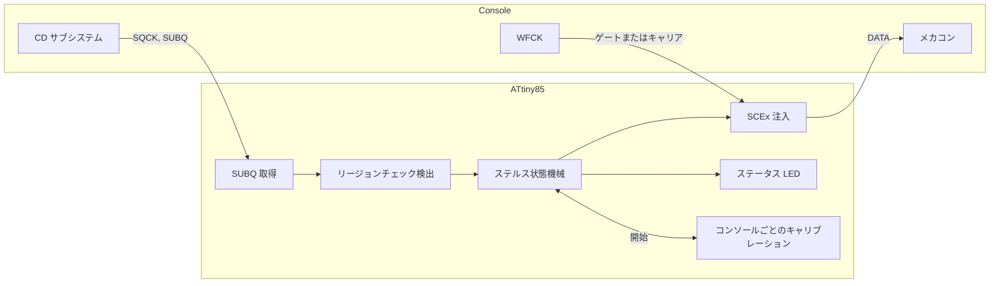

<div align="center">

<h1>openscex-modchip</h1>

<p>
  <a href="README.md">English</a> &nbsp;·&nbsp; <b>日本語</b> &nbsp;·&nbsp; <a href="README.zh.md">中文</a>
</p>

<strong>PlayStation と PSone のためのステルス SCEx リージョン解除。コンソールに合わせて自分のクロックを補正する ATtiny85 に載ります。</strong>

<br><br>

[](https://github.com/gufranco/openscex-modchip/actions/workflows/ci.yml)
[](https://github.com/gufranco/openscex-modchip/releases)
[](AGENTS.md)
[](LICENSE)

<br>

<p>
  <a href="#クイックスタート">クイックスタート</a> &nbsp;|&nbsp;
  <a href="#コンソールのタップ位置">配線</a> &nbsp;|&nbsp;
  <a href="#ステータス-led">ステータス LED</a> &nbsp;|&nbsp;
  <a href="#他のチップとの比較">他のチップとの比較</a> &nbsp;|&nbsp;
  <a href="../../issues/new?template=compatibility.yml">あなたの機種を報告</a>
</p>

</div>

フラッシュ [**5720**](Makefile) バイト · 基板 [**8**](assets/psnee) 系統、PU-7 から PM-41(2) · リージョン [**3**](src/region.c) 種 · MISRA 逸脱 [**0**](AGENTS.md) · ホストの行と分岐カバレッジ [**100%**](tests/host) · ミュータント [**206/206**](tools/mutate.py) 撃破

```bash
gh release download --repo gufranco/openscex-modchip --pattern 'openscex-modchip-attiny85.hex' --pattern SHA256SUMS
sha256sum -c SHA256SUMS --ignore-missing
avrdude -c <programmer> -p attiny85 -U flash:w:openscex-modchip-attiny85.hex:i
```

> [!IMPORTANT]
> 現在のファームウェアはシミュレーションのゲートをすべて通過していますが、まだ実機では動かしていません。配線前にタップ位置の電圧を測ってください。 出典: [compatibility reports](https://github.com/gufranco/openscex-modchip/issues?q=label%3Acompatibility), [tests/sim](tests/sim)。

初代ソニー PlayStation（フット機）と PSone 向けのリージョン解除ファームウェアで、内蔵発振器で動き、それをコンソール自身の SUBQ フレームレートに合わせて補正する ATtiny85 に載ります。設定されたリージョン文字列を SUBQ リージョンチェックの窓の間だけ送り、コンソールが受け入れた瞬間に止め、プレイ中はデータ線をハイインピーダンスに保ちます。蓋線は不要です。ドライブが止まって SUBQ が静かになることで、ディスク交換を知ります。ブート ROM はパッチしないため、日本のフット機と PAL の PSone は 2 回目のリージョンチェックを残します。それを回避したい場合はパッチ済み BIOS を入れてください。光学ドライブエミュレータではなく、PS2 やサターンには対応せず、LibCrypt も回避しません。 出典: [src/run.c](src/run.c), [src/inject.c](src/inject.c), [AGENTS.md](AGENTS.md)。

| | | 出典 |
|:--|:--|:--|
| **受け入れ後は沈黙**<br>最初のプログラム領域フレームで注入を止め（文字列の途中でも）、ゲーム中は何も送りません。アンチモッドのゲームが強制する TOC 再読み取りのような新しいリードイン読み取りにだけ、再び応じます。 | **蓋線なしのディスク交換**<br>ドライブが 1.5 s 静かになることを交換とみなし、マルチディスクのゲームの全ディスクに向けて再武装します。 | [src/inject.c](src/inject.c), [src/loop.c](src/loop.c), [src/run.c](src/run.c) |
| **自己補正のタイミング**<br>チップはコンソールの 75 Hz の SUBQ フレームを計時し、内蔵発振器を約 1% 以内に補正します。クロック線は不要です。 | **1 リージョン、1 つの窓**<br>設定したリージョン文字列だけを、SUBQ リージョンチェックの窓の間だけ、武装ごとに最大 16 回。 | [src/trim.c](src/trim.c), [src/region.c](src/region.c), [include/pscu/config.h](include/pscu/config.h) |
| **ステータス LED またはブザー**<br>1 本のピンにつないだ LED かアクティブブザーで、起動の各段階、ディスクごとの結果、配線の異常を示す。final ビルドは短く鳴るだけで、異常は 1 回だけ知らせる。 | **コードで実証**<br>MISRA C:2012 準拠、ホストカバレッジ 100%、simavr コンソールモデル、ミューテーションテスト、バイト一致の再ビルド。 | [src/led.c](src/led.c), [tests/host](tests/host), [tools/mutate.py](tools/mutate.py) |

## 概要

| 項目 | 値 | 出典 |
|:-----|:---|:--|
| 対象機種 | PlayStation フット機 PU-7 から PU-23、PSone PM-41 と PM-41(2) | [assets/psnee](assets/psnee), [PsNee PSNee.ino L372-L406](https://github.com/kalymos/PsNee/blob/df52aec97d4e1677e3ed3ead1fba0bf102b1cfd7/PSNee/PSNee.ino#L372-L406) |
| MCU | ATtiny85（8 ピン DIP） | [include/port/registers.h](include/port/registers.h), [ATtiny25/45/85 datasheet 2586Q](https://ww1.microchip.com/downloads/en/DeviceDoc/Atmel-2586-AVR-8-bit-Microcontroller-ATtiny25-ATtiny45-ATtiny85_Datasheet.pdf) |
| 方式 | SCEx 注入 | [src/inject.c](src/inject.c), [psx-spx cdromdrive.md, SCEx](https://github.com/psx-spx/psx-spx.github.io/blob/6d7d1bc106a7e0b616b0330fe58401ab1ba57f0f/docs/cdromdrive.md#L1211-L1230) |
| リージョン | ビルドごとに 1 つ、`REGION=jp|us|eu`（既定 us） | [Makefile](Makefile), [src/region.c](src/region.c) |
| クロック | 内蔵 8 MHz RC 発振器。コンソールの SUBQ フレームレートで補正 | [src/trim.c](src/trim.c), [ATtiny25/45/85 datasheet 2586Q](https://ww1.microchip.com/downloads/en/DeviceDoc/Atmel-2586-AVR-8-bit-Microcontroller-ATtiny25-ATtiny45-ATtiny85_Datasheet.pdf) |
| 配線 | 信号 4 本（SQCK、SUBQ、DATA、WFCK）と電源、LED かアクティブブザーは任意 | [include/port/registers.h](include/port/registers.h), [PsNee MCU.h L453-L530](https://github.com/kalymos/PsNee/blob/df52aec97d4e1677e3ed3ead1fba0bf102b1cfd7/PSNee/MCU.h#L453-L530) |
| ツールチェーン | C17、MISRA C:2012 逸脱ゼロ、バージョン固定の Docker イメージ | [Dockerfile](Dockerfile), [AGENTS.md](AGENTS.md) |

## 機種ごとのビルド

| 機種 | 基板 | `REGION` | 2 回目のリージョンチェック | 出典 |
|:-----|:-----|:---------|:---------------------------|:--|
| フット US/カナダ、SCPH-1001 | PU-8 | `us` | なし | [consolemods PS1 region information](https://consolemods.org/wiki/PS1:Region_Information), [PsNee PSNee.ino L10-L17](https://github.com/kalymos/PsNee/blob/df52aec97d4e1677e3ed3ead1fba0bf102b1cfd7/PSNee/PSNee.ino#L10-L17) |
| フット US/カナダ、SCPH-550x1/700x1/900x1 | PU-18 から PU-23 | `us` | なし | [consolemods PS1 region information](https://consolemods.org/wiki/PS1:Region_Information), [PsNee PSNee.ino L10-L17](https://github.com/kalymos/PsNee/blob/df52aec97d4e1677e3ed3ead1fba0bf102b1cfd7/PSNee/PSNee.ino#L10-L17) |
| フット PAL、SCPH-1002 | PU-8 | `eu` | なし | [consolemods PS1 region information](https://consolemods.org/wiki/PS1:Region_Information), [PsNee PSNee.ino L10-L17](https://github.com/kalymos/PsNee/blob/df52aec97d4e1677e3ed3ead1fba0bf102b1cfd7/PSNee/PSNee.ino#L10-L17) |
| フット PAL、SCPH-550x2/900x2 | PU-18 から PU-22 | `eu` | なし | [consolemods PS1 region information](https://consolemods.org/wiki/PS1:Region_Information), [PsNee PSNee.ino L10-L17](https://github.com/kalymos/PsNee/blob/df52aec97d4e1677e3ed3ead1fba0bf102b1cfd7/PSNee/PSNee.ino#L10-L17) |
| PSone US/カナダ、SCPH-101 | PM-41 / PM-41(2) | `us` | なし | [consolemods PS1 region information](https://consolemods.org/wiki/PS1:Region_Information), [PsNee PSNee.ino L10-L17](https://github.com/kalymos/PsNee/blob/df52aec97d4e1677e3ed3ead1fba0bf102b1cfd7/PSNee/PSNee.ino#L10-L17) |
| PSone PAL、SCPH-102 | PM-41 / PM-41(2) | `eu` | ブート ROM 内。パッチ済み BIOS が必要 | [consolemods PS1 region information](https://consolemods.org/wiki/PS1:Region_Information), [PsNee PSNee.ino L33-L38](https://github.com/kalymos/PsNee/blob/df52aec97d4e1677e3ed3ead1fba0bf102b1cfd7/PSNee/PSNee.ino#L33-L38) |
| PSone 日本、SCPH-100 | PM-41 | `jp` | ブート ROM 内。パッチ済み BIOS が必要 | [consolemods PS1 region information](https://consolemods.org/wiki/PS1:Region_Information), [PsNee PSNee.ino L33-L38](https://github.com/kalymos/PsNee/blob/df52aec97d4e1677e3ed3ead1fba0bf102b1cfd7/PSNee/PSNee.ino#L33-L38) |
| フット日本、SCPH-1000/3000/3500/5000/5500/7000/7500/9000 | PU-7 から PU-23 | `jp` | ブート ROM 内。パッチ済み BIOS が必要。ただし初期の SCPH-1000 はそれでもディスクを起動する | [consolemods PS1 region information](https://consolemods.org/wiki/PS1:Region_Information), [PsNee PSNee.ino L33-L38](https://github.com/kalymos/PsNee/blob/df52aec97d4e1677e3ed3ead1fba0bf102b1cfd7/PSNee/PSNee.ino#L33-L38) |
| アジア、SCPH-xxx3 | 未記録 | `jp` | なし | [consolemods PS1 region information](https://consolemods.org/wiki/PS1:Region_Information), [PsNee PSNee.ino L10-L17](https://github.com/kalymos/PsNee/blob/df52aec97d4e1677e3ed3ead1fba0bf102b1cfd7/PSNee/PSNee.ino#L10-L17) |
| アジア ビデオ CD、SCPH-5903 | 未記録 | `jp` + `VCD_FILTER=on` | なし | [consolemods PS1 region information](https://consolemods.org/wiki/PS1:Region_Information), [PsNee PSNee.ino L456-L490](https://github.com/kalymos/PsNee/blob/df52aec97d4e1677e3ed3ead1fba0bf102b1cfd7/PSNee/PSNee.ino#L456-L490) |

PU-7 と PU-8 は PU-18 と PU-20 と同じ静的ゲート方式で、PsNee V9.0 もそれらで同じ方式を使います。PsNee は SCPH-1000 と SCPH-3000 も、2 回目のチェックに BIOS パッチが必要な機種に挙げています（Read: PSNee.ino:33-38）。ブート ROM のチェックはこのチップでは扱いません。上で示した機種では、パッチ済み BIOS を入れるまで輸入ソフトが拒否されることがあります。アジア向けモデルはパッチ不要です。PsNee V9.0 は SCPH-xxx3 と SCPH-5903 を NTSC-J の文字列だけで対象にしています。SCPH-5903 はビデオ CD も再生するため、そのビルドには `VCD_FILTER=on` を加え、注入をゲームのリードインでのみ起動し、ビデオ CD では起動しません。アジア向けのどちらの行もここではまだ実機で確認していません。開発機（DTL-H120x、PU-9）は焼いたディスクをそのまま読むためチップ不要です。 出典: [PsNee PSNee.ino L33-L38](https://github.com/kalymos/PsNee/blob/df52aec97d4e1677e3ed3ead1fba0bf102b1cfd7/PSNee/PSNee.ino#L33-L38), [PsNee PSNee.ino L10-L17](https://github.com/kalymos/PsNee/blob/df52aec97d4e1677e3ed3ead1fba0bf102b1cfd7/PSNee/PSNee.ino#L10-L17), [PsNee PSNee.ino L456-L490](https://github.com/kalymos/PsNee/blob/df52aec97d4e1677e3ed3ead1fba0bf102b1cfd7/PSNee/PSNee.ino#L456-L490), [src/subq.c](src/subq.c)。

## クイックスタート

機種別のビルド済み `.hex` は各[リリース](../../releases)に添付されるので、ツールチェーンを飛ばして下の `avrdude` 手順で書き込めます。各リリースには ATtiny85 のイメージ 3 種（`us`、`eu`、`jp`）、SCPH-5903 用イメージ（`jp-vcd`）、この 4 種それぞれの静かな `-final` イメージ（[ステータス LED](#ステータス-led) を参照）、`SHA256SUMS` ファイル、ライセンス、ビルド来歴のアテステーションが付きます。v0.3.0 から v0.8.0 のリリースには ATtiny84 のイメージが、v0.2.0 までのリリースには以前の 4 線設計の ATtiny85 イメージが付いていました。書き込む前にダウンロードを確認してください:

```bash
sha256sum -c SHA256SUMS --ignore-missing
gh attestation verify openscex-modchip-attiny85.hex --repo gufranco/openscex-modchip
```

リリースはコミット履歴から自動でバージョンが付き、CI が通ったコミットからのみ作られます。`0.x` 系はファームウェアが実機検証前であることを示します。ソースからビルドする場合: ビルド、チェック、テストはすべてバージョン固定の Docker ツールチェーン内で `make` を通して実行し、ホストで動くのは `avrdude` だけです。 出典: [.releaserc.json](.releaserc.json), [.github/workflows/release.yml](.github/workflows/release.yml)。

| ツール | 用途 | 出典 |
|:-------|:-----|:--|
| Docker | 固定ツールチェーンを動かす | [Docker](https://docs.docker.com/get-docker/), [Dockerfile](Dockerfile) |
| Git | リポジトリを取得する | [Git](https://git-scm.com/downloads) |
| avrdude | イメージをチップに書き込む | [avrdude](https://github.com/avrdudes/avrdude) |

```bash
git clone https://github.com/gufranco/openscex-modchip.git
cd openscex-modchip
make REGION=us                                        # アメリカ
make REGION=jp VCD_FILTER=on                          # SCPH-5903
make REGION=us PROFILE=final                          # アメリカ、静かな表示
avrdude -c <programmer> -p attiny85 -U flash:w:openscex-modchip-attiny85.hex:i
avrdude -c <programmer> -p attiny85 -U lfuse:w:0xE2:m -U hfuse:w:0xDD:m -U efuse:w:0xFF:m
```

ISP は何でも使えます。Arduino as ISP も可。フラッシュを先に、ヒューズを最後に書きます。low ヒューズ `0xE2` は内蔵 8 MHz 発振器、緩やかな電源立ち上がり向けの起動遅延、クロック分周なしを選びます（Read: ATtiny25/45/85 データシート 2586Q、Table 6-6 と Table 6-7、CKSEL 0010、SUT 10）。そのためチップはプログラマだけで机上で読み出しも書き直しもできます。ファームウェアは起動時にクロックプリスケーラもクリアするので、CKDIV8 ヒューズで遅くなることはありません。書き直すとキャリブレーションレコードと発振器の補正も消え、チップが学び直します。 出典: [Arduino as ISP](https://docs.arduino.cc/built-in-examples/arduino-isp/ArduinoISP/), [ATtiny25/45/85 datasheet 2586Q](https://ww1.microchip.com/downloads/en/DeviceDoc/Atmel-2586-AVR-8-bit-Microcontroller-ATtiny25-ATtiny45-ATtiny85_Datasheet.pdf), [src/run.c](src/run.c)。

| ビルド | ヒューズ（low / high / extended） | 出典 |
|:-------|:----------------------------------|:--|
| 内蔵 8 MHz、2.7 V のブラウンアウト検出付き、推奨 | `0xE2` / `0xDD` / `0xFF` | [ATtiny25/45/85 datasheet 2586Q](https://ww1.microchip.com/downloads/en/DeviceDoc/Atmel-2586-AVR-8-bit-Microcontroller-ATtiny25-ATtiny45-ATtiny85_Datasheet.pdf) |
| 内蔵 8 MHz、ブラウンアウト検出なし | `0xE2` / `0xDF` / `0xFF` | [ATtiny25/45/85 datasheet 2586Q](https://ww1.microchip.com/downloads/en/DeviceDoc/Atmel-2586-AVR-8-bit-Microcontroller-ATtiny25-ATtiny45-ATtiny85_Datasheet.pdf) |

ブラウンアウト検出は電源が 2.7 V を下回る間チップをリセットに保つので、電源を切るときに崩れていく電源でチップが動くことはありません。実機ではまだ確かめていません。有効にしておいてください。速度グレード上、ATtiny85 は 2.7 V 以上で 0 から 10 MHz で動くので（Read: 同データシート。1.8 V まで下がれるのは ATtiny85V だけ）、2.7 V を下回るとチップは定格外です。ヒューズは設定し忘れやすいので、ファームウェアも各文字列の前に電源を測り、約 2.75 V 未満では送信を控えてコード 7 を示します。この値はバンドギャップが高めに出るチップに合わせてあり、5 パーセント低い 3.3 V 電源でも通ります。 出典: [ATtiny25/45/85 datasheet 2586Q](https://ww1.microchip.com/downloads/en/DeviceDoc/Atmel-2586-AVR-8-bit-Microcontroller-ATtiny25-ATtiny45-ATtiny85_Datasheet.pdf), [src/supply.c](src/supply.c)。

[Makefile](Makefile) のターゲットで検証:

```bash
make size        # イメージサイズ。空きフラッシュが 256 バイト未満なら失敗
make test        # ホストテスト、simavr コンソールモデルとスタック検査、静的解析、MISRA
make repro       # 2 回の新規ビルドがバイト単位で一致
make mutate      # ロジック層のミューテーションテスト
make bench_ci    # コンソールベンチ: 同じ模擬コンソールでこのファームウェアと PsNee を比較
```

同じゲートが push とプルリクエストごとに CI で走ります。定義は [`.github/workflows/ci.yml`](.github/workflows/ci.yml)。コントリビュータは `make hooks` を一度実行すると、コミットメッセージと整形のチェックをローカルで有効にできます。

## MCU ピン配置

4 本の SCEx 信号と LED は PsNee の実証済みの ATtiny85 の割り当てを保ちます（PsNee `MCU.h` から Read）。そのため PsNee の配線ガイドとピン単位で一致します。PB5 はリセットのままなので、チップは ISP で書き込めます。物理ピン番号は標準の 8 ピン PDIP 配置です。SOIC はデータシートで確認してください。 出典: [PsNee MCU.h L453-L530](https://github.com/kalymos/PsNee/blob/df52aec97d4e1677e3ed3ead1fba0bf102b1cfd7/PSNee/MCU.h#L453-L530), [include/port/registers.h](include/port/registers.h), [ATtiny25/45/85 datasheet 2586Q](https://ww1.microchip.com/downloads/en/DeviceDoc/Atmel-2586-AVR-8-bit-Microcontroller-ATtiny25-ATtiny45-ATtiny85_Datasheet.pdf)。

| DIP ピン | ポート | 信号 | 方向 | 接続先 | 出典 |
|:--------:|:-------|:-----|:-----|:-------|:--|
| 1 | PB5 | RESET | - | リセットのまま | [include/port/registers.h](include/port/registers.h), [ATtiny25/45/85 datasheet 2586Q](https://ww1.microchip.com/downloads/en/DeviceDoc/Atmel-2586-AVR-8-bit-Microcontroller-ATtiny25-ATtiny45-ATtiny85_Datasheet.pdf) |
| 2 | PB3 | LED | 出力、任意 | 1 kΩ の抵抗経由の状態 LED、または付けない | [include/port/registers.h](include/port/registers.h), [PsNee PSNee.ino L64](https://github.com/kalymos/PsNee/blob/df52aec97d4e1677e3ed3ead1fba0bf102b1cfd7/PSNee/PSNee.ino#L64) |
| 3 | PB4 | WFCK | 入出力 | 静的ゲート、または PU-22 以降のライブキャリア | [include/port/registers.h](include/port/registers.h), [PsNee MCU.h L453-L530](https://github.com/kalymos/PsNee/blob/df52aec97d4e1677e3ed3ead1fba0bf102b1cfd7/PSNee/MCU.h#L453-L530) |
| 4 | GND | GND | - | コンソールのグランド | [ATtiny25/45/85 datasheet 2586Q](https://ww1.microchip.com/downloads/en/DeviceDoc/Atmel-2586-AVR-8-bit-Microcontroller-ATtiny25-ATtiny45-ATtiny85_Datasheet.pdf) |
| 5 | PB0 | SQCK | 入力 | SUBQ シリアルクロック | [include/port/registers.h](include/port/registers.h), [PsNee MCU.h L453-L530](https://github.com/kalymos/PsNee/blob/df52aec97d4e1677e3ed3ead1fba0bf102b1cfd7/PSNee/MCU.h#L453-L530) |
| 6 | PB1 | SUBQ | 入力 | SUBQ シリアルデータ | [include/port/registers.h](include/port/registers.h), [PsNee MCU.h L453-L530](https://github.com/kalymos/PsNee/blob/df52aec97d4e1677e3ed3ead1fba0bf102b1cfd7/PSNee/MCU.h#L453-L530) |
| 7 | PB2 | DATA | 出力、Low 駆動またはハイ Z | メカコンへの SCEx 注入 | [include/port/registers.h](include/port/registers.h), [src/port.S](src/port.S) |
| 8 | VCC | VCC | - | コンソール電源、先に測る | [ATtiny25/45/85 datasheet 2586Q](https://ww1.microchip.com/downloads/en/DeviceDoc/Atmel-2586-AVR-8-bit-Microcontroller-ATtiny25-ATtiny45-ATtiny85_Datasheet.pdf) |

## コンソールのタップ位置

すべての点が下の写真に名前付きで示されています。各基板で SQCK、SUBQ、DATA、WFCK、VCC、GND が表示されているので、各線は写真が示す位置にはんだ付けしてください。PU-18 の写真は基板の裏面です。AX、DX、RESET も表示されていますが PsNee のブート ROM パッチ用で、このチップにはないので接続しないでください。 出典: [assets/psnee](assets/psnee)。

<table>
<tr><td align="center" width="33%"><a href="assets/psnee/pu-7.jpg"></a><br><sub><b>PU-7</b>。写真: PsNee</sub></td><td align="center" width="33%"><a href="assets/psnee/pu-8a.jpg"></a><br><sub><b>PU-8</b>、1-658-467-22。写真: PsNee</sub></td><td align="center" width="33%"><a href="assets/psnee/pu-8b.jpg"></a><br><sub><b>PU-8</b>、1-658-467-12。写真: PsNee</sub></td></tr>
<tr><td align="center" width="33%"><a href="assets/psnee/pu-18.jpg"></a><br><sub><b>PU-18</b>。写真: PsNee</sub></td><td align="center" width="33%"><a href="assets/psnee/pu-20.jpg"></a><br><sub><b>PU-20</b>。写真: PsNee</sub></td><td align="center" width="33%"><a href="assets/psnee/pu-22.jpg"></a><br><sub><b>PU-22</b>。写真: PsNee</sub></td></tr>
<tr><td align="center" width="33%"><a href="assets/psnee/pu-23.jpg"></a><br><sub><b>PU-23</b>。写真: PsNee</sub></td><td align="center" width="33%"><a href="assets/psnee/pm-41.jpg"></a><br><sub><b>PM-41</b>。写真: PsNee</sub></td><td align="center" width="33%"><a href="assets/psnee/pm-41-2.jpg"></a><br><sub><b>PM-41(2)</b>。写真: PsNee</sub></td></tr>
</table>

この 9 枚の写真は kalymos とコントリビュータによる [PsNee](https://github.com/kalymos/PsNee) V9.0 のもので、[Unlicense](LICENSES/Unlicense.txt) でパブリックドメインに置かれており、縮小してここに複製しています。これで、チップのすべての配線に取り付け位置の画像があります。

| 基板 | SCPH 世代 | DATA 注入点 | WFCK の役割 | 確度 | 出典 |
|:-----|:----------|:------------|:------------|:-----|:--|
| PU-7、PU-8、PU-18、PU-20 | 1000-750x | ウォブル ASIC からメカコンへのデジタル NRZ 出力 | 静的ゲート | Read | [assets/psnee](assets/psnee), [PsNee PSNee.ino L372-L406](https://github.com/kalymos/PsNee/blob/df52aec97d4e1677e3ed3ead1fba0bf102b1cfd7/PSNee/PSNee.ino#L372-L406) |
| PU-22、PU-23 | 7500-900x | CD プロセッサのトラッキング線、WFCK を偽キャリアに、3 線プラスリンク | ライブクロック、同期必須 | Read | [assets/psnee](assets/psnee), [PsNee PSNee.ino L372-L406](https://github.com/kalymos/PsNee/blob/df52aec97d4e1677e3ed3ead1fba0bf102b1cfd7/PSNee/PSNee.ino#L372-L406) |
| PM-41、PM-41(2) | PSone 100-103 | 同じトラッキング線キャリア方式。PM-41(2) では待機中にチップの I/O を浮かせる | ライブクロック | Read | [assets/psnee](assets/psnee), [quade.co PsNee guide](https://quade.co/ps1-modchip-guide/psnee/) |

クロック線も蓋線もありません。チップは自分の発振器で動き、ディスク交換を SUBQ から知るので、4 本の信号線が届く場所ならどこにでも置けます。線は短く保ってください。quade.co は Mayumi V4 の不具合を長い線が拾うノイズに帰しています。以前のリリース向けの取り付けは、このファームウェアを書き込む前にクロック線と蓋線を外してください。ATtiny85 では 2 番ピンが PB3 (インジケーター出力)、3 番ピンが PB4 (WFCK 入力) なので、2 番ピンに残したコンソールのクロックはコンソールと逆に駆動されます。 出典: [src/trim.c](src/trim.c), [src/loop.c](src/loop.c), [quade.co Mayumi V4 guide](https://quade.co/ps1-modchip-guide/mayumi-v4/), [include/port/registers.h](include/port/registers.h)。

上の写真は対応する全基板で SQCK と SUBQ を示しているので、それに従ってください。出典: [assets/psnee](assets/psnee)。

## キャリア基板

3 種類の任意の基板が、チップを DIP-8 ソケットに保持して書き換え時に取り外せるようにし、コンソールからの配線を一辺に並ぶ 6 個の 4 × 4 mm パッドで受けます。パッドは 6 mm 間隔で、WFCK、SQCK、SUBQ、DATA、VCC、GND の順です。パッドは表面にあり穴はなく、部品はすべてスルーホールで、各基板は回路図、レイアウト、デザインルールを含む KiCad 10 プロジェクトです。出典: [hardware](hardware)。

| 基板 | 部品 | 寸法 | 出典 |
|:--|:--|:--|:--|
| キャリア | ソケット、100 nF デカップリング、10 kΩ RESET プルアップ付きのキー付き ISP ヘッダ、表示回路: PB3 が 2N3904 を駆動し、2 極 DIP スイッチの設定で 1 kΩ 抵抗付き LED、ブザー、両方、またはどちらも鳴らしません。ブザーは 10 Ω と 100 µF のフィルタから給電され、1N4148 が並列に入ります | 39.6 × 36.6 mm | [hardware/openscex-carrier.kicad_sch](hardware/openscex-carrier.kicad_sch), [hardware/openscex-carrier.kicad_pcb](hardware/openscex-carrier.kicad_pcb) |
| ミニ | ソケット、100 nF デカップリング、PB3 に直接つなぐ 1 kΩ 抵抗付き LED、キー付き ISP ヘッダ | 35.7 × 25.2 mm | [hardware/openscex-mini.kicad_sch](hardware/openscex-mini.kicad_sch), [hardware/openscex-mini.kicad_pcb](hardware/openscex-mini.kicad_pcb) |
| ベア | ソケットと 100 nF デカップリングのみ | 35.7 × 21.7 mm | [hardware/openscex-bare.kicad_sch](hardware/openscex-bare.kicad_sch), [hardware/openscex-bare.kicad_pcb](hardware/openscex-bare.kicad_pcb) |

<table>
<tr><td align="center" width="33%"><a href="assets/boards/carrier-3d.png"></a><br><sub><b>キャリア基板</b>, 3D 表示</sub></td><td align="center" width="33%"><a href="assets/boards/carrier-top.png"></a><br><sub><b>キャリア基板</b>, 表面</sub></td><td align="center" width="33%"><a href="assets/boards/carrier-bottom.png"></a><br><sub><b>キャリア基板</b>, 裏面、グラウンドプレーン</sub></td></tr>
<tr><td align="center" width="33%"><a href="assets/boards/mini-3d.png"></a><br><sub><b>ミニ基板</b>, 3D 表示</sub></td><td align="center" width="33%"><a href="assets/boards/mini-top.png"></a><br><sub><b>ミニ基板</b>, 表面</sub></td><td align="center" width="33%"><a href="assets/boards/mini-bottom.png"></a><br><sub><b>ミニ基板</b>, 裏面、グラウンドプレーン</sub></td></tr>
<tr><td align="center" width="33%"><a href="assets/boards/bare-3d.png"></a><br><sub><b>ベア基板</b>, 3D 表示</sub></td><td align="center" width="33%"><a href="assets/boards/bare-top.png"></a><br><sub><b>ベア基板</b>, 表面</sub></td><td align="center" width="33%"><a href="assets/boards/bare-bottom.png"></a><br><sub><b>ベア基板</b>, 裏面、グラウンドプレーン</sub></td></tr>
</table>

3 枚ともノイズ対策を施した 2 層基板です。配線は可能な限り表面を通し、裏面はコンソール信号線の下で途切れないグラウンドプレーンとして残します。両面にグラウンドを流し込み、0.6 mm のビアで縫い合わせています。45 度を超えて曲がる配線はなく、異なるネットの配線は互いに 1 mm、パッドから 0.8 mm 離しています。キャリア基板では、2.4 kHz のパルスで最大 30 mA を流すブザーをコンソール信号線から最も遠い角に置き、そのリップルはフィルタでチップの電源から遠ざけます。出典: [hardware/openscex-carrier.kicad_dru](hardware/openscex-carrier.kicad_dru), [hardware/openscex-carrier.kicad_pcb](hardware/openscex-carrier.kicad_pcb), [CMI-1295IC-0385T datasheet](https://www.sameskydevices.com/product/resource/cmi-1295ic-0385t.pdf)。

ISP ヘッダは AVR の 6 ピン配列に従います: 1 MISO が SUBQ、2 VCC、3 SCK が DATA、4 MOSI が SQCK、5 RESET、6 GND。シュラウドはキー付きで、ケーブルが自由に挿さるよう他の部品から 1.5 mm 離しています。書き換えは基板をコンソールから外すか配線を外して行ってください。取り付けたままでは、ライタがコンソールの電源に給電し、SQCK と SUBQ でコンソール自身のドライバと衝突します。出典: [hardware/openscex-carrier.kicad_sch](hardware/openscex-carrier.kicad_sch), [hardware/openscex-mini.kicad_sch](hardware/openscex-mini.kicad_sch), [ATtiny25/45/85 datasheet 2586Q](https://ww1.microchip.com/downloads/en/DeviceDoc/Atmel-2586-AVR-8-bit-Microcontroller-ATtiny25-ATtiny45-ATtiny85_Datasheet.pdf)。

各基板には、部品ごとの購入品を記した部品表と、基板メーカーにそのまま渡せる Gerber とドリルのアーカイブがあります。どちらも KiCad 10.0.6 で出力しました。アーカイブにティアドロップは含まれません。配線とパッドの接合部を曲線にするには、KiCad で基板を開き、B キーでゾーンを再充填してから出力し直してください。出典: [hardware/openscex-carrier-bom.csv](hardware/openscex-carrier-bom.csv), [hardware/fab/openscex-carrier-gerbers.zip](hardware/fab/openscex-carrier-gerbers.zip), [hardware/openscex-mini-bom.csv](hardware/openscex-mini-bom.csv), [hardware/fab/openscex-mini-gerbers.zip](hardware/fab/openscex-mini-gerbers.zip), [hardware/openscex-bare-bom.csv](hardware/openscex-bare-bom.csv), [hardware/fab/openscex-bare-gerbers.zip](hardware/fab/openscex-bare-gerbers.zip)。

## 安全

- 配線前に、すべてのタップ位置の論理電圧を測ってください。値は確立した PsNee と Mayumi の取り付けから取っています（フット機は約 5 V、PSone PM-41(2) は低めでノイズに敏感）が、想定は測定ではありません。 出典: [quade.co PsNee guide](https://quade.co/ps1-modchip-guide/psnee/), [quade.co Mayumi V4 guide](https://quade.co/ps1-modchip-guide/mayumi-v4/)。
- コンソールを開けて CD サブシステムにはんだ付けすると壊すことがあります。自己責任で作ってください。 出典: [quade.co PS1 modchip guide](https://quade.co/ps1-modchip-guide/)。

## ステータス LED

PB3 には任意で LED かアクティブブザーをつなぎます。どちらもチップ唯一の診断手段です。いまどの段階にいるか、各ディスクがリージョンチェックを通ったか、問題があればどの配線を見るべきかを示します。どの機能も遅らせず妨げず、履歴も持たないので、コードは起動時の 2 つを除いて現在の状態です。 出典: [src/led.c](src/led.c)。

| 部品 | 選び方 | 出典 |
|:-----|:-------|:--|
| LED | 3 mm か 5 mm の赤、橙、黄、緑の LED、順方向電圧約 2 V。青や白は順方向電圧が 3 V あり、PSone の低めの電源では抵抗にほとんど電圧が残らないので不可 | [Kingbright WP7113ID datasheet](https://www.kingbrightusa.com/images/catalog/SPEC/WP7113ID.pdf), [ATtiny25/45/85 datasheet 2586Q](https://ww1.microchip.com/downloads/en/DeviceDoc/Atmel-2586-AVR-8-bit-Microcontroller-ATtiny25-ATtiny45-ATtiny85_Datasheet.pdf) |
| 抵抗 | 1 kΩ、ワット数は問わない。5 V で約 3 mA、3.5 V で約 1.5 mA。室内では十分明るく、ピンの絶対最大定格 40 mA を大きく下回る（Read: ATtiny25/45/85 データシート 2586Q） | [ATtiny25/45/85 datasheet 2586Q](https://ww1.microchip.com/downloads/en/DeviceDoc/Atmel-2586-AVR-8-bit-Microcontroller-ATtiny25-ATtiny45-ATtiny85_Datasheet.pdf) |
| LED の配線 | 2 番ピン（PB3）から抵抗、抵抗から LED のアノード（長い足）、カソード（平らな側）を GND へ | [include/port/registers.h](include/port/registers.h) |
| ブザー | LED の代わりに、直流をかけるだけで鳴る駆動回路内蔵のアクティブ圧電ブザー。例えば PUI Audio AI-3035-TWT-3V-R: 2 から 5 V、3 V で最大 9 mA、約 3.5 kHz、直径 30 mm。5 V の初期型本体では電流を確認すること | [AI-3035-TWT-3V-R datasheet](https://api.puiaudio.com/filename/AI-3035-TWT-3V-R.pdf), [ATtiny25/45/85 datasheet 2586Q](https://ww1.microchip.com/downloads/en/DeviceDoc/Atmel-2586-AVR-8-bit-Microcontroller-ATtiny25-ATtiny45-ATtiny85_Datasheet.pdf) |
| ブザーの配線 | 2 番ピン（PB3）をブザーの + 端子へ、- 端子を GND へ。抵抗もダイオードも不要: 圧電素子はコイルではないので、切っても電圧スパイクがピンに戻らない。コイルである電磁ブザーには対応しない | [AI-3035-TWT-3V-R datasheet](https://api.puiaudio.com/filename/AI-3035-TWT-3V-R.pdf), [include/port/registers.h](include/port/registers.h) |

ピンを駆動するビルドは 2 種類あります。既定の `debug` は下の表のすべてを示し、`make PROFILE=final` でビルドして `-final` イメージとして配布する `final` は静かです。取り付けと不具合調査には `debug` を書き込み、遊ぶときは `final` にします。どちらも同じ文字列を同じ時刻に送り、違うのはピンだけで、シミュレータがエッジ単位で確かめます。 出典: [include/pscu/led.h](include/pscu/led.h), [tests/sim/sim_profile.c](tests/sim/sim_profile.c)。

| 段階 | debug | final | 出典 |
|:-----|:------|:------|:--|
| 基板判別 | 電源投入後約 0.4 s 点灯 | 消灯 | [src/engine.c](src/engine.c) |
| 基板確定 | 静的ゲート基板（PU-18、PU-20）なら 300 ms の点滅 1 回、WFCK キャリア基板（PU-22 以降）なら 2 回 | 静的ゲート基板なら 60 ms の短音 1 回、WFCK キャリア基板なら 2 回 | [src/led.c](src/led.c) |
| ディスク待ち | 2 s ごとに 40 ms の短い点灯 | 消灯 | [src/led.c](src/led.c) |
| 注入中 | リージョン文字列 1 本ごとに 90 から 181 ms の点灯 | 消灯 | [src/engine.c](src/engine.c) |
| 結果 | コードを 3 回示し、その後消灯 | 受理されたディスクは 60 ms の短音 1 回、拒否されたディスクはコード 2 を 2 回。その後消灯 | [src/led.c](src/led.c) |
| プレイ中 | 消灯。OSCCAL が動くか校正値を書き込むたびに 40 ms の点灯 | 消灯 | [src/led.c](src/led.c), [src/run.c](src/run.c) |

コードは 700 ms の長い点灯を 300 ms 間隔で数え、2 s 休んでから繰り返します。`final` ではコード 3 と 4 はディスクごとに 1 回だけ示し、コード 7 は続く間 30 s ごとに繰り返します。 出典: [src/led.c](src/led.c)。

| コード | 意味 | 確認先 | 出典 |
|:------:|:-----|:-------|:--|
| 1 | コンソールがリージョン文字列を受け入れた | 何もしない、ディスクは動く | [src/led.c](src/led.c), [src/loop.c](src/loop.c) |
| 2 | 文字列を送ったがコンソールがプログラム領域に達しなかった | DATA と WFCK の配線、ビルドのリージョンがディスクと合っているか | [src/led.c](src/led.c), [src/loop.c](src/loop.c) |
| 3 | 電源投入後 5 s SUBQ フレームが無い。15 s 示してから鼓動の点滅に戻る | SQCK、SUBQ、電源と GND。ディスクが無いときも出る | [src/led.c](src/led.c), [src/loop.c](src/loop.c) |
| 4 | フレームは来るが 20 s リージョンチェックが無い。続く間は繰り返す | SUBQ。音楽 CD でも正常に出る | [src/led.c](src/led.c), [src/loop.c](src/loop.c) |
| 5 | ウォッチドッグがチップをリセットした。次の起動で 1 回示す | 注入中に止まった WFCK | [src/led.c](src/led.c), [src/port_chip.S](src/port_chip.S) |
| 6 | 基板がキャリブレーションに保存したものと違う。起動時に 1 回示し、コード 5 が優先 | 不安定な WFCK の配線。チップを別のコンソールに移した場合を除く | [src/led.c](src/led.c), [src/calib.c](src/calib.c) |
| 7 | 電源が約 2.75 V 未満と測れた、または測定に失敗した。続く間は文字列を送らず、コード 3 と 4 より優先 | 取り出し点の VCC と GND。3.3 V 以上あること | [src/led.c](src/led.c), [src/supply.c](src/supply.c) |

## 仕組み



## 含まれるもの

| 機能 | 内容 | 出典 |
|:-----|:-----|:--|
| SCEx 注入 | 44 ビット LSB ファーストのリージョン文字列。PU-7 から PU-20 の静的ゲート方式（PsNee と Mayumi V4 と同じく文字列ごとに WFCK ゲートを Low に保持）と、PU-22 以降の WFCK キャリア方式 | [src/inject.c](src/inject.c), [src/port.S](src/port.S), [PsNee PSNee.ino L53](https://github.com/kalymos/PsNee/blob/df52aec97d4e1677e3ed3ead1fba0bf102b1cfd7/PSNee/PSNee.ino#L53) |
| 基板の自動判別 | 起動時の WFCK の振る舞いでゲートかキャリアかを選ぶ。1 つのビルドが全基板に合う。MultiMode 3 と Mayumi V4 と同じく、前のエッジから 360 µs 以内に続く WFCK エッジが途切れずに 25 回並んだときだけキャリアとみなすので、ノイズの多い線や未接続の線をキャリアと取り違えない。ゲートと判別した基板では各文字列の前に WFCK を 9.4 ms もう一度観測するので、起動後に始まるキャリアを Low に保つことはない。ウォッチドッグリセットの後は再判別せず起動時に記録した基板を使うので、文字列の途中で止まったキャリアをゲートと取り違えて駆動することはない | [src/board_mode.c](src/board_mode.c), [src/engine.c](src/engine.c), [src/calib.c](src/calib.c), [PsNee PSNee.ino L372-L406](https://github.com/kalymos/PsNee/blob/df52aec97d4e1677e3ed3ead1fba0bf102b1cfd7/PSNee/PSNee.ino#L372-L406) |
| 電源ガード | 各文字列の前に 1.1 V のバンドギャップで自分の電源を測る。約 2.75 V 未満、または実在しない読み値なら何も送らずコード 7 を示す。短い低下は送信の途中を止めるだけで数え直さず、閉じたままの窓からキャリブレーションは何も学ばない | [src/supply.c](src/supply.c), [src/port_chip.S](src/port_chip.S), [ATtiny25/45/85 datasheet 2586Q](https://ww1.microchip.com/downloads/en/DeviceDoc/Atmel-2586-AVR-8-bit-Microcontroller-ATtiny25-ATtiny45-ATtiny85_Datasheet.pdf) |
| 発振器の補正 | チップは内蔵 8 MHz 発振器で動き、コンソールの 75 Hz の SUBQ フレームをリードイン中もプレイ中も計時し、バッチごとに最大 4 段、1 回の書き込みで 1 段ずつ OSCCAL を動かして、1% 以内に入るまで補正する。工場値から 16 段を超えては動かさない。補正値は EEPROM に保存し、起動時に適用する | [src/trim.c](src/trim.c), [src/run.c](src/run.c), [ATtiny25/45/85 datasheet 2586Q](https://ww1.microchip.com/downloads/en/DeviceDoc/Atmel-2586-AVR-8-bit-Microcontroller-ATtiny25-ATtiny45-ATtiny85_Datasheet.pdf) |
| ディスク交換 | 蓋線は不要。止まったドライブが生む 1.5 s の有効な SUBQ フレームの途絶で、次のディスクに向けて再武装する。回転中のディスクのシークや再読み取りはフレームを出し続けるので、交換とはみなされない。SUBQ カウンタは開始位置から 8 フレームまでしか上がらないので、コンソールが拒否したディスクでも蓋を開ければ取得失敗が約 0.5 秒続くうちにウィンドウが閉じる。どのディスクも上限の 16 本全部を受けられるので、ディスク 1 より読みにくいディスク 2 でも文字列が足りなくなることはない | [src/inject.c](src/inject.c), [src/loop.c](src/loop.c), [include/pscu/loop.h](include/pscu/loop.h) |
| ステルス | SUBQ リージョンチェックの窓の間だけ、武装ごとに上限付きで、PsNee と Mayumi V4 と同じく文字列の間に 5 フレーム、67 ms 空けて注入し、その後 DATA をハイ Z、LED をオフ。コンソールがプログラム領域を読んだ瞬間に止め、その間は沈黙。コピーには新しい文字列が要るアンチモッド v2 の TOC 再読み取りのような、以後のリードイン読み取りには同じ上限で再び応じる | [src/inject.c](src/inject.c), [src/loop.c](src/loop.c), [include/pscu/config.h](include/pscu/config.h), [PsNee PSNee.ino L53](https://github.com/kalymos/PsNee/blob/df52aec97d4e1677e3ed3ead1fba0bf102b1cfd7/PSNee/PSNee.ino#L53), [psx-spx cdromformat.md, anti-modchip](https://github.com/psx-spx/psx-spx.github.io/blob/6d7d1bc106a7e0b616b0330fe58401ab1ba57f0f/docs/cdromformat.md#L1624-L1646) |
| 単一リージョン | `REGION` だけを送り、3 つ全部は送らない | [src/region.c](src/region.c) |
| 適応タイミング | WFCK キャリアの基板では注入ビットを WFCK の 30 周期を数えて計時するので、等速でも倍速でもコンソール自身のクロックに従う。静的ゲートの基板では、チップがコンソールの SUBQ レートに合わせて補正する発振器で計時する | [src/port.S](src/port.S), [src/trim.c](src/trim.c) |
| 自己回復 | 各 SUBQ 取得はフレーム間の隙間で再同期し、30 ms で諦める。注入中に WFCK キャリアが止まるとウォッチドッグが DATA を解放する。プルアップが必要なピンはない。SQCK、SUBQ、WFCK はコンソールの線、DATA は解放中はコンソールの線、PB3 は出力 | [src/engine.c](src/engine.c), [src/port.S](src/port.S), [include/port/registers.h](include/port/registers.h) |
| ステータス LED | 専用ピンの任意の LED かアクティブブザーが起動の段階、ディスクごとの結果、現在の異常を示す。`debug` ビルドはすべてを、`final` ビルドは短音と各異常 1 回だけを示す。ファームウェアはそれを待たず、何もつながなくても正しく動く | [src/led.c](src/led.c) |
| 現場診断 | プログラマ不要。LED かブザーのコードが、クロックが来ない SUBQ からリージョンチェックが来ない SUBQ まで、失敗した段階を示す。プログラマで読み出すものは無い | [src/led.c](src/led.c), [src/loop.c](src/loop.c) |
| コンソールごとのキャリブレーション | このコンソールでどこまで遅く始められるかと自分の発振器の速さを学び、6 バイトの EEPROM レコードに保存する。無いか壊れていれば既定値に戻る | [src/calib.c](src/calib.c) |
| 閉ループ確認 | 注入後、SUBQ でプログラム領域のフレーム（実在のトラック番号）を待つ。メカコンはリージョン文字列を受け入れた後でしかそれを許さないので、リージョンチェックが通ったかを示す | [src/inject.c](src/inject.c), [src/loop.c](src/loop.c) |
| 検証 | ホストテストの行と分岐カバレッジ 100%、速い発振器と遅い発振器も含む simavr コンソールモデル、ミューテーションテスト、再現可能ビルド、そして 1 台の模擬コンソールをこのファームウェア、PsNee、Mayumi V4、MM3 に流し、他のチップが受け入れられる場面ではこのチップも受け入れられること、ビットセルがそれらの範囲内にあること、リージョンチェックの外で送る量がそれ以下であることを確かめるコンソールベンチ。そのシナリオはコンソールから到達できるこのファームウェアの全命令を実行し、到達できない命令にはソースに理由を記す | [tests/host](tests/host), [tests/sim](tests/sim), [tools/mutate.py](tools/mutate.py), [tools/bench](tools/bench), [CONTRIBUTING.md](CONTRIBUTING.md) |

## コンソールごとのキャリブレーション

チップは取り付けられたコンソールがリージョン文字列をどう読むかを学び、その結果を 6 バイトの EEPROM レコードに保存するので、以降のディスクではデータ線を駆動する時間が短くなります。学習した値はどれも固定の既定値の方向にしか戻らないので、レコードが失われても壊れても別物でも、失うのはステルス性だけでディスクではありません。 出典: [src/calib.c](src/calib.c)。

| 値 | 学習元 | 効果 | 出典 |
|:---|:-------|:-----|:--|
| 開始位置 | 受け入れられたディスクごとに開始をリードインのフレーム 2 個分、27 ms 遅らせ、最大 20 フレームまで。`jp` ビルドは既定値のまま。PsNee が日本のコンソールでの遅いトリガーを戒めているため | 文字列がリージョンチェックの近くで始まる。拒否か、開始前にリードインの読み出しが終わると 2 フレーム戻し、探索を止める | [src/calib.c](src/calib.c), [PsNee PSNee.ino L48](https://github.com/kalymos/PsNee/blob/df52aec97d4e1677e3ed3ead1fba0bf102b1cfd7/PSNee/PSNee.ino#L48) |
| 基板 | 起動時に判別した基板 | 基板が違えばコード 6 を 1 回示し、開始位置をやり直す | [src/calib.c](src/calib.c), [src/led.c](src/led.c) |
| 発振器 | コンソールの水晶が 75 Hz に刻む等速のフレーム間隔、リードイン中もプレイ中も。発振器の速さは電源電圧に左右されるので、電源チェックが通っている間だけ | 64 フレームのバッチごとに1% の不感帯を超えた誤差 1% ごとに 1 段 (端数は切り上げ)、最大 4 段まで OSCCAL を動かし、1 回の書き込みで 1 段ずつ変えて 1% 以内に入れる。補正はチップのものなので、基板が変わっても保つ | [src/trim.c](src/trim.c), [src/run.c](src/run.c) |

チップは値が変わったバイトだけを、起動時かディスクのチェックが決着した後にだけ書き、文字列を送っている最中には書かないので、落ち着いたコンソールでは何も書きません。セルの書き換え寿命は 100,000 回です（Read: ATtiny25/45/85 データシート 2586Q）。チェックバイトが電源断で途中まで書かれたレコードを検出し、その場合は既定値として読みます。上記のどちらのヒューズ設定も EESAVE を未プログラムのままにするので、書き直すとレコードも消えます（Read: 同データシート、Table 20-4、ハイヒューズのビット 3）。ディスクが受ける文字列数は学習しません。どのディスクも上限の 16 本全部を受けられ、コンソール自身の受け入れ、つまりプログラム領域がバーストを終わらせます。2 フレームの刻みと 20 フレームの上限は設計上の選択で、まだコンソールで調整していません。 出典: [src/calib.c](src/calib.c), [src/port_chip.S](src/port_chip.S), [ATtiny25/45/85 datasheet 2586Q](https://ww1.microchip.com/downloads/en/DeviceDoc/Atmel-2586-AVR-8-bit-Microcontroller-ATtiny25-ATtiny45-ATtiny85_Datasheet.pdf)。

## 設定

ひとつのソースから全バリアントをビルドします。ノブは `make` に渡します。 出典: [Makefile](Makefile)。

| ノブ | 値 | 既定 | 選ぶもの | 出典 |
|:-----|:---|:-----|:---------|:--|
| `REGION` | `jp`、`us`、`eu` | `us` | チップが送る唯一のリージョン文字列 | [Makefile](Makefile), [src/region.c](src/region.c) |
| `PROFILE` | `debug`、`final` | `debug` | LED かブザーが示す内容。debug はすべての段階、文字列、異常を示し、final は電源投入時と受理時に短く鳴り、各異常を 1 回だけ示す。DATA はどちらも同じ | [Makefile](Makefile), [include/pscu/led.h](include/pscu/led.h) |
| `VCD_FILTER` | `off`、`on` | `off` | SCPH-5903 専用で on。注入はゲームのリードイン TOC でのみ起動し、ビデオ CD では起動しない。PsNee V9.0 の SCPH-5903 フィルタに準拠 | [Makefile](Makefile), [src/subq.c](src/subq.c), [PsNee PSNee.ino L456-L490](https://github.com/kalymos/PsNee/blob/df52aec97d4e1677e3ed3ead1fba0bf102b1cfd7/PSNee/PSNee.ino#L456-L490) |

既定以外のリージョン、フィルタ、プロファイルは成果物名にタグを付けます。例 `openscex-modchip-attiny85-jp.hex`、`openscex-modchip-attiny85-jp-vcd.hex`、`openscex-modchip-attiny85-final.hex`。 出典: [Makefile](Makefile)。

## 他のチップとの比較

| 能力 | openscex | PsNee V9 | Mayumi V4 | MM3 | 出典 |
|:-----|:---------|:---------|:----------|:----|:--|
| ステルスの契機 | プログラム領域で閉じる SUBQ チェック窓 | SUBQ デコード | センス線と蓋線 | Mayumi V4 と同じプログラム | [src/loop.c](src/loop.c), [PsNee PSNee.ino L525-L551](https://github.com/kalymos/PsNee/blob/df52aec97d4e1677e3ed3ead1fba0bf102b1cfd7/PSNee/PSNee.ino#L525-L551), [quade.co Mayumi V4 guide](https://quade.co/ps1-modchip-guide/mayumi-v4/), [quade.co MM3 guide](https://quade.co/ps1-modchip-guide/mm3/) |
| ディスク交換の検出 | ドライブ停止中の SUBQ の沈黙 | SUBQ カウンタの減衰 | 蓋線 | 蓋線 | [src/run.c](src/run.c), [PsNee PSNee.ino L525-L551](https://github.com/kalymos/PsNee/blob/df52aec97d4e1677e3ed3ead1fba0bf102b1cfd7/PSNee/PSNee.ino#L525-L551), [quade.co Mayumi V4 guide](https://quade.co/ps1-modchip-guide/mayumi-v4/), [quade.co MM3 guide](https://quade.co/ps1-modchip-guide/mm3/) |
| クロック | 内蔵、SUBQ で補正 | 内蔵 | コンソール | 内蔵 RC | [src/trim.c](src/trim.c), [quade.co PsNee guide](https://quade.co/ps1-modchip-guide/psnee/), [quade.co Mayumi V4 guide](https://quade.co/ps1-modchip-guide/mayumi-v4/), [quade.co MM3 guide](https://quade.co/ps1-modchip-guide/mm3/) |
| ブート ROM の BIOS パッチ | なし、パッチ済み BIOS を使う | あり、ATmega 版 | なし | なし | [AGENTS.md](AGENTS.md), [PsNee PSNee.ino L33-L38](https://github.com/kalymos/PsNee/blob/df52aec97d4e1677e3ed3ead1fba0bf102b1cfd7/PSNee/PSNee.ino#L33-L38), [quade.co Mayumi V4 guide](https://quade.co/ps1-modchip-guide/mayumi-v4/), [quade.co MM3 guide](https://quade.co/ps1-modchip-guide/mm3/) |
| 基板 | PU-7 から PM-41(2) | PU-7 から PM-41(2) | PU-18 以降 | PU-7 以降 | [src/board_mode.c](src/board_mode.c), [quade.co PsNee guide](https://quade.co/ps1-modchip-guide/psnee/), [quade.co Mayumi V4 guide](https://quade.co/ps1-modchip-guide/mayumi-v4/), [quade.co MM3 guide](https://quade.co/ps1-modchip-guide/mm3/) |
| 診断 | LED の段階と結果コード | シリアルデバッグ | なし | なし | [src/led.c](src/led.c), [quade.co PsNee guide](https://quade.co/ps1-modchip-guide/psnee/) |
| コンソールごとの学習 | 開始位置と発振器の補正 | なし | なし | なし | [src/calib.c](src/calib.c), [quade.co PsNee guide](https://quade.co/ps1-modchip-guide/psnee/) |
| テストと静的解析 | ホスト、simavr、ミューテーション、MISRA、コンソールベンチ | なし | なし | なし | [CONTRIBUTING.md](CONTRIBUTING.md), [.github/workflows/ci.yml](.github/workflows/ci.yml) |
| 実績 | 2 基板、以前のファームウェア | 数年 | 数十年 | 数十年 | [compatibility reports](https://github.com/gufranco/openscex-modchip/issues?q=label%3Acompatibility), [quade.co PS1 modchip guide](https://quade.co/ps1-modchip-guide/) |

### コンソールベンチでの比較

コンソールベンチは、同じ模擬コンソールを、ビルドまたは読み込みできるすべてのチップに流し、以下の項目で判定します。各項目はゲームが行うアンチモッド検査かコンソールの障害を模したもので、チップが対象とする基板を表すすべてのシナリオで成り立つときだけ合格です。どの基板も対象外の項目は「対象外」です。これはベンチのコンソールモデルに対するシミュレーションの結果で、実機の結果ではありません。モデルと出典は [CONTRIBUTING.md](CONTRIBUTING.md) にあります。

<!-- showcase:start -->
| 項目 | openscex | psnee-attiny85 | psnee-atmega328p | mayumi-v4 | mm3-12c508a | old-crow-12c508 | old-crow-12c508-v54f | old-crow-16c84 | old-crow-16c54 | modavr-attiny13 | ubernee-atmega328p | onechip-12c508a | 出典 |
|---|---|---|---|---|---|---|---|---|---|---|---|---|---|
| アンチモッド v1 の検査中は無信号 | 合格 | 合格 | 合格 | 不合格 | 不合格 | 不合格 | 不合格 | 不合格 | 不合格 | 不合格 | 合格 | 合格 | [psx-spx cdromformat.md, anti-modchip](https://github.com/psx-spx/psx-spx.github.io/blob/6d7d1bc106a7e0b616b0330fe58401ab1ba57f0f/docs/cdromformat.md#L1624-L1646) |
| アンチモッド v2 の再読込で再認証 | 合格 | 合格 | 合格 | 不合格 | 不合格 | 合格 | 合格 | 合格 | 合格 | 合格 | 合格 | 不合格 | [tonyhax docs/ap_v2.c](https://github.com/socram8888/tonyhax/blob/6c9d18ccbdfd3ffc3dc5f0eb373a50600199e208/docs/ap_v2.c#L225-L285), [aprip readme, APv2](https://github.com/alex-free/aprip/blob/767fa1ded63076e2380822986120170272420443/readme.md#apv2) |
| アンチモッド v2 の検査中は無信号 | 合格 | 合格 | 合格 | 不合格 | 不合格 | 不合格 | 不合格 | 不合格 | 不合格 | 不合格 | 合格 | 合格 | [tonyhax docs/ap_v2.c](https://github.com/socram8888/tonyhax/blob/6c9d18ccbdfd3ffc3dc5f0eb373a50600199e208/docs/ap_v2.c#L225-L285), [psx-spx cdromformat.md, anti-modchip](https://github.com/psx-spx/psx-spx.github.io/blob/6d7d1bc106a7e0b616b0330fe58401ab1ba57f0f/docs/cdromformat.md#L1624-L1646) |
| ゲーム開始後は文字列を送らない | 合格 | 合格 | 合格 | 不合格 | 不合格 | 不合格 | 不合格 | 不合格 | 不合格 | 不合格 | 不合格 | 不合格 | [psx-spx cdromdrive.md, 19h,04h](https://github.com/psx-spx/psx-spx.github.io/blob/6d7d1bc106a7e0b616b0330fe58401ab1ba57f0f/docs/cdromdrive.md#L1211-L1230) |
| 注入していない間はコンソール側のピンを解放 | 合格 | 不合格 | 不合格 | 不合格 | 不合格 | 不合格 | 不合格 | 不合格 | 不合格 | 不合格 | 不合格 | 不合格 | [quade.co PsNee guide](https://quade.co/ps1-modchip-guide/psnee/), [bench runners](bench) |
| SQCK が固着した後も認証 | 合格 | 合格 | 合格 | 合格 | 合格 | 対象外 | 対象外 | 対象外 | 対象外 | 対象外 | 合格 | 不合格 | [tools/bench/edge_scenarios.py](tools/bench/edge_scenarios.py) |
| WFCK 停止から復帰し WFCK を駆動しない | 合格 | 合格 | 合格 | 合格 | 合格 | 対象外 | 対象外 | 対象外 | 対象外 | 対象外 | 不合格 | 合格 | [tools/bench/edge_scenarios.py](tools/bench/edge_scenarios.py) |
| 2 枚目のディスクで再起動 | 合格 | 合格 | 合格 | 合格 | 合格 | 対象外 | 対象外 | 対象外 | 対象外 | 対象外 | 合格 | 合格 | [tools/bench/scenarios.py](tools/bench/scenarios.py) |

- **アンチモッド v1 の検査中は無信号**: ゲームはプログラム領域の再生中に SCEx 文字列を数える。正規ディスクではそこに文字列はなく、部分的な文字列でも 1 本あればモッドチップと判定される。出典: [psx-spx cdromformat.md, anti-modchip](https://github.com/psx-spx/psx-spx.github.io/blob/6d7d1bc106a7e0b616b0330fe58401ab1ba57f0f/docs/cdromformat.md#L1624-L1646)。
- **アンチモッド v2 の再読込で再認証**: ReadTOC は正規ディスクの認証状態を消し、リードインを読み直す間に完全な文字列が届かなければ、コピーでは GetID が失敗する。出典: [tonyhax docs/ap_v2.c](https://github.com/socram8888/tonyhax/blob/6c9d18ccbdfd3ffc3dc5f0eb373a50600199e208/docs/ap_v2.c#L225-L285), [aprip readme, APv2](https://github.com/alex-free/aprip/blob/767fa1ded63076e2380822986120170272420443/readme.md#apv2)。
- **アンチモッド v2 の検査中は無信号**: 再読み取りの後、ゲームはディスクの中央へシークし、再び SCEx 文字列を数える。出典: [tonyhax docs/ap_v2.c](https://github.com/socram8888/tonyhax/blob/6c9d18ccbdfd3ffc3dc5f0eb373a50600199e208/docs/ap_v2.c#L225-L285), [psx-spx cdromformat.md, anti-modchip](https://github.com/psx-spx/psx-spx.github.io/blob/6d7d1bc106a7e0b616b0330fe58401ab1ba57f0f/docs/cdromformat.md#L1624-L1646)。
- **ゲーム開始後は文字列を送らない**: リージョンチェックはリードインを読む。プログラム領域を読んでいる間の文字列こそ検出側が探すものである。出典: [psx-spx cdromdrive.md, 19h,04h](https://github.com/psx-spx/psx-spx.github.io/blob/6d7d1bc106a7e0b616b0330fe58401ab1ba57f0f/docs/cdromdrive.md#L1211-L1230)。
- **注入していない間はコンソール側のピンを解放**: 文字列の合間に駆動またはプルアップされた線はコンソール自身の信号に負荷をかけ (PM-41(2) のピックアップノイズ)、監視する側からも見える。DATA、ゲート、すべての入力で確認する。出典: [quade.co PsNee guide](https://quade.co/ps1-modchip-guide/psnee/), [bench runners](bench)。
- **SQCK が固着した後も認証**: フレームの途中で止まったクロックで、チップがチェックを越えて止まってはならない。出典: [tools/bench/edge_scenarios.py](tools/bench/edge_scenarios.py)。
- **WFCK 停止から復帰し WFCK を駆動しない**: キャリア基板では WFCK は CD DSP の出力であり、それを駆動するとコンソールとぶつかる。出典: [tools/bench/edge_scenarios.py](tools/bench/edge_scenarios.py)。
- **2 枚目のディスクで再起動**: 複数枚組のゲームは、交換の後に再びリージョンを求める。出典: [tools/bench/scenarios.py](tools/bench/scenarios.py)。
<!-- showcase:end -->

## 実機で検証済み

実機でリージョン外のディスクが起動した組み合わせ（SCEx リージョン解除）、2026-10-05 時点のファームウェア。 出典: [compatibility reports](https://github.com/gufranco/openscex-modchip/issues?q=label%3Acompatibility)。

| 基板 | 機種 | クロック | 注入 | 状態 | 出典 |
|:-----|:-----|:---------|:-----|:-----|:--|
| PU-18 | フット機、NTSC-U/C | コンソール | SCEx | Verified 2026-10-05 | [compatibility reports](https://github.com/gufranco/openscex-modchip/issues?q=label%3Acompatibility) |
| PM-41 | PSone | コンソール | SCEx | Verified 2026-10-05 | [compatibility reports](https://github.com/gufranco/openscex-modchip/issues?q=label%3Acompatibility) |

これらの結果は現在の設計より前のものです。蓋線なしで SUBQ から見るディスク交換、補正付きの内蔵発振器、プログラム領域での沈黙と再読み取りの扱い、上限付きの SUBQ 待ち、2026-10-06 以降の全変更を含みません。現在のファームウェアはシミュレーションのゲートをすべて通過していますが、まだ実機では動かしていません。2026-10-05 のコンソールクロック版を載せたチップ、各個体の正確な SCPH、ビルド時の周波数は記録されていません。実機未確認: PU-7、PU-8、PU-20、PU-22、PU-23、PM-41(2)、どの基板でも PAL と NTSC-J。 出典: [compatibility reports](https://github.com/gufranco/openscex-modchip/issues?q=label%3Acompatibility), [AGENTS.md](AGENTS.md)。

機種ごとの検証はコミュニティで進めます。あなたの機種で試しましたか？ [互換性レポート](../../issues/new?template=compatibility.yml)を開いてください。確認された取り付けでこの表が育ちます。

## 確度タグ

| タグ | 意味 | 出典 |
|:-----|:-----|:--|
| Read | 一次資料から取得（PsNee のソース、Mayumi V4 のバイナリ、quade.co、consolemods、psdevwiki、ATtiny25/45/85 のデータシート） | [AGENTS.md](AGENTS.md), [PsNee MCU.h L453-L530](https://github.com/kalymos/PsNee/blob/df52aec97d4e1677e3ed3ead1fba0bf102b1cfd7/PSNee/MCU.h#L453-L530), [quade.co PS1 modchip guide](https://quade.co/ps1-modchip-guide/), [ATtiny25/45/85 datasheet 2586Q](https://ww1.microchip.com/downloads/en/DeviceDoc/Atmel-2586-AVR-8-bit-Microcontroller-ATtiny25-ATtiny45-ATtiny85_Datasheet.pdf) |
| Concluded | 資料から推論したもので、どれか 1 つが述べているわけではない | [AGENTS.md](AGENTS.md) |
| Verified | 本プロジェクトが実機または simavr モデルで確認 | [AGENTS.md](AGENTS.md), [tests/sim](tests/sim) |
| Unknown | どの資料にもない。実機で測ること | [AGENTS.md](AGENTS.md) |

| 事実 | タグ | 出典 |
|:-----|:-----|:--|
| SCEx のピン順 | Read（PsNee `MCU.h`）、実績ありとオーナー確認済み | [PsNee MCU.h L453-L530](https://github.com/kalymos/PsNee/blob/df52aec97d4e1677e3ed3ead1fba0bf102b1cfd7/PSNee/MCU.h#L453-L530) |
| SUBQ の沈黙から見るディスク交換 | Concluded: 蓋を開けるとドライブが止まり、有効なモード 1 フレームが止まる。1.5 s の上限は設計上の選択で、実機まで Unknown | [src/inject.c](src/inject.c), [include/pscu/config.h](include/pscu/config.h) |
| 内蔵発振器の精度 | Read: 工場校正 ±10%、ユーザー校正 ±1%（ATtiny25/45/85 データシート、Table 21-2）。コンソール上で補正がそこに達するかは Unknown | [ATtiny25/45/85 datasheet 2586Q](https://ww1.microchip.com/downloads/en/DeviceDoc/Atmel-2586-AVR-8-bit-Microcontroller-ATtiny25-ATtiny45-ATtiny85_Datasheet.pdf) |
| SQCK と SUBQ のタップ位置 | Read、対応する全基板の PsNee の写真に表示。その裏のメカコンのピン番号は Unknown のまま | [assets/psnee](assets/psnee) |
| パッドごとの電圧 | PsNee と Mayumi の取り付けから Concluded（フット機は約 5 V、PSone は低めでノイズに敏感）。測って確認 | [quade.co PsNee guide](https://quade.co/ps1-modchip-guide/psnee/), [quade.co Mayumi V4 guide](https://quade.co/ps1-modchip-guide/mayumi-v4/) |
| PU-18 と PSone での SCEx 解除 | 以前のファームウェアで Verified 2026-10-05（上の表を参照） | [compatibility reports](https://github.com/gufranco/openscex-modchip/issues?q=label%3Acompatibility) |

## バージョニング

リリースは `0.x` 系の[セマンティックバージョニング](https://semver.org/)に従います。マイナーリリースでも互換性が壊れることがあり、v0.3.0 は ATtiny85 の 4 線設計を ATtiny84 に置き換え、v0.8.0 の次のリリースで、クロック線も蓋線も不要になった設計とともに ATtiny85 に戻りました。各リリースはタグ付けされ、CI が通ったコミットからビルドされます。注記は[リリース](../../releases)を参照してください。

## サポート

| 用件 | 窓口 |
|:-----|:-----|
| バグ報告 | [バグ用テンプレート](../../issues/new?template=bug.yml) |
| あなたの機種での結果 | [互換性レポート](../../issues/new?template=compatibility.yml) |
| セキュリティ報告 | [セキュリティポリシー](SECURITY.md)、非公開で報告 |
| 貢献 | [コントリビューションガイド](CONTRIBUTING.md) |

## ライセンス

ファームウェアとドキュメントは [MIT](LICENSE)。
