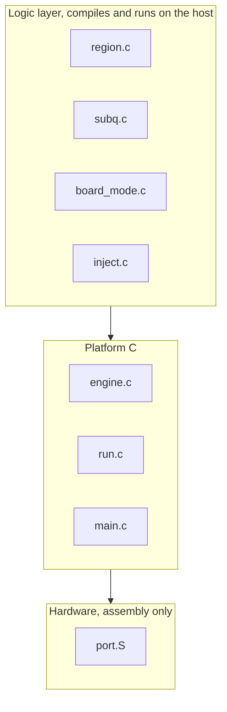
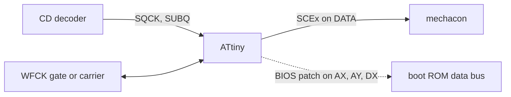

<div align="center">

# openscex-modchip

**初代ソニー PlayStation と PSone 向けのリージョン解除、ATtiny85 と ATtiny84 のための単一ファームウェア。**

[](https://github.com/gufranco/openscex-modchip/actions/workflows/ci.yml)
[](AGENTS.md)
[](LICENSE)

[English](README.md) | 日本語 | [中文](README.zh.md)

</div>

**572 B** ATtiny85 イメージ · **2** チップ、単一ソース · **3** リージョン · **8** コンソール区分 · MISRA C:2012 逸脱 **0** · ホスト行・分岐カバレッジ **100%** · 実機検証 **1** 台、PU-8 NTSC-U/C（SCEx）

```bash
git clone https://github.com/gufranco/openscex-modchip.git
cd openscex-modchip
make REGION=us                                        # ピン留め Docker ツールチェーンでビルド
avrdude -c <programmer> -p attiny85 -U flash:w:openscex-modchip-attiny85.hex:i
```

> [!IMPORTANT]
> SCEx リージョン解除は 1 台のコンソールで Verified です。PU-8 NTSC-U/C のフット機が ATtiny85 内蔵クロックビルドで 2026-10-05 にリージョン外起動しました。それ以外はすべてビルドされコンテナ内の全ゲートセットに合格しますが、まだ実機で確認していません。ブート ROM BIOS パッチの全モデル、外部クロックの経路、その他すべての基板ファミリとリージョンが該当します。各パッドの電圧と BIOS のタイミング値は測定されるまで Unknown のままです。以下のすべてのハードウェア事実は確度タグを持ちます。

## 機能

PlayStation はディスクのリードインに刻まれた物理的な指紋、すなわちウォブルグルーブを確認します。これは 4 文字のリージョン文字列（日本は SCEI、南北アメリカは SCEA、ヨーロッパは SCEE）にデコードされます。コンソールは期待する文字列を持つディスクしか起動しません。このモッドチップはコンソールが求める文字列を、コンソールが要求する窓の間だけ注入し、ディスク交換を検出すると再武装するので、リージョン外のディスクやバックアップディスクが起動します。

ビルドはリージョン固有で、設定された 1 つのリージョン文字列だけを、短いリージョンチェックの窓の間だけ送出し、それ以外のセッション中はデータ線をハイインピーダンスで沈黙させるので、プレイ中は電気的に沈黙します。リージョンはビルド時に `make REGION=jp|us|eu` で選びます（既定はアメリカ）。

チップはコンソールの必要に応じて選びます。ATtiny85 は最小かつ最低コストのビルドで、信号線 4 本と電源、任意のステータス LED が 1 つ、モードもリセットもフタ配線もありません。日本のフット機と PAL の PSone はブート ROM 内で 2 回目のリージョンチェックを行います。これらには ATtiny84 ビルドが追加ピンにブート ROM パッチを載せて対応し、最も古い二段階の SCPH-1000 と SCPH-3000 を含む全モデルをカバーします。

これは光学ドライブエミュレータではありません。ドライブを置き換えず、PS2 や Saturn には対応せず、LibCrypt のようなデータ層の保護は突破できません。

## 見どころ

<table>
<tr>
<td width="50%" valign="top">

### 2 チップ、単一ソース
同じファームウェアが 8 ピンの ATtiny85（SCEx のみ、最低コスト）と 14 ピンの ATtiny84（ブート ROM パッチを追加）向けにビルドされ、`MCU=` で選択します。

</td>
<td width="50%" valign="top">

### 構造としてのステルス
設定された 1 つのリージョン文字列を、SUBQ リージョンチェックの窓の間だけ、武装ごとに上限付きで送出し、その後はセッションの残りの間 DATA をハイ Z、LED をオフに保ちます。

</td>
</tr>
<tr>
<td width="50%" valign="top">

### 完全なリージョン解除
PU-7 から PM-41(2) までの全基板ファミリで SCEx を行い、さらに日本のフット機と PAL の PSone 向けにブート ROM BIOS パッチを、二段階の SCPH-1000 と SCPH-3000 を含む全モデルで行います。

</td>
<td width="50%" valign="top">

### 基板の自動検出
ひとつのビルドが全ファミリに適合します。ファームウェアは起動時に WFCK の挙動を読み、旧来の静的ゲートと PU-22 以降のライブキャリアを見分けます。基板別の派生はありません。

</td>
</tr>
<tr>
<td width="50%" valign="top">

### ハードウェアなしで検証
行・分岐カバレッジ 100% のホストテスト、発振器許容帯域全体にわたる simavr コンソールモデル、ミューテーションテスト、バイト単位で同一の再現可能ビルド。

</td>
<td width="50%" valign="top">

### MISRA C:2012、逸脱ゼロ
C17 でレジスタをアセンブリに限定し、ピン留めした Docker ツールチェーンで検査するので、あらゆるビルド、解析、テストが同一に走ります。

</td>
</tr>
</table>

## 課題と工学的なギャップ

リージョンロックとその回避策は数十年のコミュニティの知識であり、PsNee はほとんどの施工が土台にする現代のオープンソース統合です。既存のどの PS1 チップにもないのは、ホストテスト、シミュレーションモデル、固定標準での静的解析、再現可能ビルドです。これらの注入と BIOS パッチのタイミングは経験的な定数とコンパイラ依存の遅延に依っています。本プロジェクトの貢献はその工学的品質であり、プロトコルの新規性ではありません。プロトコルは PsNee から読み取り、下記のとおり謝辞を記します。

| 能力 | openscex-modchip | PsNee | 旧来のチップ |
|:-----|:----------------:|:-----:|:-----------:|
| プロトコル範囲 | SCEx + BIOS パッチ | SCEx + BIOS（ATmega のみ） | SCEx のみ |
| ホストテスト | あり | なし | なし |
| シミュレーションモデル | あり | なし | なし |
| MISRA C:2012 | あり、逸脱 0 | なし | なし |
| 再現可能ビルド | あり | なし | なし |
| 実機で実証済み | なし | あり | あり |

最後の行が正直な取引です。本プロジェクトは PsNee のプロトコルをより高い工学的品質で満たしますが、PsNee には本プロジェクトがまだ持たない数年分の実地実証があります。

## アーキテクチャ

3 つの層により、プロトコルロジックはホストでテストされ、レジスタアクセスだけがハードウェアに触れます。ロジックファイルがプラットフォームに達するか、C ファイルがハードウェアヘッダを含むと、層チェックがビルドを失敗させます。



基板上の信号の流れ。SCEx 注入はすべてのビルドにあり、BIOS パッチの経路は ATtiny84 のみです。



ロジック層は [`src/inject.c`](src/inject.c) とその仲間にあり、レジスタアクセスは [`src/port.S`](src/port.S) に隔離され、基板からピンへの対応は [`include/port/registers.h`](include/port/registers.h) の唯一のプロファイルです。

## 確度タグ

本書のすべてのハードウェア事実は 1 つのタグを持ち、測定していないものを測定済みとして示すことはありません。

| タグ | 意味 |
|:-----|:-----|
| Read | 一次資料、とりわけ PsNee のソースおよび consolemods と psdevwiki の資料から直接得たもの |
| Concluded | 資料から推論したもので、いずれの資料も明言していないもの |
| Verified | 本プロジェクトが実機またはシミュレーションモデルで確認したもの |
| Unknown | どの資料も示しておらず、実機で測定する必要があるもの |

MCU のピン割り当ては PsNee から Read であり、実地で実証済みのマップとして所有者が確認しています。コンソール側のタップ点は信号レベルで Read であり、PsNee と Mayumi の施工で実地実証済みですが、正確なメカコンのピン番号はフォーラムからの中継であり、基板図で再確認するまで Unknown とします。各パッドの電圧はどこでも Unknown で、測定が必要です。BIOS パッチのタイミングは PsNee から Read であり simavr で機械的に動作確認していますが、実機では決して Verified ではありません。SCEx リージョン解除は 1 台の PU-8 NTSC-U/C コンソールで Verified です（2026-10-05）。他の基板ファミリ、リージョン、BIOS パッチはまだ Verified ではありません。

## まず安全

> [!CAUTION]
> コンソールを開けて CD サブシステムにはんだ付けすると、破壊する恐れがあります。これは自己責任で組むプロジェクトです。

- 配線前に、すべてのタップ点で論理電圧を測定しなければなりません。各パッドの電圧を示す資料はないため Unknown です。フット機はおおよそ 5 V、PSone の PM-41(2) はより低くノイズに敏感と想定しますが、想定は測定ではありません。
- 測定前にコンソールの信号をクロックピンへ入力してはいけません。

## どのコンソールにどのビルドか

チップとビルドノブはコンソールから選びます。BIOS モデルはコンソールの実際の BIOS バージョンに従い、これは SCPH 番号よりも重要です。

| コンソール | 基板 | リージョン | `MCU` | `REGION` | `BIOS` | 配線 |
|:-----------|:-----|:-----------|:------|:---------|:-------|:-----|
| フット US/カナダ、SCPH-100x1/550x1/700x1/900x1 | PU-7 から PU-23 | us | `attiny85` | `us` | `none` | SCEx、4 本 |
| フット PAL、SCPH-100x2/550x2/900x2 | PU-8 から PU-22 | eu | `attiny85` | `eu` | `none` | SCEx、4 本 |
| PSone US/カナダ、SCPH-101 | PM-41 / PM-41(2) | us | `attiny85` | `us` | `none` | SCEx、4 本 |
| PSone PAL、SCPH-102 | PM-41 / PM-41(2) | eu | `attiny84` | `eu` | `scph_102` | SCEx + BIOS パッチ |
| PSone 日本、SCPH-100 | PM-41 | jp | `attiny84` | `jp` | `scph_100` | SCEx + BIOS パッチ |
| フット日本、SCPH-5000/5500/3500 | PU-18 / PU-8 | jp | `attiny84` | `jp` | `scph_3500_5500` | SCEx + BIOS パッチ |
| フット日本、SCPH-7000/7500/9000 | PU-20 から PU-23 | jp | `attiny84` | `jp` | `scph_7000_9000` | SCEx + BIOS パッチ |
| フット日本、SCPH-3000 | PU-8 | jp | `attiny84` | `jp` | `scph_3000` | SCEx + 二段階 BIOS パッチ |
| フット日本、SCPH-1000 | PU-7 | jp | `attiny84` | `jp` | `scph_1000` | SCEx + 二段階 BIOS パッチ |

例: PAL の PSone は `make MCU=attiny84 REGION=eu BIOS=scph_102`、US のフット機は `make REGION=us`（既定の ATtiny85）です。

> [!NOTE]
> 本ファームウェアが BIOS モデルでカバーしない既知の 2 例: アジア向けモデル（SCPH-xxx3、たとえば SCPH-5003/5903）は 2 回目チェックのない英語 ROM を持ちますが NTSC-J の CD コントローラにバックドアがないため SCEx だけでは不十分です。開発機（DTL-H120x、PU-9）は焼いたディスクをそのまま読むためチップは不要です。

## MCU のピン配置、各線がチップのどこに来るか

ピン割り当ては PsNee の実証済み ATtiny85（`ATTINY_X5`）マップで、PsNee `MCU.h` から Read し所有者が確認しているので、お使いの基板向けの既存の PsNee や Mayumi 施工ガイドがこのチップに一対一で一致します。ここに示す物理ピン番号は各部品の標準 PDIP ピン配置です。お使いの正確なパッケージについてはデータシートで確認してください。SOIC と QFN は番号が異なります。

### ATtiny85、8 ピン DIP、最小ビルド（SCEx のみ）

| DIP ピン | ポート | 信号 | 方向 | 接続先 |
|:-------:|:-----|:-----|:-----|:-------|
| 1 | PB5 | RESET | - | リセットのまま、未使用 |
| 2 | PB3 | LED | 出力、任意 | 抵抗経由でステータス LED のアノード、または未接続 |
| 3 | PB4 | WFCK | 入力および出力 | 旧基板ではゲート、PU-22 以降ではライブキャリア |
| 4 | GND | GND | - | コンソールのグランド |
| 5 | PB0 | SQCK | 入力 | CD デコーダからの SUBQ シリアルクロック |
| 6 | PB1 | SUBQ | 入力 | CD デコーダからの SUBQ シリアルデータ |
| 7 | PB2 | DATA | 出力、ロー駆動またはハイ Z | メカコンへの SCEx 注入 |
| 8 | VCC | VCC | - | コンソールの 5 V、先に測定 |

### ATtiny84、14 ピン DIP、フルビルド（SCEx とブート ROM BIOS パッチ）

SCEx 信号は 85 と同じ並びで PORTA に載るので配線はそのまま移せます。余ったピンが BIOS パッチを担い、日本のフット機と PAL の PSone でのみ配線します。

| DIP ピン | ポート | 信号 | 方向 | 接続先 |
|:-------:|:-----|:-----|:-----|:-------|
| 1 | VCC | VCC | - | コンソールの 5 V、先に測定 |
| 2 | PB0 | - | - | 未使用、外部クロックを有効化する場合の XTAL1 入力 |
| 3 | PB1 | - | - | 未使用、XTAL2 |
| 4 | PB3 | RESET | - | リセットのまま、未使用 |
| 5 | PB2 | AX | 入力 | BIOS パッチ: 1 本目のブート ROM アドレス線、パルスを計数 |
| 6 | PA7 | - | - | 未使用 |
| 7 | PA6 | AY | 入力 | BIOS パッチ: 2 本目のアドレス線、二段階モデルのみ、SCPH-1000/3000 |
| 8 | PA5 | DX | 出力、ロー駆動またはハイ Z | BIOS パッチ: ブート ROM データバスのオーバーライド |
| 9 | PA4 | LED | 出力、任意 | 抵抗経由でステータス LED のアノード、または未接続 |
| 10 | PA3 | WFCK | 入力および出力 | 旧基板ではゲート、PU-22 以降ではライブキャリア |
| 11 | PA2 | DATA | 出力、ロー駆動またはハイ Z | メカコンへの SCEx 注入 |
| 12 | PA1 | SUBQ | 入力 | CD デコーダからの SUBQ シリアルデータ |
| 13 | PA0 | SQCK | 入力 | CD デコーダからの SUBQ シリアルクロック |
| 14 | GND | GND | - | コンソールのグランド |

SCEx のみのコンソールでは、ATtiny84 は 85 と同じ 4 信号（SQCK、SUBQ、DATA、WFCK）に電源と任意の LED を加えて使い、AX、AY、DX は未接続のままにします。LED は常に任意で、取り付けてもしなくてもファームウェアは正しく動きます。

## コンソール側のタップ点、各線が基板のどこに来るか

DATA 線が SCEx ビットストリームを運び、ゲートまたはキャリア線（WFCK）がそれを有効化またはクロックします。これらは確立された PsNee と Mayumi のタップ点で、consolemods.org と psdevwiki.com に記載され、実地で実証済みです。基板ファミリは自動検出されるのでチップは同一で、ファミリごとに異なるのはタップ点だけです。

| 基板ファミリ | SCPH 世代 | DATA 注入点 | ゲートまたはキャリア（WFCK） | 確度 |
|:-------------|:----------|:------------|:-----------------------------|:-----|
| PU-7、PU-8 | 1000-5003 | 復調したウォブル NRZ シリアルをメカコンへ、歴史的に "point 6" | WFCK を静的ハイに保持 | Read、正確な点はフォーラム断片、基板で確認のこと |
| PU-18、PU-20 | 550x-750x | カスタムウォブル ASIC のデジタル NRZ 出力をメカコンへ | WFCK 静的ゲート | Read |
| PU-22、PU-23 | 7500-900x | WFCK を疑似キャリアとして CD プロセッサのトラッキング線へ、三線プラスリンク方式 | WFCK ライブクロック、同期が必要 | Read |
| PM-41、PM-41(2) | PSone 100-103 | 同じトラッキング線キャリア方式、PM-41(2) ではピックアップノイズのためアイドル時にチップ I/O をフロート | WFCK ライブクロック | Read |

SUBQ と SQCK のメカコンピンは、psxdev.net が 2025 年 10 月以降オフラインのためフォーラムからの中継であり Unknown とします。PU-22 以降では SUBQ がメカコンのピン 24、SQCK がピン 26。PU-7 と初期 PU-8 では SUBQ がピン 39、SQCK がピン 41。切断前に consolemods の基板図で確認してください。

### BIOS パッチのタップ点（ATtiny84 のみ）

日本のフット機や PAL の PSone では SCEx だけではブート ROM のリージョンチェックを満たせないため、ATtiny84 のパッチはブート ROM のアドレス線（AX）のパルスを計数し、データバス線（DX）を短時間オーバーライドし、最も古い 2 モデルでは 2 本目のアドレス線（AY）を計数してから 2 回目のオーバーライドを行います。MCU 側のピンは固定で上表のとおりであり、[`src/bios.c`](src/bios.c) と [`src/port.S`](src/port.S) が駆動します。AX、AY、DX のコンソール側パッドは基板および BIOS リビジョンごとに異なり、本プロジェクトに検証済みのパッド対応を与える公開資料はありません。お使いの正確なモデルについて PsNee の配線メモと consolemods の基板図で特定し、どの BIOS パッチ施工も起動するまで未確認として扱ってください。パッチのタイミングは PsNee から移植したもので、ここでは実機で確認していません。

## 設定

ひとつのソースが全派生をビルドします。ビルドノブは `make` に渡します。

| ノブ | 値 | 既定 | 選ぶもの |
|:-----|:---|:-----|:---------|
| `MCU` | `attiny85`、`attiny84` | `attiny85` | 8 ピン（SCEx のみ、最低コスト）または 14 ピン（BIOS パッチを追加） |
| `REGION` | `jp`、`us`、`eu` | `us` | チップが送出する 1 つのリージョン文字列、すなわちコンソール自身のリージョン |
| `CLOCK` | `internal`、`external` | `internal` | 内蔵 8 MHz 発振器、またはコンソール自身のクロック（`CLOCK=external EXT_F_CPU=<hz>`）、そのクロックとピン電圧を先に測定することが前提 |
| `BIOS` | `none`、`scph_102`、`scph_100`、`scph_7000_9000`、`scph_3500_5500`、`scph_1000`、`scph_3000` | `none` | ATtiny84 のみ: そのコンソールの BIOS バージョンに合わせたブート ROM パッチ |

ステータス LED は常に任意です。ステルス、単一リージョン注入、ディスク交換の再武装はすべてのビルドに入っています。既定以外のリージョンは成果物名にタグを付けます。たとえば `openscex-modchip-attiny85-jp.hex` です。

## クイックスタート

### 前提ツール

| ツール | 用途 | 入手 |
|:-------|:-----|:-----|
| Docker | ピン留めツールチェーンを実行、あらゆるビルド・検査・テストはその中で行う | [docker.com](https://www.docker.com) |
| Git | リポジトリのクローン | [git-scm.com](https://git-scm.com) |
| avrdude | ビルドしたイメージをチップへ書き込む、ホストで動く唯一の工程 | [github.com/avrdudes/avrdude](https://github.com/avrdudes/avrdude) |

### ビルドと書き込み

```bash
git clone https://github.com/gufranco/openscex-modchip.git
cd openscex-modchip
make REGION=us                                        # ATtiny85、アメリカ、内蔵クロック
make MCU=attiny84 REGION=eu BIOS=scph_102             # PAL PSone、ブート ROM パッチ付き
avrdude -c <programmer> -p attiny85 -U flash:w:openscex-modchip-attiny85.hex:i
```

Arduino as ISP を含め、どの ISP でも使えます。ファームウェアは起動時にクロックプリスケーラを 1 分周へ戻すので、工場出荷の CKDIV8 ヒューズはタイミングを変えません。シミュレーションで検証した唯一のビルド、内蔵 8 MHz RC のヒューズ: low `0xE2`、high `0xDF`、extended `0xFF`。

> [!WARNING]
> 外部クロックビルドは未検証でハードウェア前提です。測定したメカコン周波数でビルドします、`make CLOCK=external EXT_F_CPU=<hz>UL`; 成果物名に `-extclk` が付きます。候補周波数は 4.2336 MHz（16.9344 MHz の 4 分周）ですが、断片から Concluded であり測定値ではありません。外部クロックのヒューズビットは測定周波数に依存し、チップのデータシートから読む必要があります。クロックピンの電圧を測定する前に外部クロックヒューズを書き込んではいけません。

### 検証

```bash
make test        # ホストテスト、simavr コンソールモデル、静的解析、MISRA
make repro       # 2 回のフレッシュビルドがバイト単位で同一
make mutate      # ロジック層のミューテーションテスト
```

同じゲートが push と pull request のたびに CI でも走ります。定義は [`.github/workflows/ci.yml`](.github/workflows/ci.yml) にあります。

## 設計方針

- 移植性のある層状の C: ホストでテスト可能なロジック層、薄いプラットフォーム層、アセンブリに隔離したレジスタアクセス。これによりプロトコルロジックをハードウェアなしでテストします。
- 由来を明記したタイミング: すべてのタイミング定数は、測定したビットセル、データシートの数値、またはシミュレーションに辿れ、導出なしに他チップから写すことはありません。
- 主張の前に検証: フルカバレッジのホストテスト、発振器許容帯域全体のシミュレーション、ミューテーションテスト、ピン留めツールチェーンからの再現可能ビルド、そして実機でしか決着しない主張を文書化。
- ハードウェアが許す場合はコンソールからタイミングを導出し、Mayumi の設計のように精度を上げます。
- 安価、スルーホール優先、真にオープンソースで、ツリーに専有 ROM コンテンツを含みません。

## ドキュメント

- [`AGENTS.md`](AGENTS.md): このリポジトリで作業する全員のための契約とハードルール。

この README がプロジェクト説明、配線、書き込み手順の唯一の真実の源です。完全な仕様、ハードウェアモデル、調査資料、決定記録は、公開ツリーの外に置く開発資料です。

## 先行研究と謝辞

ここでのプロトコルと互換性の知識は、数十年のコミュニティの仕事を統合したものです。Old Crow のオープンソースチップ、Mayumi と MM3 の系譜、OneChip、そしてとりわけ PsNee、その源が一次プロトコル参照である現代のオープンソース統合です。本プロジェクトの貢献はプロトコルの新規性ではなく技術的品質です。出典は調査文書で主張ごとに引用しています。

## ライセンス

ファームウェアとドキュメントは参照プロジェクトに合わせて [MIT](LICENSE) です。第三者のソースは研究するものであり写しません。調査は設計に反映しますが、禁じるライセンスから実装を取り込むことはありません。
