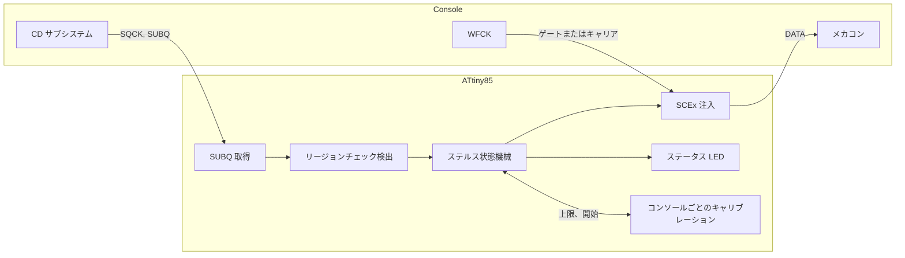
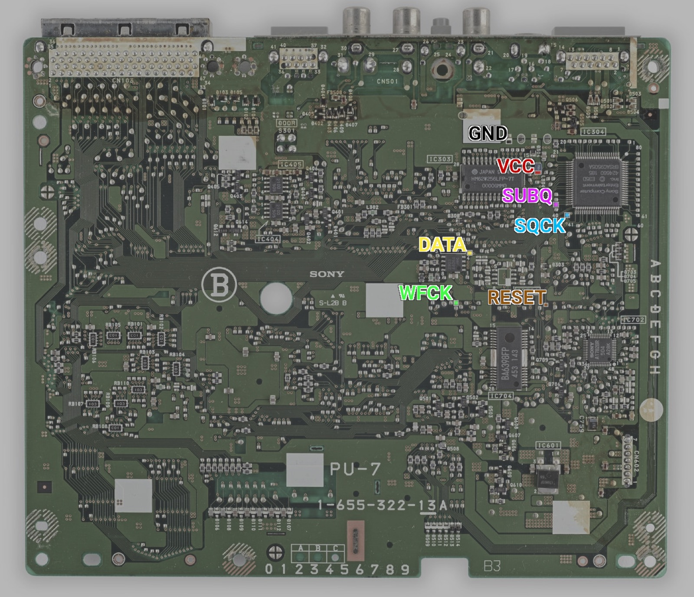
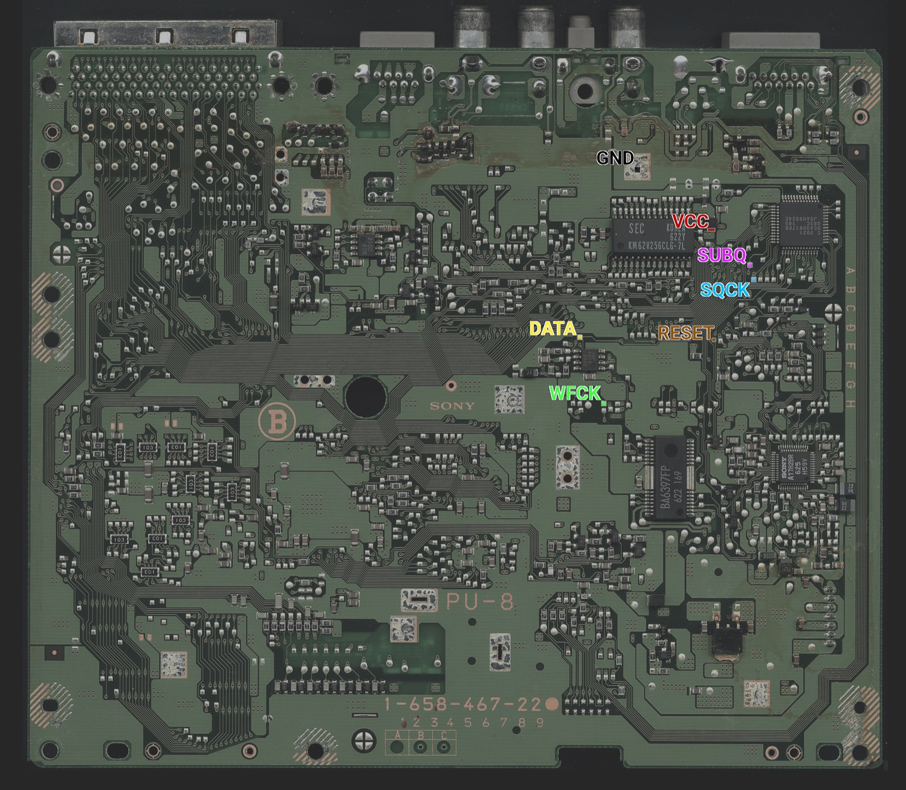
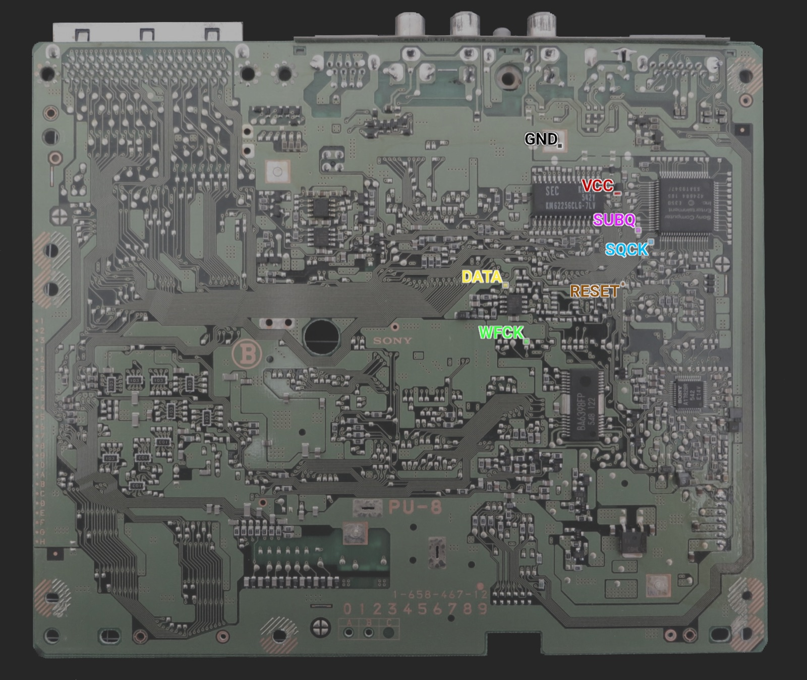
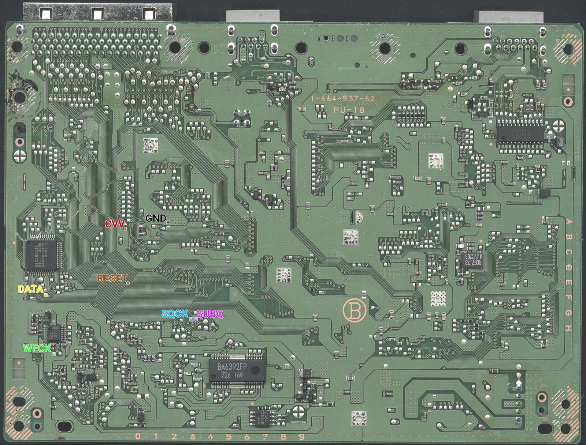
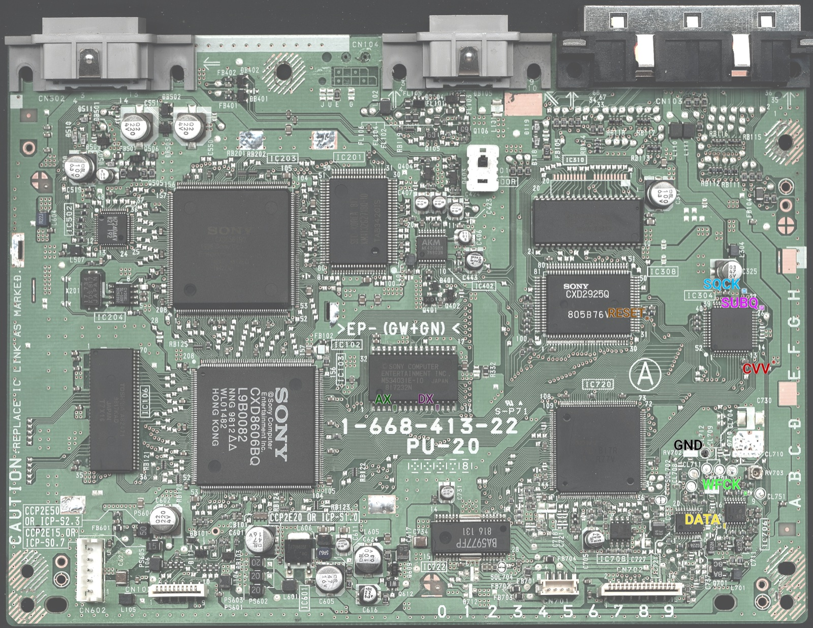
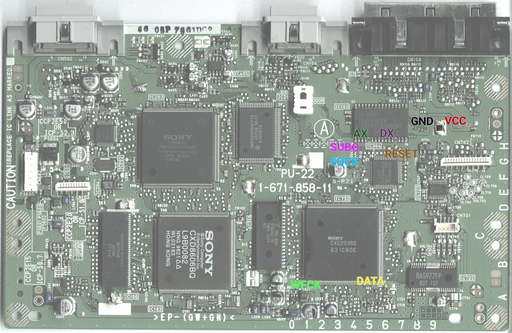
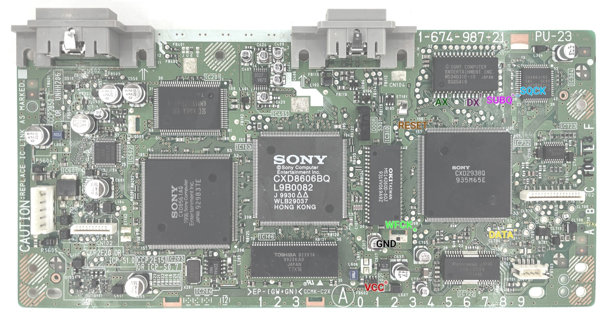
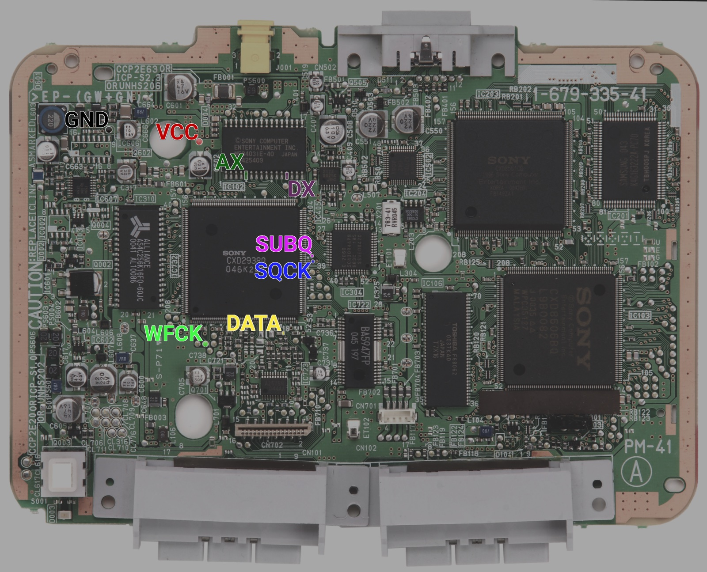
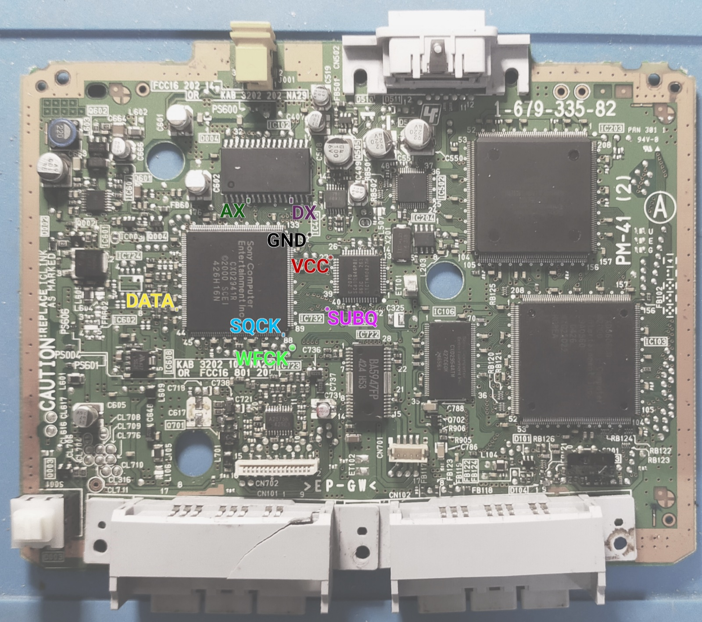

[English](README.md) | 日本語 | [中文](README.zh.md)

<div align="center">

<h1>openscex-modchip</h1>

<strong>PlayStation と PSone のためのステルス SCEx リージョン解除。コンソールに合わせて自分のクロックを補正する ATtiny85 に載ります。</strong>

<br><br>

[](https://github.com/gufranco/openscex-modchip/actions/workflows/ci.yml)
[](https://github.com/gufranco/openscex-modchip/releases)
[](AGENTS.md)
[](LICENSE)

</div>

<p align="center">
  <a href="#クイックスタート">クイックスタート</a> &nbsp;|&nbsp;
  <a href="#コンソールのタップ位置">配線</a> &nbsp;|&nbsp;
  <a href="#ステータス-led">ステータス LED</a> &nbsp;|&nbsp;
  <a href="../../issues/new?template=compatibility.yml">あなたの機種を報告</a>
</p>

フラッシュ **6022** バイト · 基板 **8** 系統、PU-7 から PM-41(2) · リージョン **3** 種 · MISRA 逸脱 **0** · ホストの行と分岐カバレッジ **100%** · ミュータント **151/151** 撃破

```bash
gh release download --repo gufranco/openscex-modchip --pattern 'openscex-modchip-attiny85.hex' --pattern SHA256SUMS
sha256sum -c SHA256SUMS --ignore-missing
avrdude -c <programmer> -p attiny85 -U flash:w:openscex-modchip-attiny85.hex:i
```

> [!IMPORTANT]
> 現在のファームウェアはシミュレーションのゲートをすべて通過していますが、まだ実機では動かしていません。配線前にタップ位置の電圧を測ってください。

初代ソニー PlayStation（フット機）と PSone 向けのリージョン解除ファームウェアで、内蔵発振器で動き、それをコンソール自身の SUBQ フレームレートに合わせて補正する ATtiny85 に載ります。設定されたリージョン文字列を SUBQ リージョンチェックの窓の間だけ送り、コンソールが受け入れた瞬間に止め、プレイ中はデータ線をハイインピーダンスに保ちます。蓋線は不要です。ドライブが止まって SUBQ が静かになることで、ディスク交換を知ります。ブート ROM はパッチしないため、日本のフット機と PAL の PSone は 2 回目のリージョンチェックを残します。それを回避したい場合はパッチ済み BIOS を入れてください。光学ドライブエミュレータではなく、PS2 やサターンには対応せず、LibCrypt も回避しません。

| | |
|:--|:--|
| **受け入れ後は沈黙**<br>最初のプログラム領域フレームで注入を止め（文字列の途中でも）、ディスクが取り出されるまで再読み取りの間も沈黙します。 | **蓋線なしのディスク交換**<br>ドライブが 1.5 s 静かになることを交換とみなし、マルチディスクのゲームの全ディスクに向けて再武装します。 |
| **自己補正のタイミング**<br>チップはコンソールの 75 Hz の SUBQ フレームを計時し、内蔵発振器を約 1% 以内に補正します。クロック線は不要です。 | **1 リージョン、1 つの窓**<br>設定したリージョン文字列だけを、SUBQ リージョンチェックの窓の間だけ、武装ごとに最大 16 回。 |
| **ステータス LED コード**<br>LED 1 個で起動の各段階、ディスクごとの結果、配線の異常を点滅回数で示し。 | **コードで実証**<br>MISRA C:2012 準拠、ホストカバレッジ 100%、simavr コンソールモデル、ミューテーションテスト、バイト一致の再ビルド。 |

## 仕組み



## 他のチップとの比較

| 能力 | openscex | PsNee V9 | Mayumi V4 | MM3 |
|:-----|:---------|:---------|:----------|:----|
| ステルスの契機 | SUBQ チェック窓と受け入れラッチ | SUBQ デコード | センス線と蓋線 | Mayumi V4 と同じプログラム |
| ディスク交換の検出 | ドライブ停止中の SUBQ の沈黙 | SUBQ カウンタの減衰 | 蓋線 | 蓋線 |
| クロック | 内蔵、SUBQ で補正 | 内蔵 | コンソール | 内蔵 RC |
| ブート ROM の BIOS パッチ | なし、パッチ済み BIOS を使う | あり、ATmega 版 | なし | なし |
| 基板 | PU-7 から PM-41(2) | PU-7 から PM-41(2) | PU-18 以降 | PU-7 以降 |
| 診断 | LED の段階と結果コード | シリアルデバッグ | なし | なし |
| コンソールごとの学習 | 文字列の上限と開始位置 | なし | なし | なし |
| テストと静的解析 | ホスト、simavr、ミューテーション、MISRA | なし | なし | なし |
| 実績 | 2 基板、以前のファームウェア | 数年 | 数十年 | 数十年 |

## 概要

| 項目 | 値 |
|:-----|:---|
| 対象機種 | PlayStation フット機 PU-7 から PU-23、PSone PM-41 と PM-41(2) |
| MCU | ATtiny85（8 ピン DIP） |
| 方式 | SCEx 注入 |
| リージョン | ビルドごとに 1 つ、`REGION=jp|us|eu`（既定 us） |
| クロック | 内蔵 8 MHz RC 発振器。コンソールの SUBQ フレームレートで補正 |
| 配線 | 信号 4 本（SQCK、SUBQ、DATA、WFCK）と電源、LED は任意 |
| ツールチェーン | C17、MISRA C:2012 逸脱ゼロ、バージョン固定の Docker イメージ |

## 実機で検証済み

実機でリージョン外のディスクが起動した組み合わせ（SCEx リージョン解除）、2026-10-05 時点のファームウェア。

| 基板 | 機種 | クロック | 注入 | 状態 |
|:-----|:-----|:---------|:-----|:-----|
| PU-18 | フット機、NTSC-U/C | コンソール | SCEx | Verified 2026-10-05 |
| PM-41 | PSone | コンソール | SCEx | Verified 2026-10-05 |

これらの結果は現在の設計より前のものです。蓋線なしで SUBQ から見るディスク交換、補正付きの内蔵発振器、受け入れラッチ、上限付きの SUBQ 待ち、2026-10-06 以降の全変更を含みません。現在のファームウェアはシミュレーションのゲートをすべて通過していますが、まだ実機では動かしていません。2026-10-05 のコンソールクロック版を載せたチップ、各個体の正確な SCPH、ビルド時の周波数は記録されていません。実機未確認: PU-7、PU-8、PU-20、PU-22、PU-23、PM-41(2)、どの基板でも PAL と NTSC-J。

機種ごとの検証はコミュニティで進めます。あなたの機種で試しましたか？ [互換性レポート](../../issues/new?template=compatibility.yml)を開いてください。確認された取り付けでこの表が育ちます。

## 含まれるもの

| 機能 | 内容 |
|:-----|:-----|
| SCEx 注入 | 44 ビット LSB ファーストのリージョン文字列。PU-7 から PU-20 の静的ゲート方式（PsNee と Mayumi V4 と同じく文字列ごとに WFCK ゲートを Low に保持）と、PU-22 以降の WFCK キャリア方式 |
| 基板の自動判別 | 起動時の WFCK の振る舞いでゲートかキャリアかを選ぶ。1 つのビルドが全基板に合う |
| 発振器の補正 | チップは内蔵 8 MHz 発振器で動き、コンソールの 75 Hz の SUBQ フレームを計時して OSCCAL を 1 段ずつ動かし、1% 以内に入るまで補正する。工場値から 16 段を超えては動かさない。補正値は EEPROM に保存し、起動時に適用する |
| ディスク交換 | 蓋線は不要。止まったドライブが生む 1.5 s の有効な SUBQ フレームの途絶で受け入れラッチを解き、次のディスクに向けて再武装する。回転中のディスクのシークや再読み取りはフレームを出し続けるので、交換とはみなされない |
| ステルス | SUBQ リージョンチェックの窓の間だけ、武装ごとに上限付きで、PsNee と Mayumi V4 と同じく文字列の間に 5 フレーム、67 ms 空けて注入し、その後 DATA をハイ Z、LED をオフ。コンソールがプログラム領域を読んだ瞬間に止め、ディスクが取り出されるまでは以後のリードイン読み取りでも沈黙 |
| 単一リージョン | `REGION` だけを送り、3 つ全部は送らない |
| 適応タイミング | WFCK キャリアの基板では注入ビットを WFCK の周期を数えて計時する。`TIMING=fixed` は補正済み発振器で計時した遅延を使う |
| 自己回復 | 各 SUBQ 取得はフレーム間の隙間で再同期し、30 ms で諦める。注入中に WFCK キャリアが止まるとウォッチドッグが DATA を解放する。未使用のピンはすべてプルアップを有効にし、浮かないようにする |
| ステータス LED | 専用ピンの任意の LED が起動の段階、ディスクごとの結果、現在の異常を点滅回数で示す。ファームウェアは LED を待たず、LED が無くても正しく動く |
| 現場診断 | プログラマ不要。LED のコードが、クロックが来ない SUBQ からリージョンチェックが来ない SUBQ まで、失敗した段階を示す。プログラマで読み出すものは無い |
| コンソールごとのキャリブレーション | このコンソールが必要とする文字列数、どこまで遅く始められるか、自分の発振器の速さを学び、7 バイトの EEPROM レコードに保存する。無いか壊れていれば既定値に戻る |
| 閉ループ確認 | 注入後、SUBQ でプログラム領域のフレーム（実在のトラック番号）を待つ。メカコンはリージョン文字列を受け入れた後でしかそれを許さないので、リージョンチェックが通ったかを示す |
| 検証 | ホストテストの行と分岐カバレッジ 100%、速い発振器と遅い発振器も含む simavr コンソールモデル、ミューテーションテスト、再現可能ビルド |

## 確度タグ

| タグ | 意味 |
|:-----|:-----|
| Read | 一次資料から取得（PsNee のソース、Mayumi V4 のバイナリ、quade.co、consolemods、psdevwiki、ATtiny25/45/85 のデータシート） |
| Concluded | 資料から推論したもので、どれか 1 つが述べているわけではない |
| Verified | 本プロジェクトが実機または simavr モデルで確認 |
| Unknown | どの資料にもない。実機で測ること |

| 事実 | タグ |
|:-----|:-----|
| SCEx のピン順 | Read（PsNee `MCU.h`）、実績ありとオーナー確認済み |
| SUBQ の沈黙から見るディスク交換 | Concluded: 蓋を開けるとドライブが止まり、有効なモード 1 フレームが止まる。1.5 s の上限は設計上の選択で、実機まで Unknown |
| 内蔵発振器の精度 | Read: 工場校正 ±10%、ユーザー校正 ±1%（ATtiny25/45/85 データシート、Table 21-2）。コンソール上で補正がそこに達するかは Unknown |
| SQCK と SUBQ のタップ位置 | Read、対応する全基板の PsNee の写真に表示。その裏のメカコンのピン番号は Unknown のまま |
| パッドごとの電圧 | PsNee と Mayumi の取り付けから Concluded（フット機は約 5 V、PSone は低めでノイズに敏感）。測って確認 |
| PU-18 と PSone での SCEx 解除 | 以前のファームウェアで Verified 2026-10-05（上の表を参照） |

## 機種ごとのビルド

| 機種 | 基板 | `REGION` | 2 回目のリージョンチェック |
|:-----|:-----|:---------|:---------------------------|
| フット US/カナダ、SCPH-1001 | PU-8 | `us` | なし |
| フット US/カナダ、SCPH-550x1/700x1/900x1 | PU-18 から PU-23 | `us` | なし |
| フット PAL、SCPH-1002 | PU-8 | `eu` | なし |
| フット PAL、SCPH-550x2/900x2 | PU-18 から PU-22 | `eu` | なし |
| PSone US/カナダ、SCPH-101 | PM-41 / PM-41(2) | `us` | なし |
| PSone PAL、SCPH-102 | PM-41 / PM-41(2) | `eu` | ブート ROM 内。パッチ済み BIOS が必要 |
| PSone 日本、SCPH-100 | PM-41 | `jp` | ブート ROM 内。パッチ済み BIOS が必要 |
| フット日本、SCPH-1000/3000/3500/5000/5500/7000/7500/9000 | PU-7 から PU-23 | `jp` | ブート ROM 内。パッチ済み BIOS が必要 |
| アジア、SCPH-xxx3 | 未記録 | `jp` | なし |
| アジア ビデオ CD、SCPH-5903 | 未記録 | `jp` + `VCD_FILTER=on` | なし |

PU-7 と PU-8 は PU-18 と PU-20 と同じ静的ゲート方式で、PsNee V9.0 もそれらで同じ方式を使います。PsNee は SCPH-1000 と SCPH-3000 も、2 回目のチェックに BIOS パッチが必要な機種に挙げています（Read: PSNee.ino:33-38）。ブート ROM のチェックはこのチップでは扱いません。上で示した機種では、パッチ済み BIOS を入れるまで輸入ソフトが拒否されることがあります。アジア向けモデルはパッチ不要です。PsNee V9.0 は SCPH-xxx3 と SCPH-5903 を NTSC-J の文字列だけで対象にしています。SCPH-5903 はビデオ CD も再生するため、そのビルドには `VCD_FILTER=on` を加え、注入をゲームのリードインでのみ起動し、ビデオ CD では起動しません。アジア向けのどちらの行もここではまだ実機で確認していません。開発機（DTL-H120x、PU-9）は焼いたディスクをそのまま読むためチップ不要です。

## 設定

ひとつのソースから全バリアントをビルドします。ノブは `make` に渡します。

| ノブ | 値 | 既定 | 選ぶもの |
|:-----|:---|:-----|:---------|
| `REGION` | `jp`、`us`、`eu` | `us` | チップが送る唯一のリージョン文字列 |
| `TIMING` | `adaptive`、`fixed` | `adaptive` | adaptive は WFCK キャリアの注入ビットを WFCK の周期を数えて計時する。fixed はコンパイル時の遅延を使い、これは補正済みの内蔵発振器で計時する |
| `VCD_FILTER` | `off`、`on` | `off` | SCPH-5903 専用で on。注入はゲームのリードイン TOC でのみ起動し、ビデオ CD では起動しない。PsNee V9.0 の SCPH-5903 フィルタに準拠 |

既定以外のリージョンやフィルタは成果物名にタグを付けます。例 `openscex-modchip-attiny85-jp.hex` や `openscex-modchip-attiny85-jp-vcd.hex`。

## MCU ピン配置

4 本の SCEx 信号と LED は PsNee の実証済みの ATtiny85 の割り当てを保ちます（PsNee `MCU.h` から Read）。そのため PsNee の配線ガイドとピン単位で一致します。PB5 はリセットのままなので、チップは ISP で書き込めます。物理ピン番号は標準の 8 ピン PDIP 配置です。SOIC はデータシートで確認してください。

| DIP ピン | ポート | 信号 | 方向 | 接続先 |
|:--------:|:-------|:-----|:-----|:-------|
| 1 | PB5 | RESET | - | リセットのまま |
| 2 | PB3 | LED | 出力、任意 | 1 kΩ の抵抗経由の状態 LED、または付けない |
| 3 | PB4 | WFCK | 入出力 | 静的ゲート、または PU-22 以降のライブキャリア |
| 4 | GND | GND | - | コンソールのグランド |
| 5 | PB0 | SQCK | 入力 | SUBQ シリアルクロック |
| 6 | PB1 | SUBQ | 入力 | SUBQ シリアルデータ |
| 7 | PB2 | DATA | 出力、Low 駆動またはハイ Z | メカコンへの SCEx 注入 |
| 8 | VCC | VCC | - | コンソール電源、先に測る |

## コンソールごとのキャリブレーション

チップは取り付けられたコンソールがリージョン文字列をどう読むかを学び、その結果を 7 バイトの EEPROM レコードに保存するので、以降のディスクではデータ線を駆動する時間が短くなります。学習した値はどれも固定の既定値の方向にしか戻らないので、レコードが失われても壊れても別物でも、失うのはステルス性だけでディスクではありません。

| 値 | 学習元 | 効果 |
|:---|:-------|:-----|
| 文字列の上限 | 受け入れられたディスクが必要とした文字列数に 4 を足した数 | 以降のディスクは 16 本ではなくその本数まで。拒否されたディスクがあると次のディスクから 16 本に戻る |
| 開始位置 | 受け入れられたディスクごとに開始をリードインのフレーム 2 個分、27 ms 遅らせ、最大 20 フレームまで。`jp` ビルドは既定値のまま。PsNee が日本のコンソールでの遅いトリガーを戒めているため | 文字列がリージョンチェックの近くで始まる。拒否か、開始前にリードインの読み出しが終わると 2 フレーム戻し、探索を止める |
| 基板 | 起動時に判別した基板 | 基板が違えばコード 6 を 1 回示し、文字列の上限と開始位置をやり直す |
| 発振器 | コンソールの水晶が 75 Hz に刻むリードインのフレーム間隔 | 64 フレームごとに OSCCAL を 1 段動かし、1% 以内に入れる。補正はチップのものなので、基板が変わっても保つ |

チップは値が変わったバイトだけを、起動時かディスクのチェックが決着した後にだけ書き、文字列を送っている最中には書かないので、落ち着いたコンソールでは何も書きません。セルの書き換え寿命は 100,000 回です（Read: ATtiny25/45/85 データシート 2586Q）。チェックバイトが電源断で途中まで書かれたレコードを検出し、その場合は既定値として読みます。上記のどちらのヒューズ設定も EESAVE を未プログラムのままにするので、書き直すとレコードも消えます（Read: 同データシート、Table 20-4、ハイヒューズのビット 3）。4 本の余裕、2 フレームの刻み、20 フレームの上限は設計上の選択で、まだコンソールで調整していません。

## コンソールのタップ位置

すべての点が下の写真に名前付きで示されています。各基板で SQCK、SUBQ、DATA、WFCK、VCC、GND が表示されているので、各線は写真が示す位置にはんだ付けしてください。PU-18 の写真は基板の裏面です。AX、DX、RESET も表示されていますが PsNee のブート ROM パッチ用で、このチップにはないので接続しないでください。

<table>
<tr><td align="center" width="33%"><a href="assets/psnee/pu-7.jpg"></a><br><sub><b>PU-7</b>。写真: PsNee</sub></td><td align="center" width="33%"><a href="assets/psnee/pu-8a.jpg"></a><br><sub><b>PU-8</b>、1-658-467-22。写真: PsNee</sub></td><td align="center" width="33%"><a href="assets/psnee/pu-8b.jpg"></a><br><sub><b>PU-8</b>、1-658-467-12。写真: PsNee</sub></td></tr>
<tr><td align="center" width="33%"><a href="assets/psnee/pu-18.jpg"></a><br><sub><b>PU-18</b>。写真: PsNee</sub></td><td align="center" width="33%"><a href="assets/psnee/pu-20.jpg"></a><br><sub><b>PU-20</b>。写真: PsNee</sub></td><td align="center" width="33%"><a href="assets/psnee/pu-22.jpg"></a><br><sub><b>PU-22</b>。写真: PsNee</sub></td></tr>
<tr><td align="center" width="33%"><a href="assets/psnee/pu-23.jpg"></a><br><sub><b>PU-23</b>。写真: PsNee</sub></td><td align="center" width="33%"><a href="assets/psnee/pm-41.jpg"></a><br><sub><b>PM-41</b>。写真: PsNee</sub></td><td align="center" width="33%"><a href="assets/psnee/pm-41-2.jpg"></a><br><sub><b>PM-41(2)</b>。写真: PsNee</sub></td></tr>
</table>

この 9 枚の写真は kalymos とコントリビュータによる [PsNee](https://github.com/kalymos/PsNee) V9.0 のもので、[Unlicense](LICENSES/Unlicense.txt) でパブリックドメインに置かれており、縮小してここに複製しています。これで、チップのすべての配線に取り付け位置の画像があります。

| 基板 | SCPH 世代 | DATA 注入点 | WFCK の役割 | 確度 |
|:-----|:----------|:------------|:------------|:-----|
| PU-7、PU-8、PU-18、PU-20 | 1000-750x | ウォブル ASIC からメカコンへのデジタル NRZ 出力 | 静的ゲート | Read |
| PU-22、PU-23 | 7500-900x | CD プロセッサのトラッキング線、WFCK を偽キャリアに、3 線プラスリンク | ライブクロック、同期必須 | Read |
| PM-41、PM-41(2) | PSone 100-103 | 同じトラッキング線キャリア方式。PM-41(2) では待機中にチップの I/O を浮かせる | ライブクロック | Read |

クロック線も蓋線もありません。チップは自分の発振器で動き、ディスク交換を SUBQ から知るので、4 本の信号線が届く場所ならどこにでも置けます。線は短く保ってください。quade.co は Mayumi V4 の不具合を長い線が拾うノイズに帰しています。以前のリリース向けの取り付けは、2 番と 3 番ピンのクロック線と蓋線を残しても構いません。ファームウェアはそれらを駆動せずプルアップで保持しますが、外す方がすっきりします。

上の写真は対応する全基板で SQCK と SUBQ を示しているので、それに従ってください。フォーラムの伝聞による PU-22 以降のメカコンのピン番号、SUBQ が 24 番、SQCK が 26 番は、psxdev.net が 2025 年 10 月から停止中のため Unknown のままです。

## クイックスタート

機種別のビルド済み `.hex` は各[リリース](../../releases)に添付されるので、ツールチェーンを飛ばして下の `avrdude` 手順で書き込めます。各リリースには ATtiny85 のイメージ 3 種（`us`、`eu`、`jp`）、SCPH-5903 用イメージ（`jp-vcd`）、`SHA256SUMS` ファイル、ライセンス、ビルド来歴のアテステーションが付きます。v0.3.0 から v0.8.0 のリリースには ATtiny84 のイメージが、v0.2.0 までのリリースには以前の 4 線設計の ATtiny85 イメージが付いていました。書き込む前にダウンロードを確認してください:

```bash
sha256sum -c SHA256SUMS --ignore-missing
gh attestation verify openscex-modchip-attiny85.hex --repo gufranco/openscex-modchip
```

リリースはコミット履歴から自動でバージョンが付き、CI が通ったコミットからのみ作られます。`0.x` 系はファームウェアが実機検証前であることを示します。ソースからビルドする場合: ビルド、チェック、テストはすべてバージョン固定の Docker ツールチェーン内で `make` を通して実行し、ホストで動くのは `avrdude` だけです。

| ツール | 用途 |
|:-------|:-----|
| Docker | 固定ツールチェーンを動かす |
| Git | リポジトリを取得する |
| avrdude | イメージをチップに書き込む |

```bash
git clone https://github.com/gufranco/openscex-modchip.git
cd openscex-modchip
make REGION=us                                        # アメリカ
make REGION=jp VCD_FILTER=on                          # SCPH-5903
avrdude -c <programmer> -p attiny85 -U flash:w:openscex-modchip-attiny85.hex:i
avrdude -c <programmer> -p attiny85 -U lfuse:w:0xE2:m -U hfuse:w:0xDD:m -U efuse:w:0xFF:m
```

ISP は何でも使えます。Arduino as ISP も可。フラッシュを先に、ヒューズを最後に書きます。low ヒューズ `0xE2` は内蔵 8 MHz 発振器、緩やかな電源立ち上がり向けの起動遅延、クロック分周なしを選びます（Read: ATtiny25/45/85 データシート 2586Q、Table 6-6 と Table 6-7、CKSEL 0010、SUT 10）。そのためチップはプログラマだけで机上で読み出しも書き直しもできます。ファームウェアは起動時にクロックプリスケーラもクリアするので、CKDIV8 ヒューズで遅くなることはありません。書き直すとキャリブレーションレコードと発振器の補正も消え、チップが学び直します。

| ビルド | ヒューズ（low / high / extended） |
|:-------|:----------------------------------|
| 内蔵 8 MHz、2.7 V のブラウンアウト検出付き、推奨 | `0xE2` / `0xDD` / `0xFF` |
| 内蔵 8 MHz、ブラウンアウト検出なし | `0xE2` / `0xDF` / `0xFF` |

ブラウンアウト検出は電源が 2.7 V を下回る間チップをリセットに保つので、電源を切るときに崩れていく電源でチップが動くことはありません。実機ではまだ確かめていません。有効にしておいてください。速度グレード上、ATtiny85 は 2.7 V 以上で 0 から 10 MHz で動くので（Read: 同データシート。1.8 V まで下がれるのは ATtiny85V だけ）、2.7 V を下回るとチップは定格外です。

検証:

```bash
make test        # ホストテスト、simavr コンソールモデル、静的解析、MISRA
make repro       # 2 回の新規ビルドがバイト単位で一致
make mutate      # ロジック層のミューテーションテスト
```

同じゲートが push とプルリクエストごとに CI で走ります。定義は [`.github/workflows/ci.yml`](.github/workflows/ci.yml)。コントリビュータは `make hooks` を一度実行すると、コミットメッセージと整形のチェックをローカルで有効にできます。

## ステータス LED

LED は任意で、チップ唯一の診断手段です。いまどの段階にいるか、各ディスクがリージョンチェックを通ったか、問題があればどの配線を見るべきかを示します。どの機能も遅らせず妨げず、履歴も持たないので、コードは起動時の 2 つを除いて現在の状態です。

| 部品 | 選び方 |
|:-----|:-------|
| LED | 3 mm か 5 mm の赤、橙、黄、緑の LED、順方向電圧約 2 V。青や白は順方向電圧が 3 V あり、PSone の低めの電源では抵抗にほとんど電圧が残らないので不可 |
| 抵抗 | 1 kΩ、ワット数は問わない。5 V で約 3 mA、3.5 V で約 1.5 mA。室内では十分明るく、ピンの絶対最大定格 40 mA を大きく下回る（Read: ATtiny25/45/85 データシート 2586Q） |
| 配線 | 2 番ピン（PB3）から抵抗、抵抗から LED のアノード（長い足）、カソード（平らな側）を GND へ |

| 段階 | LED の動き |
|:-----|:-----------|
| 基板判別 | 電源投入後約 0.4 s 点灯 |
| 基板確定 | 静的ゲート基板（PU-18、PU-20）なら 300 ms の点滅 1 回、WFCK キャリア基板（PU-22 以降）なら 2 回 |
| ディスク待ち | 2 s ごとに 40 ms の短い点灯 |
| 注入中 | リージョン文字列 1 本ごとに 90 から 181 ms の点灯 |
| 結果 | コードを 3 回示し、その後プレイ中は消灯 |

コードは 700 ms の長い点灯を 300 ms 間隔で数え、2 s 休んでから繰り返します。

| コード | 意味 | 確認先 |
|:------:|:-----|:-------|
| 1 | コンソールがリージョン文字列を受け入れた | 何もしない、ディスクは動く |
| 2 | 文字列を送ったがコンソールがプログラム領域に達しなかった | DATA と WFCK の配線、ビルドのリージョンがディスクと合っているか |
| 3 | 電源投入後 5 s SUBQ フレームが無い。15 s 示してから鼓動の点滅に戻る | SQCK、SUBQ、電源と GND。ディスクが無いときも出る |
| 4 | フレームは来るが 20 s リージョンチェックが無い。続く間は繰り返す | SUBQ。音楽 CD でも正常に出る |
| 5 | ウォッチドッグがチップをリセットした。次の起動で 1 回示す | 注入中に止まった WFCK |
| 6 | 基板がキャリブレーションに保存したものと違う。起動時に 1 回示し、コード 5 が優先 | 不安定な WFCK の配線。チップを別のコンソールに移した場合を除く |

## 安全

- 配線前に、すべてのタップ位置の論理電圧を測ってください。値は確立した PsNee と Mayumi の取り付けから取っています（フット機は約 5 V、PSone PM-41(2) は低めでノイズに敏感）が、想定は測定ではありません。
- コンソールを開けて CD サブシステムにはんだ付けすると壊すことがあります。自己責任で作ってください。

## バージョニング

リリースは `0.x` 系の[セマンティックバージョニング](https://semver.org/)に従います。マイナーリリースでも互換性が壊れることがあり、v0.3.0 は ATtiny85 の 4 線設計を ATtiny84 に置き換え、v0.8.0 の次のリリースで、クロック線も蓋線も不要になった設計とともに ATtiny85 に戻りました。各リリースはタグ付けされ、CI が通ったコミットからビルドされます。注記は[リリース](../../releases)を参照してください。

## サポート

| 用件 | 窓口 |
|:-----|:-----|
| バグ報告 | [バグ用テンプレート](../../issues/new?template=bug.yml) |
| あなたの機種での結果 | [互換性レポート](../../issues/new?template=compatibility.yml) |
| セキュリティ報告 | [セキュリティポリシー](SECURITY.md)、非公開で報告 |
| 貢献 | [コントリビューションガイド](CONTRIBUTING.md) |

## ライセンス

ファームウェアとドキュメントは [MIT](LICENSE)。
