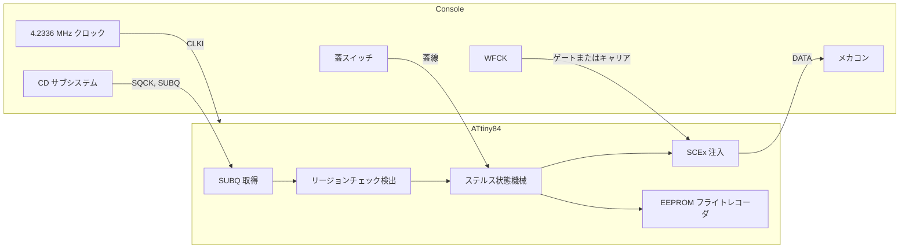

[English](README.md) | 日本語 | [中文](README.zh.md)

<div align="center">

<h1>openscex-modchip</h1>

<strong>PlayStation と PSone のためのステルス SCEx リージョン解除。コンソール自身のクロックで動く ATtiny84 に載ります。</strong>

<br><br>

[](https://github.com/gufranco/openscex-modchip/actions/workflows/ci.yml)
[](https://github.com/gufranco/openscex-modchip/releases)
[](AGENTS.md)
[](LICENSE)

</div>

<p align="center">
  <a href="#クイックスタート">クイックスタート</a> &nbsp;|&nbsp;
  <a href="#コンソールのタップ位置">配線</a> &nbsp;|&nbsp;
  <a href="#診断">診断</a> &nbsp;|&nbsp;
  <a href="../../issues/new?template=compatibility.yml">あなたの機種を報告</a>
</p>

フラッシュ **1220** バイト · 基板 **6** 系統、PU-18 から PM-41(2) · リージョン **3** 種 · MISRA 逸脱 **0** · ホストの行と分岐カバレッジ **100%** · ミュータント **48/48** 撃破

```bash
gh release download --repo gufranco/openscex-modchip --pattern 'openscex-modchip-attiny84.hex' --pattern SHA256SUMS
sha256sum -c SHA256SUMS --ignore-missing
avrdude -c <programmer> -p attiny84 -U flash:w:openscex-modchip-attiny84.hex:i
```

> [!IMPORTANT]
> ATtiny84 への再設計（v0.3.0）はシミュレーションのゲートをすべて通過していますが、まだ実機では動かしていません。配線前にクロックと蓋の点を測ってください。

初代ソニー PlayStation（フット機）と PSone 向けのリージョン解除ファームウェアで、コンソール自身のクロックで動く ATtiny84 に載ります。設定されたリージョン文字列を SUBQ リージョンチェックの窓の間だけ送り、コンソールが受け入れた瞬間に止め、プレイ中はデータ線をハイインピーダンスに保ちます。蓋スイッチへの配線で、ディスク交換を正確に知ります。ブート ROM はパッチしないため、日本のフット機と PAL の PSone は 2 回目のリージョンチェックを残します。それを回避したい場合はパッチ済み BIOS を入れてください。光学ドライブエミュレータではなく、PS2 やサターンには対応せず、LibCrypt も回避しません。

| | |
|:--|:--|
| **受け入れ後は沈黙**<br>最初のプログラム領域フレームで注入を止め（文字列の途中でも）、蓋が開くまで沈黙します。 | **正確なディスク交換**<br>蓋線は開いてから 4 ms 以内に文字列を止め、閉じると再武装します。マルチディスクのゲームの全ディスクに対応。 |
| **コンソール同期のタイミング**<br>チップはコンソールの 4.2336 MHz クロックで動き、自前の発振器は使いません。 | **1 リージョン、1 つの窓**<br>設定したリージョン文字列だけを、SUBQ リージョンチェックの窓の間だけ、武装ごとに最大 16 回。 |
| **フライトレコーダ**<br>ディスクごとに 5 バイトの EEPROM 記録（基板、セッション、文字列、確認）を avrdude で読み出し。 | **コードで実証**<br>MISRA C:2012 準拠、ホストカバレッジ 100%、simavr コンソールモデル、ミューテーションテスト、バイト一致の再ビルド。 |

## 仕組み



## 他のチップとの比較

| 能力 | openscex | PsNee V9 | Mayumi V4 | MM3 |
|:-----|:---------|:---------|:----------|:----|
| ステルスの契機 | SUBQ チェック窓と受け入れラッチ | SUBQ デコード | センス線と蓋線 | Mayumi V4 と同じプログラム |
| ディスク交換の検出 | 蓋線 | SUBQ カウンタの減衰 | 蓋線 | 蓋線 |
| クロック | コンソール | 内蔵 | コンソール | 内蔵 RC |
| ブート ROM の BIOS パッチ | なし、パッチ済み BIOS を使う | あり、ATmega 版 | なし | なし |
| 基板 | PU-18 から PM-41(2) | PU-7 から PM-41(2) | PU-18 以降 | PU-7 以降 |
| 診断 | EEPROM レコーダ | シリアルデバッグ | なし | なし |
| テストと静的解析 | ホスト、simavr、ミューテーション、MISRA | なし | なし | なし |
| 実績 | 2 基板、以前のファームウェア | 数年 | 数十年 | 数十年 |

## 概要

| 項目 | 値 |
|:-----|:---|
| 対象機種 | PlayStation フット機 PU-18 から PU-23、PSone PM-41 と PM-41(2) |
| MCU | ATtiny84（14 ピン DIP） |
| 方式 | SCEx 注入 |
| リージョン | ビルドごとに 1 つ、`REGION=jp|us|eu`（既定 us） |
| クロック | コンソールの 4.2336 MHz クロックを CLKI に入力、内蔵発振器は使わない |
| 配線 | 信号 6 本（SQCK、SUBQ、DATA、WFCK、クロック、蓋）と電源、LED は任意 |
| ツールチェーン | C17、MISRA C:2012 逸脱ゼロ、バージョン固定の Docker イメージ |

## 実機で検証済み

実機でリージョン外のディスクが起動した組み合わせ（SCEx リージョン解除）、2026-10-05 時点のファームウェア。

| 基板 | 機種 | クロック | 注入 | 状態 |
|:-----|:-----|:---------|:-----|:-----|
| PU-18 | フット機、NTSC-U/C | コンソール | SCEx | Verified 2026-10-05 |
| PM-41 | PSone | コンソール | SCEx | Verified 2026-10-05 |

これらの結果は ATtiny84 専用への再設計より前のものです。必須の蓋線、唯一のクロックとしてのコンソールクロック、受け入れラッチ、上限付きの SUBQ 待ち、2026-10-06 の全変更を含みません。再設計はシミュレーションのゲートをすべて通過していますが、まだ実機では動かしていません。2026-10-05 のコンソールクロック版を載せたチップ、各個体の正確な SCPH、ビルド時の周波数は記録されていません。実機未確認: PU-20、PU-22、PU-23、PM-41(2)、どの基板でも PAL と NTSC-J。

機種ごとの検証はコミュニティで進めます。あなたの機種で試しましたか？ [互換性レポート](../../issues/new?template=compatibility.yml)を開いてください。確認された取り付けでこの表が育ちます。

## 含まれるもの

| 機能 | 内容 |
|:-----|:-----|
| SCEx 注入 | 44 ビット LSB ファーストのリージョン文字列。PU-18 と PU-20 の静的ゲート方式と、PU-22 以降の WFCK キャリア方式 |
| 基板の自動判別 | 起動時の WFCK の振る舞いでゲートかキャリアかを選ぶ。1 つのビルドが全基板に合う |
| コンソールクロック | チップはコンソール自身の 4.2336 MHz クロックで動くので、すべての遅延がコンソールの水晶に同期する。Mayumi V4 と同じ |
| 蓋線 | 蓋スイッチへの必須配線。蓋が開くと 4 ms のビットセル 1 つ以内に文字列を止め、閉じると次のディスクに向けて再武装する。マルチディスクのゲームの交換はすべて推測ではなく検出される |
| ステルス | SUBQ リージョンチェックの窓の間だけ、武装ごとに上限付きで注入し、その後 DATA をハイ Z、LED をオフ。コンソールがプログラム領域を読んだ瞬間に止め、蓋が開くまでは以後のリードイン読み取りでも沈黙 |
| 単一リージョン | `REGION` だけを送り、3 つ全部は送らない |
| 適応タイミング | WFCK キャリアの基板では注入ビットを WFCK の周期を数えて計時する。`TIMING=fixed` はコンソールクロックで計時した遅延を使う |
| 自己回復 | 各 SUBQ 取得はフレーム間の隙間で再同期し、30 ms で諦める。注入中に WFCK キャリアが止まるとウォッチドッグが DATA を解放する。蓋線が外れていると開いたと読むので、チップは盲目的に注入せず沈黙する |
| 任意の LED | 専用ピンの状態出力。LED が無くてもファームウェアは正しく動く |
| 現場診断 | 5 バイトのフライトレコーダをセッションごとに 1 回 EEPROM に書く。チップが応答したディスクごとに 1 セッション（判別した基板、セッション数、注入数、確認）。avrdude で読み出す |
| 閉ループ確認 | 注入後、SUBQ でプログラム領域のフレーム（実在のトラック番号）を待つ。メカコンはリージョン文字列を受け入れた後でしかそれを許さないので、リージョンチェックが通ったかを記録する |
| 検証 | ホストテストの行と分岐カバレッジ 100%、コンソールクロックでの simavr コンソールモデル、ミューテーションテスト、再現可能ビルド |

## 確度タグ

| タグ | 意味 |
|:-----|:-----|
| Read | 一次資料から取得（PsNee のソース、Mayumi V4 のバイナリ、quade.co、consolemods、psdevwiki、ATtiny24A/44A/84A のデータシート） |
| Concluded | 資料から推論したもので、どれか 1 つが述べているわけではない |
| Verified | 本プロジェクトが実機または simavr モデルで確認 |
| Unknown | どの資料にもない。実機で測ること |

| 事実 | タグ |
|:-----|:-----|
| SCEx のピン順 | Read（PsNee `MCU.h`）、実績ありとオーナー確認済み |
| クロックと蓋のタップ位置 | Read、quade.co の Mayumi V4 の 2 番と 7 番。PM-41(2) のページは "Clock: Pin 2" と "CD Door: Pin 7" と明記 |
| 蓋の極性、開いている間 high | Read、Mayumi V4 のバイナリはドア入力が high の間待つ |
| コンソールクロック 4.2336 MHz | Concluded、16.9344 MHz の 4 分の 1。Mayumi V4 の遅延ループと整合（MM3 が 4 MHz RC で 170 回のところ 182 回） |
| メカコンのピン番号 | Unknown、フォーラムの伝聞。基板図で再確認 |
| パッドごとの電圧 | PsNee と Mayumi の取り付けから Concluded（フット機は約 5 V、PSone は低めでノイズに敏感）。測って確認 |
| PU-18 と PSone での SCEx 解除 | 以前のファームウェアで Verified 2026-10-05（上の表を参照） |

## 機種ごとのビルド

| 機種 | 基板 | `REGION` | 2 回目のリージョンチェック |
|:-----|:-----|:---------|:---------------------------|
| フット US/カナダ、SCPH-550x1/700x1/900x1 | PU-18 から PU-23 | `us` | なし |
| フット PAL、SCPH-550x2/900x2 | PU-18 から PU-22 | `eu` | なし |
| PSone US/カナダ、SCPH-101 | PM-41 / PM-41(2) | `us` | なし |
| PSone PAL、SCPH-102 | PM-41 / PM-41(2) | `eu` | ブート ROM 内。パッチ済み BIOS が必要 |
| PSone 日本、SCPH-100 | PM-41 | `jp` | ブート ROM 内。パッチ済み BIOS が必要 |
| フット日本、SCPH-5000/5500/7000/7500/9000 | PU-18 から PU-23 | `jp` | ブート ROM 内。パッチ済み BIOS が必要 |
| アジア、SCPH-xxx3 | 未記録 | `jp` | なし |
| アジア ビデオ CD、SCPH-5903 | 未記録 | `jp` + `VCD_FILTER=on` | なし |

PU-18 より古い基板（PU-7 と PU-8、SCPH-1000 から SCPH-500x）は対象外です。ブート ROM のチェックはこのチップでは扱いません。上で示した機種では、パッチ済み BIOS を入れるまで輸入ソフトが拒否されることがあります。アジア向けモデルはパッチ不要です。PsNee V9.0 は SCPH-xxx3 と SCPH-5903 を NTSC-J の文字列だけで対象にしています。SCPH-5903 はビデオ CD も再生するため、そのビルドには `VCD_FILTER=on` を加え、注入をゲームのリードインでのみ起動し、ビデオ CD では起動しません。アジア向けのどちらの行もここではまだ実機で確認していません。開発機（DTL-H120x、PU-9）は焼いたディスクをそのまま読むためチップ不要です。

## 設定

ひとつのソースから全バリアントをビルドします。ノブは `make` に渡します。

| ノブ | 値 | 既定 | 選ぶもの |
|:-----|:---|:-----|:---------|
| `REGION` | `jp`、`us`、`eu` | `us` | チップが送る唯一のリージョン文字列 |
| `TIMING` | `adaptive`、`fixed` | `adaptive` | adaptive は WFCK キャリアの注入ビットを WFCK の周期を数えて計時する。fixed はコンパイル時の遅延を使い、これもコンソールクロックに同期する |
| `VCD_FILTER` | `off`、`on` | `off` | SCPH-5903 専用で on。注入はゲームのリードイン TOC でのみ起動し、ビデオ CD では起動しない。PsNee V9.0 の SCPH-5903 フィルタに準拠 |

既定以外のリージョンやフィルタは成果物名にタグを付けます。例 `openscex-modchip-attiny84-jp.hex` や `openscex-modchip-attiny84-jp-vcd.hex`。

## MCU ピン配置

SCEx の信号は PsNee の実証済みの順序を保ちます（PsNee `MCU.h` から Read）。クロックと蓋は PORTB にあります。物理ピン番号は標準 PDIP 配置です。SOIC や QFN はデータシートで確認してください。

| DIP ピン | ポート | 信号 | 方向 | 接続先 |
|:--------:|:-------|:-----|:-----|:-------|
| 1 | VCC | VCC | - | コンソール電源、先に測る |
| 2 | PB0 | CLKI | 入力 | コンソールクロック、Mayumi V4 の 2 番。この線を最も短くする |
| 3 | PB1 | LID | 入力、プルアップ | 蓋スイッチ、Mayumi V4 の 7 番 |
| 4 | PB3 | RESET | - | リセットのまま |
| 5 | PB2 | - | - | 未使用 |
| 6 | PA7 | - | - | 未使用 |
| 7 | PA6 | - | - | 未使用 |
| 8 | PA5 | - | - | 未使用 |
| 9 | PA4 | LED | 出力、任意 | 抵抗経由の状態 LED、または付けない |
| 10 | PA3 | WFCK | 入出力 | 静的ゲート、または PU-22 以降のライブキャリア |
| 11 | PA2 | DATA | 出力、Low 駆動またはハイ Z | メカコンへの SCEx 注入 |
| 12 | PA1 | SUBQ | 入力 | SUBQ シリアルデータ |
| 13 | PA0 | SQCK | 入力 | SUBQ シリアルクロック |
| 14 | GND | GND | - | コンソールのグランド |

## コンソールのタップ位置

DATA は SCEx ビット列を運び、WFCK はゲートまたはキャリアです。これらは PsNee と Mayumi のタップ位置です。クロックと蓋の線は、Mayumi V4 チップが 2 番と 7 番のピンを付ける場所に付けます。基板ごとの位置は quade.co の図にあります: [PU-18](https://quade.co/ps1-modchip-guide/mayumi-v4/pu-18/)、[PU-20](https://quade.co/ps1-modchip-guide/mayumi-v4/pu-20/)、[PU-22](https://quade.co/ps1-modchip-guide/mayumi-v4/pu-22/)、[PU-23](https://quade.co/ps1-modchip-guide/mayumi-v4/pu-23/)、[PM-41](https://quade.co/ps1-modchip-guide/mayumi-v4/pm-41/)、[PM-41(2)](https://quade.co/ps1-modchip-guide/mayumi-v4/pm-41-2/)。

| 基板 | SCPH 世代 | DATA 注入点 | WFCK の役割 | 確度 |
|:-----|:----------|:------------|:------------|:-----|
| PU-18、PU-20 | 550x-750x | ウォブル ASIC からメカコンへのデジタル NRZ 出力 | 静的ゲート | Read |
| PU-22、PU-23 | 7500-900x | CD プロセッサのトラッキング線、WFCK を偽キャリアに、3 線プラスリンク | ライブクロック、同期必須 | Read |
| PM-41、PM-41(2) | PSone 100-103 | 同じトラッキング線キャリア方式。PM-41(2) では待機中にチップの I/O を浮かせる | ライブクロック | Read |

クロック線はコンソールの 4.2336 MHz クロックをチップに運ぶので、長さが重要です。quade.co は Mayumi V4 の不具合をこの線が拾うノイズに帰しており、最も短くするよう勧めています。チップはクロック点の近くに置いてください。データシートは、1 サイクルごとに 2% を超えて変動するクロックはチップの予測不能な動作を招くと警告しています。

メカコンの SUBQ と SQCK のピン、フォーラムの伝聞で、psxdev.net が 2025 年 10 月から停止中のため Unknown: PU-22 以降は SUBQ が 24 番、SQCK が 26 番。切る前に consolemods の基板図で確認してください。

## クイックスタート

機種別のビルド済み `.hex` は各[リリース](../../releases)に添付されるので、ツールチェーンを飛ばして下の `avrdude` 手順で書き込めます。各リリースには ATtiny84 のイメージ 3 種（`us`、`eu`、`jp`）、SCPH-5903 用イメージ（`jp-vcd`）、`SHA256SUMS` ファイル、ライセンス、ビルド来歴のアテステーションが付きます。v0.2.0 までのリリースには以前の 4 線設計の ATtiny85 イメージが付いていました。書き込む前にダウンロードを確認してください:

```bash
sha256sum -c SHA256SUMS --ignore-missing
gh attestation verify openscex-modchip-attiny84.hex --repo gufranco/openscex-modchip
```

リリースはコミット履歴から自動でバージョンが付き、CI が通ったコミットからのみ作られます。`0.x` 系はファームウェアが実機検証前であることを示します。ソースからビルドする場合: ビルド、チェック、テストはすべてバージョン固定の Docker ツールチェーン内で `make` を通して実行し、ホストで動くのは `avrdude` だけです。

| ツール | 用途 |
|:-------|:-----|
| Docker | 固定ツールチェーンを動かす |
| Git | リポジトリを取得する |
| avrdude | イメージをチップに書き込む |

```bash
git clone https://github.com/gufranco/openscex-modchip.git
cd openscex-modchip
make REGION=us                                        # アメリカ
make REGION=jp VCD_FILTER=on                          # SCPH-5903
avrdude -c <programmer> -p attiny84 -U flash:w:openscex-modchip-attiny84.hex:i
avrdude -c <programmer> -p attiny84 -U lfuse:w:0xE0:m -U hfuse:w:0xDF:m -U efuse:w:0xFF:m
```

ISP は何でも使えます。Arduino as ISP も可。フラッシュを先に、ヒューズを最後に書きます。low ヒューズ `0xE0` は CLKI の外部クロック、緩やかな電源立ち上がり向けの起動遅延、クロック分周なしを選びます（Read: ATtiny24A/44A/84A データシート DS40002269A、Table 19-5 と Table 6-3、CKSEL 0000、SUT 10）。以後チップは自前のクロックを持たないので、読み出しや書き直しはコンソールの電源を入れた状態で載せたまま行うか、プログラマから 2 番ピンにクロックを入れてください。ファームウェアは起動時にクロックプリスケーラもクリアするので、CKDIV8 ヒューズで遅くなることはありません。

| ビルド | ヒューズ（low / high / extended） |
|:-------|:----------------------------------|
| コンソールクロック | `0xE0` / `0xDF` / `0xFF` |
| コンソールクロック、2.7 V のブラウンアウト検出付き | `0xE0` / `0xDD` / `0xFF` |

ブラウンアウト検出は電源が 2.7 V を下回る間チップをリセットに保つので、診断の書き込み中に電源が落ちても EEPROM の記録が壊れません。実機ではまだ確かめていません。ATtiny84 は速度グレード上 1.8 V 以上で 4.2336 MHz で動くため（Read: 同データシート、1.8 V で 0 から 4 MHz、2.7 V で 0 から 10 MHz）、PSone の低めの電源も範囲内です。

検証:

```bash
make test        # ホストテスト、simavr コンソールモデル、静的解析、MISRA
make repro       # 2 回の新規ビルドがバイト単位で一致
make mutate      # ロジック層のミューテーションテスト
```

同じゲートが push とプルリクエストごとに CI で走ります。定義は [`.github/workflows/ci.yml`](.github/workflows/ci.yml)。コントリビュータは `make hooks` を一度実行すると、コミットメッセージと整形のチェックをローカルで有効にできます。

## 診断

チップはセッションごとに 5 バイトのフライトレコーダを EEPROM に書きます。セッションとは 1 枚のディスクのリージョンチェックで、最初に注入した文字列からチェックが決着するまでです。これで取り付けを推測ではなく診断できます。書き込みは起動時にもリージョンチェックの窓の中でも起きないので注入タイミングに影響せず、値が変わったバイトだけを書くので EEPROM の寿命も問題になりません。チップがクロックを得られるようコンソールの電源を入れた状態で、プログラマで読み出します:

```bash
avrdude -c <programmer> -p attiny84 -U eeprom:r:diag.bin:r
```

| バイト | 意味 |
|:-------|:-----|
| 0 | マジック `0x50`。他の値ならまだ記録が無い |
| 1 | 判別した基板: `0` 静的ゲート、`1` WFCK キャリア |
| 2 | 記録したセッション数、チップが応答したディスクごとに 1。255 で一周 |
| 3 | 最新セッションで送ったリージョン文字列の数 |
| 4 | リージョンチェック確認: 最新セッションの注入後にコンソールがプログラム領域に達したら 1、そうでなければ 0 |

## 安全

- 配線前に、クロックと蓋の点も含めすべてのタップ位置の論理電圧を測ってください。値は確立した PsNee と Mayumi の取り付けから取っています（フット機は約 5 V、PSone PM-41(2) は低めでノイズに敏感）が、想定は測定ではありません。
- クロックピンには、電圧と周波数を測る前にコンソールの信号を入れないでください。
- コンソールを開けて CD サブシステムにはんだ付けすると壊すことがあります。自己責任で作ってください。

## バージョニング

リリースは `0.x` 系の[セマンティックバージョニング](https://semver.org/)に従います。マイナーリリースでも互換性が壊れることがあり、v0.3.0 は ATtiny85 の 4 線設計を ATtiny84 に置き換えました。各リリースはタグ付けされ、CI が通ったコミットからビルドされます。注記は[リリース](../../releases)を参照してください。

## サポート

| 用件 | 窓口 |
|:-----|:-----|
| バグ報告 | [バグ用テンプレート](../../issues/new?template=bug.yml) |
| あなたの機種での結果 | [互換性レポート](../../issues/new?template=compatibility.yml) |
| セキュリティ報告 | [セキュリティポリシー](SECURITY.md)、非公開で報告 |
| 貢献 | [コントリビューションガイド](CONTRIBUTING.md) |

## ライセンス

ファームウェアとドキュメントは [MIT](LICENSE)。
