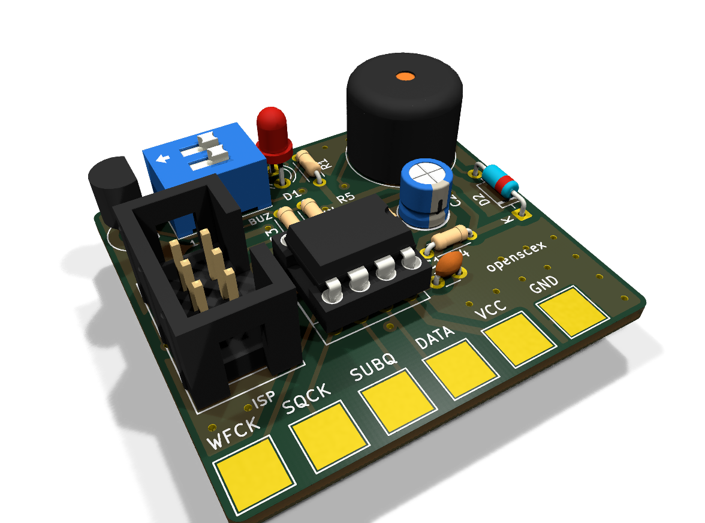
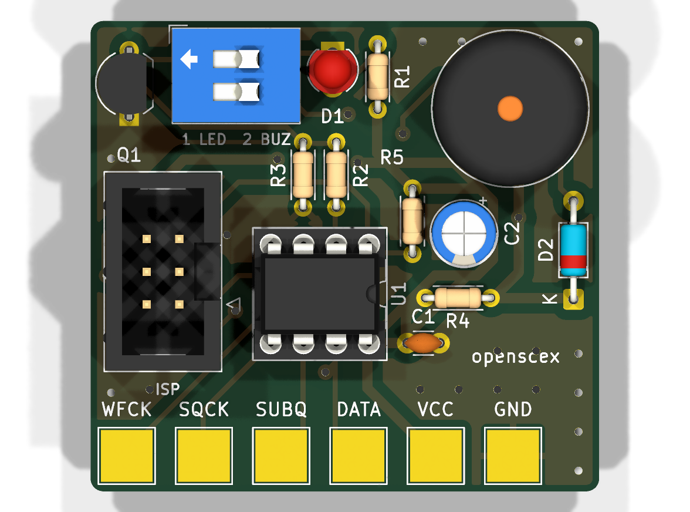
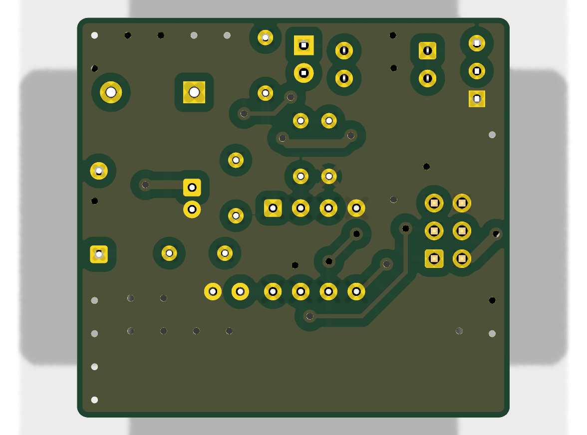
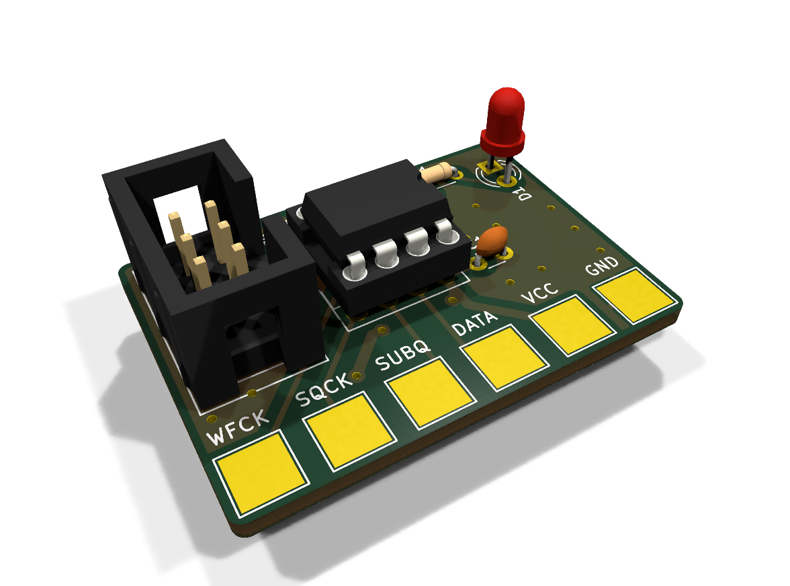
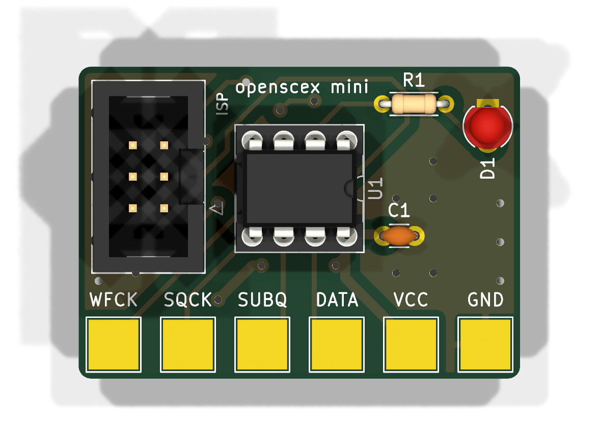
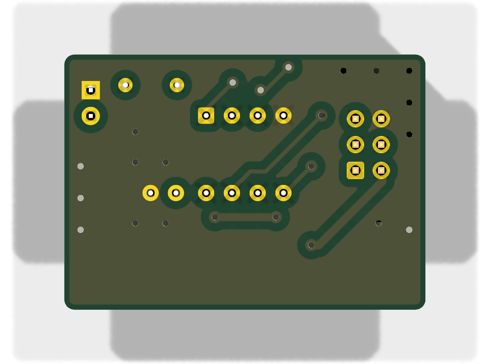
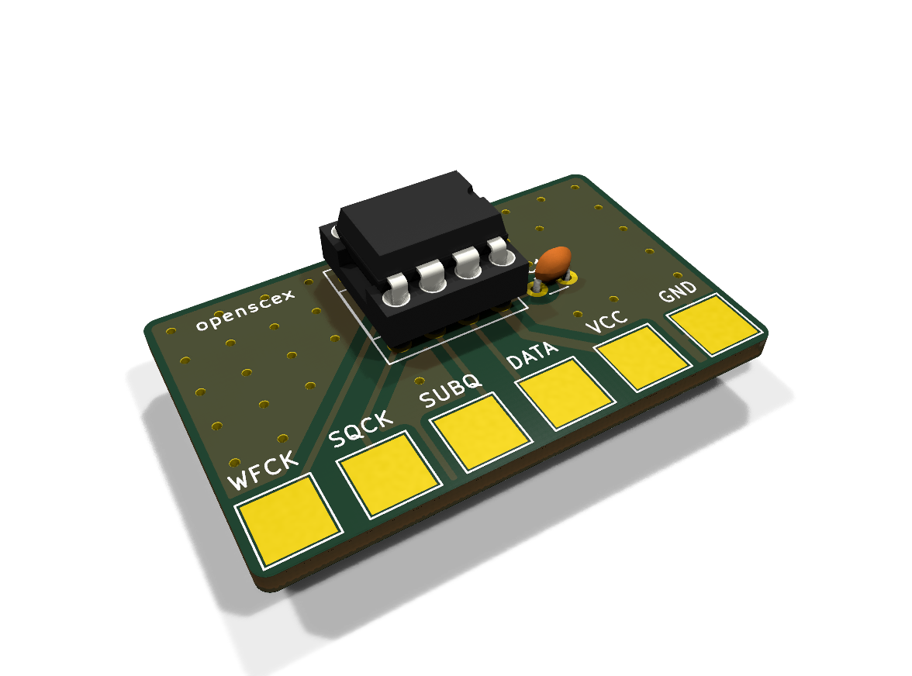
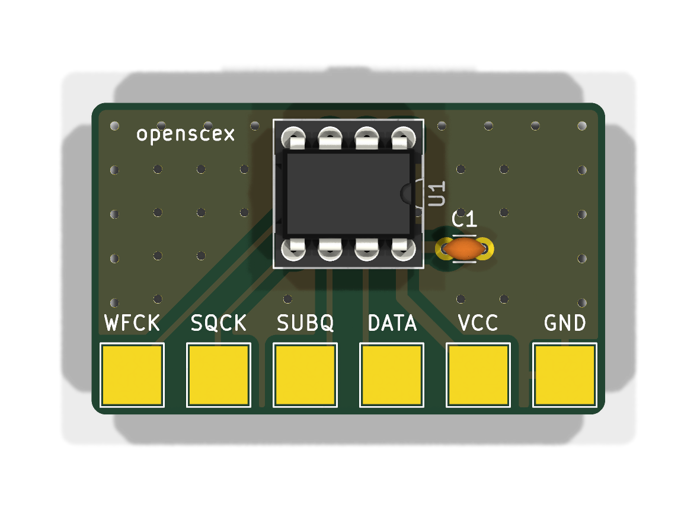
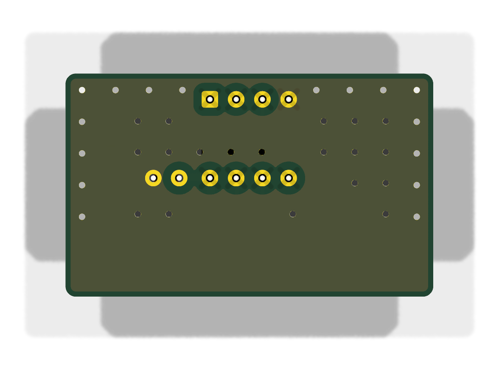
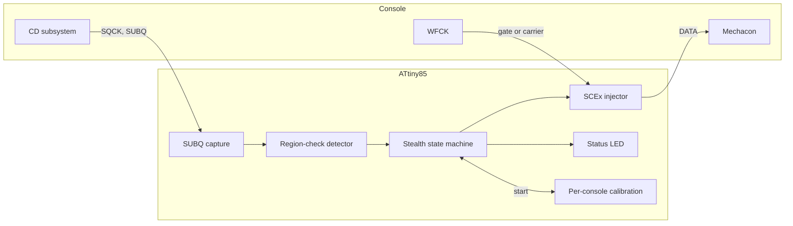

<div align="center">

<h1>openscex-modchip</h1>

<p>
  <b>English</b> &nbsp;·&nbsp; <a href="README.ja.md">日本語</a> &nbsp;·&nbsp; <a href="README.zh.md">中文</a>
</p>

<strong>Stealth SCEx region unlock for the PlayStation and PSone, on an ATtiny85 that trims its own clock against the console.</strong>

<br><br>

[](https://github.com/gufranco/openscex-modchip/actions/workflows/ci.yml)
[](https://github.com/gufranco/openscex-modchip/releases)
[](AGENTS.md)
[](LICENSE)

<br>

<p>
  <a href="#quick-start">Quick start</a> &nbsp;|&nbsp;
  <a href="#console-tap-points">Wiring</a> &nbsp;|&nbsp;
  <a href="#status-led">Status LED</a> &nbsp;|&nbsp;
  <a href="#against-other-chips">Comparison</a> &nbsp;|&nbsp;
  <a href="../../issues/new?template=compatibility.yml">Report your console</a>
</p>

</div>

[**5720**](Makefile) bytes of flash · [**8**](assets/psnee) board families, PU-7 to PM-41(2) · [**3**](src/region.c) regions · [**0**](AGENTS.md) MISRA deviations · [**100%**](tests/host) host line and branch coverage · [**206/206**](tools/mutate.py) mutants killed

```bash
gh release download --repo gufranco/openscex-modchip --pattern 'openscex-modchip-attiny85.hex' --pattern SHA256SUMS
sha256sum -c SHA256SUMS --ignore-missing
avrdude -c <programmer> -p attiny85 -U flash:w:openscex-modchip-attiny85.hex:i
```

> [!IMPORTANT]
> The current firmware passes the full simulation gate and has not yet run on a console. Measure the tap voltages before wiring. Source: [compatibility reports](https://github.com/gufranco/openscex-modchip/issues?q=label%3Acompatibility), [tests/sim](tests/sim).

Region-unlock firmware for the original Sony PlayStation (fat) and PSone, on an ATtiny85 running from its internal oscillator, which it trims against the console's own SUBQ frame rate. It emits the configured region string inside the SUBQ region-check window, stops the moment the console accepts it, and leaves the data line high-impedance during play. It needs no lid wire: it knows a disc was swapped when SUBQ goes quiet while the drive is stopped. It does not patch the boot ROM, so Japanese fat consoles and the PAL PSone keep their second region check; install a patched BIOS if you need that bypassed. It is not an optical-drive emulator, does not support PS2 or Saturn, and does not defeat LibCrypt. Source: [src/run.c](src/run.c), [src/inject.c](src/inject.c), [AGENTS.md](AGENTS.md).

| | | Source |
|:--|:--|:--|
| **Silent after acceptance**<br>The first program-area frame stops injection, mid-string included, and nothing is sent while the game runs; only a new lead-in read, such as the TOC re-read anti-mod games force, is served again. | **Disc swaps without a lid wire**<br>The chip sees a swap as the drive going quiet for 1.5 s and re-arms for every disc of a multi-disc game. | [src/inject.c](src/inject.c), [src/loop.c](src/loop.c), [src/run.c](src/run.c) |
| **Self-trimmed timing**<br>The chip times the console's 75 Hz SUBQ frames and trims its internal oscillator to within about 1%, with no clock wire. | **One region, one window**<br>Only the configured region string, only inside the SUBQ region-check window, at most 16 strings per arming. | [src/trim.c](src/trim.c), [src/region.c](src/region.c), [include/pscu/config.h](include/pscu/config.h) |
| **Status LED or buzzer**<br>An LED or an active buzzer on one pin reports each boot stage, every disc's result and any live wiring fault; a final build only chirps, and reports each fault once. | **Proven in code**<br>MISRA C:2012 clean, 100% host coverage, a simavr console model, mutation testing, byte-identical rebuilds. | [src/led.c](src/led.c), [tests/host](tests/host), [tools/mutate.py](tools/mutate.py) |

## Overview

| Property | Value | Source |
|:---------|:------|:--|
| Console targets | PlayStation fat PU-7 through PU-23, PSone PM-41 and PM-41(2) | [assets/psnee](assets/psnee), [PsNee PSNee.ino L372-L406](https://github.com/kalymos/PsNee/blob/df52aec97d4e1677e3ed3ead1fba0bf102b1cfd7/PSNee/PSNee.ino#L372-L406) |
| MCU | ATtiny85 (8-pin DIP) | [include/port/registers.h](include/port/registers.h), [ATtiny25/45/85 datasheet 2586Q](https://ww1.microchip.com/downloads/en/DeviceDoc/Atmel-2586-AVR-8-bit-Microcontroller-ATtiny25-ATtiny45-ATtiny85_Datasheet.pdf) |
| Method | SCEx injection | [src/inject.c](src/inject.c), [psx-spx cdromdrive.md, SCEx](https://github.com/psx-spx/psx-spx.github.io/blob/6d7d1bc106a7e0b616b0330fe58401ab1ba57f0f/docs/cdromdrive.md#L1211-L1230) |
| Region | one per build, `REGION=jp|us|eu` (default us) | [Makefile](Makefile), [src/region.c](src/region.c) |
| Clock | the internal 8 MHz RC oscillator, trimmed against the console's SUBQ frame rate | [src/trim.c](src/trim.c), [ATtiny25/45/85 datasheet 2586Q](https://ww1.microchip.com/downloads/en/DeviceDoc/Atmel-2586-AVR-8-bit-Microcontroller-ATtiny25-ATtiny45-ATtiny85_Datasheet.pdf) |
| Wires | 4 signals (SQCK, SUBQ, DATA, WFCK) plus power; optional LED or active buzzer | [include/port/registers.h](include/port/registers.h), [PsNee MCU.h L453-L530](https://github.com/kalymos/PsNee/blob/df52aec97d4e1677e3ed3ead1fba0bf102b1cfd7/PSNee/MCU.h#L453-L530) |
| Toolchain | C17, MISRA C:2012 zero deviations, pinned Docker image | [Dockerfile](Dockerfile), [AGENTS.md](AGENTS.md) |

## Supported build per console

| Console | Board | `REGION` | Second region check | Source |
|:--------|:------|:---------|:--------------------|:--|
| Fat US/Canada, SCPH-1001 | PU-8 | `us` | none | [consolemods PS1 region information](https://consolemods.org/wiki/PS1:Region_Information), [PsNee PSNee.ino L10-L17](https://github.com/kalymos/PsNee/blob/df52aec97d4e1677e3ed3ead1fba0bf102b1cfd7/PSNee/PSNee.ino#L10-L17) |
| Fat US/Canada, SCPH-550x1/700x1/900x1 | PU-18 to PU-23 | `us` | none | [consolemods PS1 region information](https://consolemods.org/wiki/PS1:Region_Information), [PsNee PSNee.ino L10-L17](https://github.com/kalymos/PsNee/blob/df52aec97d4e1677e3ed3ead1fba0bf102b1cfd7/PSNee/PSNee.ino#L10-L17) |
| Fat PAL, SCPH-1002 | PU-8 | `eu` | none | [consolemods PS1 region information](https://consolemods.org/wiki/PS1:Region_Information), [PsNee PSNee.ino L10-L17](https://github.com/kalymos/PsNee/blob/df52aec97d4e1677e3ed3ead1fba0bf102b1cfd7/PSNee/PSNee.ino#L10-L17) |
| Fat PAL, SCPH-550x2/900x2 | PU-18 to PU-22 | `eu` | none | [consolemods PS1 region information](https://consolemods.org/wiki/PS1:Region_Information), [PsNee PSNee.ino L10-L17](https://github.com/kalymos/PsNee/blob/df52aec97d4e1677e3ed3ead1fba0bf102b1cfd7/PSNee/PSNee.ino#L10-L17) |
| PSone US/Canada, SCPH-101 | PM-41 / PM-41(2) | `us` | none | [consolemods PS1 region information](https://consolemods.org/wiki/PS1:Region_Information), [PsNee PSNee.ino L10-L17](https://github.com/kalymos/PsNee/blob/df52aec97d4e1677e3ed3ead1fba0bf102b1cfd7/PSNee/PSNee.ino#L10-L17) |
| PSone PAL, SCPH-102 | PM-41 / PM-41(2) | `eu` | in the boot ROM; needs a patched BIOS | [consolemods PS1 region information](https://consolemods.org/wiki/PS1:Region_Information), [PsNee PSNee.ino L33-L38](https://github.com/kalymos/PsNee/blob/df52aec97d4e1677e3ed3ead1fba0bf102b1cfd7/PSNee/PSNee.ino#L33-L38) |
| PSone Japan, SCPH-100 | PM-41 | `jp` | in the boot ROM; needs a patched BIOS | [consolemods PS1 region information](https://consolemods.org/wiki/PS1:Region_Information), [PsNee PSNee.ino L33-L38](https://github.com/kalymos/PsNee/blob/df52aec97d4e1677e3ed3ead1fba0bf102b1cfd7/PSNee/PSNee.ino#L33-L38) |
| Fat Japan, SCPH-1000/3000/3500/5000/5500/7000/7500/9000 | PU-7 to PU-23 | `jp` | in the boot ROM; needs a patched BIOS, though early SCPH-1000 units boot the disc anyway | [consolemods PS1 region information](https://consolemods.org/wiki/PS1:Region_Information), [PsNee PSNee.ino L33-L38](https://github.com/kalymos/PsNee/blob/df52aec97d4e1677e3ed3ead1fba0bf102b1cfd7/PSNee/PSNee.ino#L33-L38) |
| Asia, SCPH-xxx3 | not recorded | `jp` | none | [consolemods PS1 region information](https://consolemods.org/wiki/PS1:Region_Information), [PsNee PSNee.ino L10-L17](https://github.com/kalymos/PsNee/blob/df52aec97d4e1677e3ed3ead1fba0bf102b1cfd7/PSNee/PSNee.ino#L10-L17) |
| Asia Video CD, SCPH-5903 | not recorded | `jp` + `VCD_FILTER=on` | none | [consolemods PS1 region information](https://consolemods.org/wiki/PS1:Region_Information), [PsNee PSNee.ino L456-L490](https://github.com/kalymos/PsNee/blob/df52aec97d4e1677e3ed3ead1fba0bf102b1cfd7/PSNee/PSNee.ino#L456-L490) |

The PU-7 and PU-8 use the same static-gate method as the PU-18 and PU-20, as PsNee V9.0 does on them; PsNee also lists the SCPH-1000 and SCPH-3000 among the consoles whose second check needs a BIOS patch (Read: PSNee.ino:33-38). The boot-ROM check is not handled by this chip: on the consoles marked above, imports may still be refused until a patched BIOS is installed. The Asian models need no patch: PsNee V9.0 targets SCPH-xxx3 and SCPH-5903 with the NTSC-J string alone. The SCPH-5903 also plays Video CDs, so its build adds `VCD_FILTER=on`, which arms injection only on a game's lead-in and never on a Video CD's. Neither Asian row has been confirmed on a console here. Dev boards (DTL-H120x, PU-9) read burned discs natively and need no chip. Source: [PsNee PSNee.ino L33-L38](https://github.com/kalymos/PsNee/blob/df52aec97d4e1677e3ed3ead1fba0bf102b1cfd7/PSNee/PSNee.ino#L33-L38), [PsNee PSNee.ino L10-L17](https://github.com/kalymos/PsNee/blob/df52aec97d4e1677e3ed3ead1fba0bf102b1cfd7/PSNee/PSNee.ino#L10-L17), [PsNee PSNee.ino L456-L490](https://github.com/kalymos/PsNee/blob/df52aec97d4e1677e3ed3ead1fba0bf102b1cfd7/PSNee/PSNee.ino#L456-L490), [src/subq.c](src/subq.c).

## Quick start

Prebuilt per-console `.hex` images are attached to each [release](../../releases), so you can skip the toolchain and go straight to flashing with the `avrdude` steps below. Each release carries the three ATtiny85 images (`us`, `eu`, `jp`), the SCPH-5903 image (`jp-vcd`), each of the four again as a quiet `-final` image (see [Status LED](#status-led)), a `SHA256SUMS` file, the license, and a build-provenance attestation. Releases v0.3.0 to v0.8.0 carried ATtiny84 images, and releases up to v0.2.0 ATtiny85 images of the earlier four-wire design. Check a download before flashing it:

```bash
sha256sum -c SHA256SUMS --ignore-missing
gh attestation verify openscex-modchip-attiny85.hex --repo gufranco/openscex-modchip
```

Releases are versioned automatically from the commit history, and only from a commit whose CI run passed; the `0.x` line marks the firmware as pre-hardware-validation. To build from source instead: every build, check and test runs in the pinned Docker toolchain through `make`, and only `avrdude` runs on the host. Source: [.releaserc.json](.releaserc.json), [.github/workflows/release.yml](.github/workflows/release.yml).

| Tool | Purpose | Source |
|:-----|:--------|:--|
| Docker | runs the pinned toolchain | [Docker](https://docs.docker.com/get-docker/), [Dockerfile](Dockerfile) |
| Git | clones the repository | [Git](https://git-scm.com/downloads) |
| avrdude | flashes the image to the chip | [avrdude](https://github.com/avrdudes/avrdude) |

```bash
git clone https://github.com/gufranco/openscex-modchip.git
cd openscex-modchip
make REGION=us                                        # America
make REGION=jp VCD_FILTER=on                          # SCPH-5903
make REGION=us PROFILE=final                          # America, quiet indicator
avrdude -c <programmer> -p attiny85 -U flash:w:openscex-modchip-attiny85.hex:i
avrdude -c <programmer> -p attiny85 -U lfuse:w:0xE2:m -U hfuse:w:0xDD:m -U efuse:w:0xFF:m
```

Any ISP works, including an Arduino as ISP. Write the flash first and the fuses last. The low fuse `0xE2` selects the internal 8 MHz oscillator with the slow-rising-power start-up delay and no clock divider (Read: ATtiny25/45/85 datasheet 2586Q, Table 6-6 and Table 6-7, CKSEL 0010, SUT 10), so the chip can be read and reprogrammed on the bench with nothing but the programmer. The firmware also clears the clock prescaler at boot, so the CKDIV8 fuse cannot slow it. Reflashing erases the calibration record and its oscillator trim; the chip learns them again. Source: [Arduino as ISP](https://docs.arduino.cc/built-in-examples/arduino-isp/ArduinoISP/), [ATtiny25/45/85 datasheet 2586Q](https://ww1.microchip.com/downloads/en/DeviceDoc/Atmel-2586-AVR-8-bit-Microcontroller-ATtiny25-ATtiny45-ATtiny85_Datasheet.pdf), [src/run.c](src/run.c).

| Build | Fuses (low / high / extended) | Source |
|:------|:------------------------------|:--|
| Internal 8 MHz with brown-out detection at 2.7 V, recommended | `0xE2` / `0xDD` / `0xFF` | [ATtiny25/45/85 datasheet 2586Q](https://ww1.microchip.com/downloads/en/DeviceDoc/Atmel-2586-AVR-8-bit-Microcontroller-ATtiny25-ATtiny45-ATtiny85_Datasheet.pdf) |
| Internal 8 MHz without brown-out detection | `0xE2` / `0xDF` / `0xFF` | [ATtiny25/45/85 datasheet 2586Q](https://ww1.microchip.com/downloads/en/DeviceDoc/Atmel-2586-AVR-8-bit-Microcontroller-ATtiny25-ATtiny45-ATtiny85_Datasheet.pdf) |

Brown-out detection holds the chip in reset while the supply is below 2.7 V, so it never runs on a supply that is collapsing at power-off; it is not yet exercised on a console. Keep it on: by its speed grade the ATtiny85 runs 0 to 10 MHz from 2.7 V (Read: the same datasheet; only the ATtiny85V reaches down to 1.8 V), so below 2.7 V the chip is out of its rating. A fuse is easy to forget, so the firmware also measures its supply before every string and holds back below about 2.75 V, shown as code 7. The limit is set for a chip whose bandgap reads high, so a 3.3 V supply 5 percent low still passes. Source: [ATtiny25/45/85 datasheet 2586Q](https://ww1.microchip.com/downloads/en/DeviceDoc/Atmel-2586-AVR-8-bit-Microcontroller-ATtiny25-ATtiny45-ATtiny85_Datasheet.pdf), [src/supply.c](src/supply.c).

Verify with the [Makefile](Makefile) targets:

```bash
make size        # image size; fails when less than 256 bytes of flash stay free
make test        # host tests, simavr console model and its stack check, static analysis, MISRA
make repro       # two fresh builds, byte-identical
make mutate      # mutation testing on the logic layer
make bench_ci    # console bench: this firmware against PsNee in the same simulated console
```

The same gates run in CI on every push and pull request, defined in [`.github/workflows/ci.yml`](.github/workflows/ci.yml). Contributors can run `make hooks` once to enable the commit-message and formatting checks locally.

## MCU pinout

The four SCEx signals and the LED keep PsNee's tested ATtiny85 assignment, read from PsNee `MCU.h`, so PsNee wiring guides match pin for pin; PB5 stays RESET, so the chip remains ISP-programmable. The physical pin numbers are the standard 8-pin PDIP pinout; verify against the datasheet for SOIC. Source: [PsNee MCU.h L453-L530](https://github.com/kalymos/PsNee/blob/df52aec97d4e1677e3ed3ead1fba0bf102b1cfd7/PSNee/MCU.h#L453-L530), [include/port/registers.h](include/port/registers.h), [ATtiny25/45/85 datasheet 2586Q](https://ww1.microchip.com/downloads/en/DeviceDoc/Atmel-2586-AVR-8-bit-Microcontroller-ATtiny25-ATtiny45-ATtiny85_Datasheet.pdf).

| DIP pin | Port | Signal | Direction | Connect to | Source |
|:-------:|:-----|:-------|:----------|:-----------|:--|
| 1 | PB5 | RESET | - | leave as reset | [include/port/registers.h](include/port/registers.h), [ATtiny25/45/85 datasheet 2586Q](https://ww1.microchip.com/downloads/en/DeviceDoc/Atmel-2586-AVR-8-bit-Microcontroller-ATtiny25-ATtiny45-ATtiny85_Datasheet.pdf) |
| 2 | PB3 | LED | out, optional | status LED through a 1 kΩ resistor, or leave off | [include/port/registers.h](include/port/registers.h), [PsNee PSNee.ino L64](https://github.com/kalymos/PsNee/blob/df52aec97d4e1677e3ed3ead1fba0bf102b1cfd7/PSNee/PSNee.ino#L64) |
| 3 | PB4 | WFCK | in and out | static gate, or PU-22+ live carrier | [include/port/registers.h](include/port/registers.h), [PsNee MCU.h L453-L530](https://github.com/kalymos/PsNee/blob/df52aec97d4e1677e3ed3ead1fba0bf102b1cfd7/PSNee/MCU.h#L453-L530) |
| 4 | GND | GND | - | console ground | [ATtiny25/45/85 datasheet 2586Q](https://ww1.microchip.com/downloads/en/DeviceDoc/Atmel-2586-AVR-8-bit-Microcontroller-ATtiny25-ATtiny45-ATtiny85_Datasheet.pdf) |
| 5 | PB0 | SQCK | in | SUBQ serial clock | [include/port/registers.h](include/port/registers.h), [PsNee MCU.h L453-L530](https://github.com/kalymos/PsNee/blob/df52aec97d4e1677e3ed3ead1fba0bf102b1cfd7/PSNee/MCU.h#L453-L530) |
| 6 | PB1 | SUBQ | in | SUBQ serial data | [include/port/registers.h](include/port/registers.h), [PsNee MCU.h L453-L530](https://github.com/kalymos/PsNee/blob/df52aec97d4e1677e3ed3ead1fba0bf102b1cfd7/PSNee/MCU.h#L453-L530) |
| 7 | PB2 | DATA | out, drive-low or high-Z | SCEx injection into the mechacon | [include/port/registers.h](include/port/registers.h), [src/port.S](src/port.S) |
| 8 | VCC | VCC | - | console supply, measure first | [ATtiny25/45/85 datasheet 2586Q](https://ww1.microchip.com/downloads/en/DeviceDoc/Atmel-2586-AVR-8-bit-Microcontroller-ATtiny25-ATtiny45-ATtiny85_Datasheet.pdf) |

## Console tap points

Every point has a labeled photo below: SQCK, SUBQ, DATA, WFCK, VCC and GND are marked by name on each board; solder each wire where these photos mark it. The PU-18 photo shows the underside of the board. AX, DX and RESET are labeled too but belong to PsNee's boot-ROM patch, which this chip does not have; leave them unconnected. Source: [assets/psnee](assets/psnee).

<table>
<tr><td align="center" width="33%"><a href="assets/psnee/pu-7.jpg"></a><br><sub><b>PU-7</b>. Photo from PsNee</sub></td><td align="center" width="33%"><a href="assets/psnee/pu-8a.jpg"></a><br><sub><b>PU-8</b>, 1-658-467-22. Photo from PsNee</sub></td><td align="center" width="33%"><a href="assets/psnee/pu-8b.jpg"></a><br><sub><b>PU-8</b>, 1-658-467-12. Photo from PsNee</sub></td></tr>
<tr><td align="center" width="33%"><a href="assets/psnee/pu-18.jpg"></a><br><sub><b>PU-18</b>. Photo from PsNee</sub></td><td align="center" width="33%"><a href="assets/psnee/pu-20.jpg"></a><br><sub><b>PU-20</b>. Photo from PsNee</sub></td><td align="center" width="33%"><a href="assets/psnee/pu-22.jpg"></a><br><sub><b>PU-22</b>. Photo from PsNee</sub></td></tr>
<tr><td align="center" width="33%"><a href="assets/psnee/pu-23.jpg"></a><br><sub><b>PU-23</b>. Photo from PsNee</sub></td><td align="center" width="33%"><a href="assets/psnee/pm-41.jpg"></a><br><sub><b>PM-41</b>. Photo from PsNee</sub></td><td align="center" width="33%"><a href="assets/psnee/pm-41-2.jpg"></a><br><sub><b>PM-41(2)</b>. Photo from PsNee</sub></td></tr>
</table>

These nine photos come from [PsNee](https://github.com/kalymos/PsNee) V9.0 by kalymos and its contributors, released into the public domain under the [Unlicense](LICENSES/Unlicense.txt), and are copied here resized. With them, every wire of the chip has a picture of where it goes.

| Board family | SCPH era | DATA injection point | WFCK role | Confidence | Source |
|:-------------|:---------|:---------------------|:----------|:-----------|:--|
| PU-7, PU-8, PU-18, PU-20 | 1000-750x | digital NRZ output of the wobble ASIC into the mechacon | static gate | Read | [assets/psnee](assets/psnee), [PsNee PSNee.ino L372-L406](https://github.com/kalymos/PsNee/blob/df52aec97d4e1677e3ed3ead1fba0bf102b1cfd7/PSNee/PSNee.ino#L372-L406) |
| PU-22, PU-23 | 7500-900x | CD-processor tracking line, WFCK as a fake carrier, three-wire-plus-link | live clock, sync required | Read | [assets/psnee](assets/psnee), [PsNee PSNee.ino L372-L406](https://github.com/kalymos/PsNee/blob/df52aec97d4e1677e3ed3ead1fba0bf102b1cfd7/PSNee/PSNee.ino#L372-L406) |
| PM-41, PM-41(2) | PSone 100-103 | same tracking-line carrier method; float the chip I/O when idle on PM-41(2) | live clock | Read | [assets/psnee](assets/psnee), [quade.co PsNee guide](https://quade.co/ps1-modchip-guide/psnee/) |

There is no clock wire and no lid wire: the chip runs from its own oscillator and sees disc swaps in SUBQ, so it can sit anywhere the four signal wires reach. Keep those wires short; quade.co traced Mayumi V4 failures to a long wire picking up noise. An install made for an earlier release must lose its clock and lid wires before this firmware goes on the chip: on the ATtiny85 pin 2 is PB3, the indicator output, and pin 3 is PB4, the WFCK input, so a console clock left on pin 2 would be driven against the console. Source: [src/trim.c](src/trim.c), [src/loop.c](src/loop.c), [quade.co Mayumi V4 guide](https://quade.co/ps1-modchip-guide/mayumi-v4/), [include/port/registers.h](include/port/registers.h).

The photos above mark SQCK and SUBQ on every supported board, so follow them. Source: [assets/psnee](assets/psnee).

## Carrier boards

Three optional boards hold the chip in a DIP-8 socket, so it comes out for reflashing, and take the console's wires on six 4 by 4 mm pads, 6 mm apart, along one edge: WFCK, SQCK, SUBQ, DATA, VCC and GND. The pads sit on top with no holes, every part is through-hole, and each board is a KiCad 10 project with its schematic, layout and design rules. Source: [hardware](hardware).

| Board | Parts | Size | Source |
|:--|:--|:--|:--|
| Carrier | socket, 100 nF decoupling, keyed ISP header with a 10 kΩ RESET pull-up, and the indicator: PB3 switches a 2N3904 that drives the LED with its 1 kΩ resistor, the buzzer, both or neither, as a two-position DIP switch sets; the buzzer runs from a 10 Ω and 100 µF filter with a 1N4148 across it | 39.6 × 36.6 mm | [hardware/openscex-carrier.kicad_sch](hardware/openscex-carrier.kicad_sch), [hardware/openscex-carrier.kicad_pcb](hardware/openscex-carrier.kicad_pcb) |
| Mini | socket, 100 nF decoupling, the LED with its 1 kΩ resistor straight on PB3, keyed ISP header | 35.7 × 25.2 mm | [hardware/openscex-mini.kicad_sch](hardware/openscex-mini.kicad_sch), [hardware/openscex-mini.kicad_pcb](hardware/openscex-mini.kicad_pcb) |
| Bare | socket and 100 nF decoupling, nothing else | 35.7 × 21.7 mm | [hardware/openscex-bare.kicad_sch](hardware/openscex-bare.kicad_sch), [hardware/openscex-bare.kicad_pcb](hardware/openscex-bare.kicad_pcb) |

<table>
<tr><td align="center" width="33%"><a href="assets/boards/carrier-3d.png"></a><br><sub><b>Carrier board</b>, 3D view</sub></td><td align="center" width="33%"><a href="assets/boards/carrier-top.png"></a><br><sub><b>Carrier board</b>, top</sub></td><td align="center" width="33%"><a href="assets/boards/carrier-bottom.png"></a><br><sub><b>Carrier board</b>, bottom, the ground plane</sub></td></tr>
<tr><td align="center" width="33%"><a href="assets/boards/mini-3d.png"></a><br><sub><b>Mini board</b>, 3D view</sub></td><td align="center" width="33%"><a href="assets/boards/mini-top.png"></a><br><sub><b>Mini board</b>, top</sub></td><td align="center" width="33%"><a href="assets/boards/mini-bottom.png"></a><br><sub><b>Mini board</b>, bottom, the ground plane</sub></td></tr>
<tr><td align="center" width="33%"><a href="assets/boards/bare-3d.png"></a><br><sub><b>Bare board</b>, 3D view</sub></td><td align="center" width="33%"><a href="assets/boards/bare-top.png"></a><br><sub><b>Bare board</b>, top</sub></td><td align="center" width="33%"><a href="assets/boards/bare-bottom.png"></a><br><sub><b>Bare board</b>, bottom, the ground plane</sub></td></tr>
</table>

All three are two-layer boards built against noise. Every track runs on top where it can, so the bottom layer stays a ground plane under the console lines; both layers are poured with ground and stitched with 0.6 mm vias; no track bends more than 45 degrees; tracks of different nets keep 1 mm apart and 0.8 mm from pads. On the carrier the buzzer, which draws up to 30 mA in 2.4 kHz pulses, sits in the corner farthest from the console lines, and its filter keeps that ripple off the chip's supply. Source: [hardware/openscex-carrier.kicad_dru](hardware/openscex-carrier.kicad_dru), [hardware/openscex-carrier.kicad_pcb](hardware/openscex-carrier.kicad_pcb), [CMI-1295IC-0385T datasheet](https://www.sameskydevices.com/product/resource/cmi-1295ic-0385t.pdf).

The ISP header follows the AVR 6-pin layout: 1 MISO on SUBQ, 2 VCC, 3 SCK on DATA, 4 MOSI on SQCK, 5 RESET, 6 GND, and its shroud is keyed and kept 1.5 mm clear of every other part so the cable plugs in freely. Reflash with the board out of the console or its wires unsoldered: in place, the programmer would feed the console's supply and fight the console's own drivers on SQCK and SUBQ. Source: [hardware/openscex-carrier.kicad_sch](hardware/openscex-carrier.kicad_sch), [hardware/openscex-mini.kicad_sch](hardware/openscex-mini.kicad_sch), [ATtiny25/45/85 datasheet 2586Q](https://ww1.microchip.com/downloads/en/DeviceDoc/Atmel-2586-AVR-8-bit-Microcontroller-ATtiny25-ATtiny45-ATtiny85_Datasheet.pdf).

Each board has a bill of materials with what to buy for every part, and a Gerber and drill archive ready to upload to a board house. Both were exported with KiCad 10.0.6. The archives carry no teardrops: for the curved joints where tracks meet pads, open the board in KiCad, refill its zones with B and export again. Source: [hardware/openscex-carrier-bom.csv](hardware/openscex-carrier-bom.csv), [hardware/fab/openscex-carrier-gerbers.zip](hardware/fab/openscex-carrier-gerbers.zip), [hardware/openscex-mini-bom.csv](hardware/openscex-mini-bom.csv), [hardware/fab/openscex-mini-gerbers.zip](hardware/fab/openscex-mini-gerbers.zip), [hardware/openscex-bare-bom.csv](hardware/openscex-bare-bom.csv), [hardware/fab/openscex-bare-gerbers.zip](hardware/fab/openscex-bare-gerbers.zip).

## Safety

- Measure the logic voltage at every tap point before wiring. The values are taken from the established PsNee and Mayumi installs (fat boards around 5 V, the PSone PM-41(2) lower and noise-sensitive), but assumption is not measurement. Source: [quade.co PsNee guide](https://quade.co/ps1-modchip-guide/psnee/), [quade.co Mayumi V4 guide](https://quade.co/ps1-modchip-guide/mayumi-v4/).
- Opening a console and soldering to the CD subsystem can destroy it. Build at your own risk. Source: [quade.co PS1 modchip guide](https://quade.co/ps1-modchip-guide/).

## Status LED

PB3 drives an optional LED or an optional active buzzer, and either one is the chip's only diagnostic channel: it shows which stage the chip is in, whether each disc passed its region check, and which wire to look at when something is wrong. It never delays or gates a feature and keeps no history, so a code is about now, except the two boot codes. Source: [src/led.c](src/led.c).

| Part | Choice | Source |
|:-----|:-------|:--|
| LED | a 3 mm or 5 mm red, orange, yellow or green LED, forward voltage about 2 V; not blue or white, whose 3 V forward voltage leaves almost nothing across the resistor on the PSone's lower supply | [Kingbright WP7113ID datasheet](https://www.kingbrightusa.com/images/catalog/SPEC/WP7113ID.pdf), [ATtiny25/45/85 datasheet 2586Q](https://ww1.microchip.com/downloads/en/DeviceDoc/Atmel-2586-AVR-8-bit-Microcontroller-ATtiny25-ATtiny45-ATtiny85_Datasheet.pdf) |
| Resistor | 1 kΩ, any wattage: about 3 mA at 5 V and 1.5 mA at 3.5 V, bright enough indoors and far below the pin's 40 mA absolute maximum (Read: ATtiny25/45/85 datasheet 2586Q) | [ATtiny25/45/85 datasheet 2586Q](https://ww1.microchip.com/downloads/en/DeviceDoc/Atmel-2586-AVR-8-bit-Microcontroller-ATtiny25-ATtiny45-ATtiny85_Datasheet.pdf) |
| LED wiring | pin 2 (PB3) to the resistor, the resistor to the LED anode (long leg), the cathode (flat side) to ground | [include/port/registers.h](include/port/registers.h) |
| Buzzer | instead of the LED, an active piezo buzzer, one with its own driver that sounds on plain DC, such as the PUI Audio AI-3035-TWT-3V-R: 2 to 5 V, at most 9 mA at 3 V, about 3.5 kHz, 30 mm across; check the current at 5 V on a fat console | [AI-3035-TWT-3V-R datasheet](https://api.puiaudio.com/filename/AI-3035-TWT-3V-R.pdf), [ATtiny25/45/85 datasheet 2586Q](https://ww1.microchip.com/downloads/en/DeviceDoc/Atmel-2586-AVR-8-bit-Microcontroller-ATtiny25-ATtiny45-ATtiny85_Datasheet.pdf) |
| Buzzer wiring | pin 2 (PB3) to the buzzer's + lead, the - lead to ground, with no resistor and no diode: a piezo is not a coil, so switching it off sends no voltage spike back into the pin. A magnetic buzzer is a coil and is not supported | [AI-3035-TWT-3V-R datasheet](https://api.puiaudio.com/filename/AI-3035-TWT-3V-R.pdf), [include/port/registers.h](include/port/registers.h) |

Two builds drive the pin. `debug`, the default, shows everything below; `final`, built with `make PROFILE=final` and released as the `-final` images, stays quiet. Flash `debug` to install and troubleshoot, then `final` to play. Both send the same strings at the same time; only the pin differs, which the simulator checks edge by edge. Source: [include/pscu/led.h](include/pscu/led.h), [tests/sim/sim_profile.c](tests/sim/sim_profile.c).

| Stage | debug | final | Source |
|:------|:------|:------|:--|
| Board detection | lit for about 0.4 s after power-on | dark | [src/engine.c](src/engine.c) |
| Board found | one 300 ms blink for a static-gate board (PU-18, PU-20), two for a WFCK-carrier board (PU-22 and later) | one 60 ms chirp for a static-gate board, two for a WFCK-carrier board | [src/led.c](src/led.c) |
| Waiting for a disc | a 40 ms blip every 2 s | dark | [src/led.c](src/led.c) |
| Injecting | a 90 to 181 ms flash per region string | dark | [src/engine.c](src/engine.c) |
| Result | a code shown three times, then dark | an accepted disc gives one 60 ms chirp, a refused one code 2 twice; then dark | [src/led.c](src/led.c) |
| Play | dark, with a 40 ms tick each time OSCCAL moves or the calibration is written | dark | [src/led.c](src/led.c), [src/run.c](src/run.c) |

Codes are long 700 ms flashes, 300 ms apart, with a 2 s pause before the code repeats. In `final`, codes 3 and 4 play once per disc, and code 7 repeats every 30 s while it holds. Source: [src/led.c](src/led.c).

| Code | Meaning | Check | Source |
|:----:|:--------|:------|:--|
| 1 | the console accepted the region string | nothing, the disc plays | [src/led.c](src/led.c), [src/loop.c](src/loop.c) |
| 2 | strings were sent and the console never reached the program area | DATA and WFCK wiring, and that the build's region matches the disc | [src/led.c](src/led.c), [src/loop.c](src/loop.c) |
| 3 | no SUBQ frame for 5 s after power-on; shown for 15 s, then the heartbeat | SQCK, SUBQ, power and ground; also shown with no disc in | [src/led.c](src/led.c), [src/loop.c](src/loop.c) |
| 4 | frames arrive but no region check for 20 s; repeats while it holds | SUBQ; also normal with an audio CD | [src/led.c](src/led.c), [src/loop.c](src/loop.c) |
| 5 | the watchdog reset the chip, shown once at the next boot | WFCK, which stalled mid-injection | [src/led.c](src/led.c), [src/port_chip.S](src/port_chip.S) |
| 6 | the board differs from the one the calibration stored, shown once at boot; code 5 takes priority | the WFCK wire, which is intermittent, unless the chip moved to another console | [src/led.c](src/led.c), [src/calib.c](src/calib.c) |
| 7 | the supply measured under about 2.75 V, or the reading failed; no string is sent while it holds, and it outranks codes 3 and 4 | VCC and ground at the tap points, which must measure 3.3 V or more | [src/led.c](src/led.c), [src/supply.c](src/supply.c) |

## How it works



## What's included

| Feature | Detail | Source |
|:--------|:-------|:--|
| SCEx injection | 44-bit LSB-first region string, the PU-7 to PU-20 static-gate method, with the WFCK gate held low for each string as PsNee and Mayumi V4 do, and the PU-22-and-later WFCK-carrier method | [src/inject.c](src/inject.c), [src/port.S](src/port.S), [PsNee PSNee.ino L53](https://github.com/kalymos/PsNee/blob/df52aec97d4e1677e3ed3ead1fba0bf102b1cfd7/PSNee/PSNee.ino#L53) |
| Board auto-detect | WFCK behaviour at boot selects gate or carrier mode; one build fits every family. Only an unbroken run of 25 WFCK edges, each within 360 µs of the last, counts as a carrier, as MultiMode 3 and Mayumi V4 require, so a noisy or unconnected line is not taken for one. Before each string on a board taken for a gate, WFCK is watched again for 9.4 ms, so a carrier that starts after boot is never held low. After a watchdog reset the board recorded at boot is kept rather than detected again, so a carrier that stalled mid-string is not mistaken for a gate and driven | [src/board_mode.c](src/board_mode.c), [src/engine.c](src/engine.c), [src/calib.c](src/calib.c), [PsNee PSNee.ino L372-L406](https://github.com/kalymos/PsNee/blob/df52aec97d4e1677e3ed3ead1fba0bf102b1cfd7/PSNee/PSNee.ino#L372-L406) |
| Supply guard | before every string the chip measures its own supply against its 1.1 V bandgap; below about 2.75 V, or on a reading no real supply gives, it sends nothing and shows code 7; a brief dip pauses a burst without restarting its count, and a window it kept shut teaches the calibration nothing | [src/supply.c](src/supply.c), [src/port_chip.S](src/port_chip.S), [ATtiny25/45/85 datasheet 2586Q](https://ww1.microchip.com/downloads/en/DeviceDoc/Atmel-2586-AVR-8-bit-Microcontroller-ATtiny25-ATtiny45-ATtiny85_Datasheet.pdf) |
| Oscillator trim | the chip runs from its internal 8 MHz oscillator and times the console's 75 Hz SUBQ frames in the lead-in and in play, stepping OSCCAL by up to 4 notches per batch, one notch per write, until it is within 1% and never more than 16 notches from the factory value; the trim is kept in EEPROM and applied at boot | [src/trim.c](src/trim.c), [src/run.c](src/run.c), [ATtiny25/45/85 datasheet 2586Q](https://ww1.microchip.com/downloads/en/DeviceDoc/Atmel-2586-AVR-8-bit-Microcontroller-ATtiny25-ATtiny45-ATtiny85_Datasheet.pdf) |
| Disc swaps | no lid wire: 1.5 s with no valid SUBQ frame, which a stopped drive gives, re-arms the chip for the next disc; a seek or a reread on a spinning disc keeps producing frames, so it never reads as a swap. The SUBQ counter climbs no more than 8 frames past the start, so a lid opened even on a disc the console refused closes the window within about half a second of failed captures, and every disc may get the whole 16-string cap, so a disc 2 that reads worse than disc 1 is never short of strings | [src/inject.c](src/inject.c), [src/loop.c](src/loop.c), [include/pscu/loop.h](include/pscu/loop.h) |
| Stealth | injects only inside the SUBQ region-check window, capped per arming, with 5 frames, 67 ms, between strings as PsNee and Mayumi V4 space them, then DATA high-Z and LED off; stops the moment the console reads the program area and stays silent while it does; a later lead-in read, such as the TOC re-read of the anti-mod v2 check that needs a fresh string on a copy, is served again under the same cap | [src/inject.c](src/inject.c), [src/loop.c](src/loop.c), [include/pscu/config.h](include/pscu/config.h), [PsNee PSNee.ino L53](https://github.com/kalymos/PsNee/blob/df52aec97d4e1677e3ed3ead1fba0bf102b1cfd7/PSNee/PSNee.ino#L53), [psx-spx cdromformat.md, anti-modchip](https://github.com/psx-spx/psx-spx.github.io/blob/6d7d1bc106a7e0b616b0330fe58401ab1ba57f0f/docs/cdromformat.md#L1624-L1646) |
| Single configured region | emits only `REGION`, never all three | [src/region.c](src/region.c) |
| Adaptive timing | on WFCK-carrier boards the injection bit is timed by counting 30 WFCK periods, so it follows the console's own clock at single and double speed; on static-gate boards it is timed by the oscillator the chip trims against the console's SUBQ rate | [src/port.S](src/port.S), [src/trim.c](src/trim.c) |
| Self-recovery | each SUBQ capture realigns on the gap between frames and gives up after 30 ms; a WFCK carrier that stalls mid-injection lets the watchdog release DATA; no pin needs a pull-up: SQCK, SUBQ and WFCK are console lines, DATA is the console's line while released, and PB3 is an output | [src/engine.c](src/engine.c), [src/port.S](src/port.S), [include/port/registers.h](include/port/registers.h) |
| Status LED | an optional LED or active buzzer on its own pin shows the boot stages, each disc's result and live faults; a `debug` build says everything, a `final` build only chirps and reports each fault once; the firmware never waits on it and is correct with nothing fitted | [src/led.c](src/led.c) |
| In-field diagnostics | no programmer needed: the LED or buzzer codes name the failing stage, from a SUBQ line that never clocks to one that never shows a region check; nothing is read back with a programmer | [src/led.c](src/led.c), [src/loop.c](src/loop.c) |
| Per-console calibration | learns how late this console lets it start and how fast its own oscillator runs, kept in a six-byte EEPROM record that falls back to the defaults when missing or damaged | [src/calib.c](src/calib.c) |
| Closed-loop confirmation | after injecting, the chip watches SUBQ for a program-area frame (a real track number), which the mechacon only allows once it accepts the region string, and shows whether the region check passed | [src/inject.c](src/inject.c), [src/loop.c](src/loop.c) |
| Verification | host tests 100% line and branch coverage, simavr console model, including a fast and a slow oscillator, mutation testing, reproducible builds, and a console bench that plays one simulated console into this firmware, PsNee, Mayumi V4 and MM3 and checks that this one accepts wherever they do, keeps its bit cell in their range and sends no more outside the region check; its scenarios execute every instruction of this firmware a console can reach, and each one they cannot carries its reason in the source | [tests/host](tests/host), [tests/sim](tests/sim), [tools/mutate.py](tools/mutate.py), [tools/bench](tools/bench), [CONTRIBUTING.md](CONTRIBUTING.md) |

## Per-console calibration

The chip learns how the console it is installed in reads the region string and keeps the result in a six-byte EEPROM record, so later discs spend less time with the data line driven. Every learned value only ever falls back toward the fixed defaults, so a lost, damaged or foreign record costs stealth, never a disc. Source: [src/calib.c](src/calib.c).

| Value | Learned from | Effect | Source |
|:------|:-------------|:-------|:--|
| Start point | each accepted disc moves the start 2 lead-in frames, 27 ms, later, up to 20 frames; a `jp` build keeps the default, since PsNee warns against a later trigger on Japanese consoles | strings start closer to the region check; a refusal, or a lead-in read that ends before the start, steps back 2 frames and stops the probe | [src/calib.c](src/calib.c), [PsNee PSNee.ino L48](https://github.com/kalymos/PsNee/blob/df52aec97d4e1677e3ed3ead1fba0bf102b1cfd7/PSNee/PSNee.ino#L48) |
| Board | the board detected at boot | a different board shows code 6 once and restarts the start point | [src/calib.c](src/calib.c), [src/led.c](src/led.c) |
| Oscillator | the time between frames at single speed, which the console's crystal spaces at 75 Hz, in the lead-in and in play, only while the supply check passes, since the oscillator's rate follows its supply | each 64-frame batch moves OSCCAL one notch per percent of error past the 1% dead band, rounded up, up to 4, written a notch at a time, until the chip is within 1%; the trim belongs to the chip, so a board change keeps it | [src/trim.c](src/trim.c), [src/run.c](src/run.c) |

The chip writes only a byte whose value changed, only at boot or after a disc's check has resolved, never while a string is being sent, so a console that has settled writes nothing. The cell endurance is 100,000 writes (Read: ATtiny25/45/85 datasheet 2586Q). A check byte catches a record cut short by a power-off, which then reads as the defaults. Reflashing erases the record too, because both fuse sets above leave EESAVE unprogrammed (Read: the same datasheet, Table 20-4, high fuse bit 3). How many strings a disc gets is not learned: every disc may get the whole 16-string cap, and the console's own acceptance, the program area, ends the burst. The 2-frame step and the 20-frame bound are design choices, not yet tuned on a console. Source: [src/calib.c](src/calib.c), [src/port_chip.S](src/port_chip.S), [ATtiny25/45/85 datasheet 2586Q](https://ww1.microchip.com/downloads/en/DeviceDoc/Atmel-2586-AVR-8-bit-Microcontroller-ATtiny25-ATtiny45-ATtiny85_Datasheet.pdf).

## Configuration

One source builds every variant; the knobs are passed to `make`. Source: [Makefile](Makefile).

| Knob | Values | Default | Selects | Source |
|:-----|:-------|:--------|:--------|:--|
| `REGION` | `jp`, `us`, `eu` | `us` | the one region string the chip emits | [Makefile](Makefile), [src/region.c](src/region.c) |
| `PROFILE` | `debug`, `final` | `debug` | what the LED or buzzer says: debug shows every stage, string and fault; final chirps at power-on and on an accepted disc, and shows each fault once; DATA is the same in both | [Makefile](Makefile), [include/pscu/led.h](include/pscu/led.h) |
| `VCD_FILTER` | `off`, `on` | `off` | on for the SCPH-5903 only: injection arms on a game's lead-in TOC and never on a Video CD's, following PsNee V9.0's SCPH-5903 filter | [Makefile](Makefile), [src/subq.c](src/subq.c), [PsNee PSNee.ino L456-L490](https://github.com/kalymos/PsNee/blob/df52aec97d4e1677e3ed3ead1fba0bf102b1cfd7/PSNee/PSNee.ino#L456-L490) |

A non-default region, filter or profile tags the artifact name, for example `openscex-modchip-attiny85-jp.hex`, `openscex-modchip-attiny85-jp-vcd.hex` or `openscex-modchip-attiny85-final.hex`. Source: [Makefile](Makefile).

## Against other chips

| Capability | openscex | PsNee V9 | Mayumi V4 | MM3 | Source |
|:-----------|:---------|:---------|:----------|:----|:--|
| Stealth trigger | SUBQ check window, closed by the program area | SUBQ decode | sense line plus lid line | same program as Mayumi V4 | [src/loop.c](src/loop.c), [PsNee PSNee.ino L525-L551](https://github.com/kalymos/PsNee/blob/df52aec97d4e1677e3ed3ead1fba0bf102b1cfd7/PSNee/PSNee.ino#L525-L551), [quade.co Mayumi V4 guide](https://quade.co/ps1-modchip-guide/mayumi-v4/), [quade.co MM3 guide](https://quade.co/ps1-modchip-guide/mm3/) |
| Disc-swap detection | SUBQ silence while the drive is stopped | SUBQ counter decay | lid line | lid line | [src/run.c](src/run.c), [PsNee PSNee.ino L525-L551](https://github.com/kalymos/PsNee/blob/df52aec97d4e1677e3ed3ead1fba0bf102b1cfd7/PSNee/PSNee.ino#L525-L551), [quade.co Mayumi V4 guide](https://quade.co/ps1-modchip-guide/mayumi-v4/), [quade.co MM3 guide](https://quade.co/ps1-modchip-guide/mm3/) |
| Clock | internal, trimmed against SUBQ | internal | console | internal RC | [src/trim.c](src/trim.c), [quade.co PsNee guide](https://quade.co/ps1-modchip-guide/psnee/), [quade.co Mayumi V4 guide](https://quade.co/ps1-modchip-guide/mayumi-v4/), [quade.co MM3 guide](https://quade.co/ps1-modchip-guide/mm3/) |
| Boot-ROM BIOS patch | no, use a patched BIOS | yes, ATmega builds | no | no | [AGENTS.md](AGENTS.md), [PsNee PSNee.ino L33-L38](https://github.com/kalymos/PsNee/blob/df52aec97d4e1677e3ed3ead1fba0bf102b1cfd7/PSNee/PSNee.ino#L33-L38), [quade.co Mayumi V4 guide](https://quade.co/ps1-modchip-guide/mayumi-v4/), [quade.co MM3 guide](https://quade.co/ps1-modchip-guide/mm3/) |
| Boards | PU-7 to PM-41(2) | PU-7 to PM-41(2) | PU-18 and later | PU-7 and later | [src/board_mode.c](src/board_mode.c), [quade.co PsNee guide](https://quade.co/ps1-modchip-guide/psnee/), [quade.co Mayumi V4 guide](https://quade.co/ps1-modchip-guide/mayumi-v4/), [quade.co MM3 guide](https://quade.co/ps1-modchip-guide/mm3/) |
| Diagnostics | LED stage and result codes | serial debug | none | none | [src/led.c](src/led.c), [quade.co PsNee guide](https://quade.co/ps1-modchip-guide/psnee/) |
| Per-console learning | start point and oscillator trim | none | none | none | [src/calib.c](src/calib.c), [quade.co PsNee guide](https://quade.co/ps1-modchip-guide/psnee/) |
| Tests and static analysis | host, simavr, mutation, MISRA, console bench | none | none | none | [CONTRIBUTING.md](CONTRIBUTING.md), [.github/workflows/ci.yml](.github/workflows/ci.yml) |
| Field record | 2 boards, earlier firmware | years | decades | decades | [compatibility reports](https://github.com/gufranco/openscex-modchip/issues?q=label%3Acompatibility), [quade.co PS1 modchip guide](https://quade.co/ps1-modchip-guide/) |

### In the console bench

The console bench plays one simulated console into every chip it can build or load and judges each on the checks below. Each check models an anti-mod test a game runs or a fault a console can show, and holds only if it holds in every scenario that stands for a board the chip is made for; a chip made for none of a check's boards reads n/a. These are results of a simulation against the bench's console model, not of a console; [CONTRIBUTING.md](CONTRIBUTING.md) describes the model and its sources.

<!-- showcase:start -->
| Property | openscex | psnee-attiny85 | psnee-atmega328p | mayumi-v4 | mm3-12c508a | old-crow-12c508 | old-crow-12c508-v54f | old-crow-16c84 | old-crow-16c54 | modavr-attiny13 | ubernee-atmega328p | onechip-12c508a | Source |
|---|---|---|---|---|---|---|---|---|---|---|---|---|---|
| Silent in the anti-mod v1 probe | pass | pass | pass | fail | fail | fail | fail | fail | fail | fail | pass | pass | [psx-spx cdromformat.md, anti-modchip](https://github.com/psx-spx/psx-spx.github.io/blob/6d7d1bc106a7e0b616b0330fe58401ab1ba57f0f/docs/cdromformat.md#L1624-L1646) |
| Re-authenticates in the anti-mod v2 re-read | pass | pass | pass | fail | fail | pass | pass | pass | pass | pass | pass | fail | [tonyhax docs/ap_v2.c](https://github.com/socram8888/tonyhax/blob/6c9d18ccbdfd3ffc3dc5f0eb373a50600199e208/docs/ap_v2.c#L225-L285), [aprip readme, APv2](https://github.com/alex-free/aprip/blob/767fa1ded63076e2380822986120170272420443/readme.md#apv2) |
| Silent in the anti-mod v2 probe | pass | pass | pass | fail | fail | fail | fail | fail | fail | fail | pass | pass | [tonyhax docs/ap_v2.c](https://github.com/socram8888/tonyhax/blob/6c9d18ccbdfd3ffc3dc5f0eb373a50600199e208/docs/ap_v2.c#L225-L285), [psx-spx cdromformat.md, anti-modchip](https://github.com/psx-spx/psx-spx.github.io/blob/6d7d1bc106a7e0b616b0330fe58401ab1ba57f0f/docs/cdromformat.md#L1624-L1646) |
| No string once the game runs | pass | pass | pass | fail | fail | fail | fail | fail | fail | fail | fail | fail | [psx-spx cdromdrive.md, 19h,04h](https://github.com/psx-spx/psx-spx.github.io/blob/6d7d1bc106a7e0b616b0330fe58401ab1ba57f0f/docs/cdromdrive.md#L1211-L1230) |
| Console pins float while not injecting | pass | fail | fail | fail | fail | fail | fail | fail | fail | fail | fail | fail | [quade.co PsNee guide](https://quade.co/ps1-modchip-guide/psnee/), [bench runners](bench) |
| Accepts after SQCK sticks low | pass | pass | pass | pass | pass | n/a | n/a | n/a | n/a | n/a | pass | fail | [tools/bench/edge_scenarios.py](tools/bench/edge_scenarios.py) |
| Recovers from a WFCK stall, WFCK never driven | pass | pass | pass | pass | pass | n/a | n/a | n/a | n/a | n/a | fail | pass | [tools/bench/edge_scenarios.py](tools/bench/edge_scenarios.py) |
| Rearms for a second disc | pass | pass | pass | pass | pass | n/a | n/a | n/a | n/a | n/a | pass | pass | [tools/bench/scenarios.py](tools/bench/scenarios.py) |

- **Silent in the anti-mod v1 probe**: the game counts SCEx strings while playing the program area, where an original disc has none; any string there, even a partial one, means a modchip. Source: [psx-spx cdromformat.md, anti-modchip](https://github.com/psx-spx/psx-spx.github.io/blob/6d7d1bc106a7e0b616b0330fe58401ab1ba57f0f/docs/cdromformat.md#L1624-L1646).
- **Re-authenticates in the anti-mod v2 re-read**: ReadTOC clears the licensed status, and GetID fails on a copy unless a full string arrives while the lead-in is read again. Source: [tonyhax docs/ap_v2.c](https://github.com/socram8888/tonyhax/blob/6c9d18ccbdfd3ffc3dc5f0eb373a50600199e208/docs/ap_v2.c#L225-L285), [aprip readme, APv2](https://github.com/alex-free/aprip/blob/767fa1ded63076e2380822986120170272420443/readme.md#apv2).
- **Silent in the anti-mod v2 probe**: after the re-read the game seeks to the middle of the disc and counts SCEx strings again. Source: [tonyhax docs/ap_v2.c](https://github.com/socram8888/tonyhax/blob/6c9d18ccbdfd3ffc3dc5f0eb373a50600199e208/docs/ap_v2.c#L225-L285), [psx-spx cdromformat.md, anti-modchip](https://github.com/psx-spx/psx-spx.github.io/blob/6d7d1bc106a7e0b616b0330fe58401ab1ba57f0f/docs/cdromformat.md#L1624-L1646).
- **No string once the game runs**: the region check reads the lead-in; a string while the program area is read is what a detector looks for. Source: [psx-spx cdromdrive.md, 19h,04h](https://github.com/psx-spx/psx-spx.github.io/blob/6d7d1bc106a7e0b616b0330fe58401ab1ba57f0f/docs/cdromdrive.md#L1211-L1230).
- **Console pins float while not injecting**: a line driven or pulled up between strings loads the console's own signal, the PM-41(2) pickup noise, and is visible to anything watching it; checked on DATA, the gate and every input. Source: [quade.co PsNee guide](https://quade.co/ps1-modchip-guide/psnee/), [bench runners](bench).
- **Accepts after SQCK sticks low**: a clock that stops mid-frame must not hang the chip past the check. Source: [tools/bench/edge_scenarios.py](tools/bench/edge_scenarios.py).
- **Recovers from a WFCK stall, WFCK never driven**: on a carrier board WFCK is the CD DSP's output; driving it fights the console. Source: [tools/bench/edge_scenarios.py](tools/bench/edge_scenarios.py).
- **Rearms for a second disc**: a multi-disc game asks for the region again after a swap. Source: [tools/bench/scenarios.py](tools/bench/scenarios.py).
<!-- showcase:end -->

## Verified on hardware

Combinations that booted out of region on a real console (SCEx region unlock), with the firmware of 2026-10-05. Source: [compatibility reports](https://github.com/gufranco/openscex-modchip/issues?q=label%3Acompatibility).

| Board family | Console | Clock | Injection | Status | Source |
|:-------------|:--------|:------|:----------|:-------|:--|
| PU-18 | fat, NTSC-U/C | console | SCEx | Verified 2026-10-05 | [compatibility reports](https://github.com/gufranco/openscex-modchip/issues?q=label%3Acompatibility) |
| PM-41 | PSone | console | SCEx | Verified 2026-10-05 | [compatibility reports](https://github.com/gufranco/openscex-modchip/issues?q=label%3Acompatibility) |

These results predate the current design: disc swaps seen from SUBQ with no lid wire, the internal oscillator with its trim, the program-area silence and re-read handling, the bounded SUBQ waits, and every change since 2026-10-06. The current firmware passes the full simulation gate and has not yet run on a console. Which chip carried the 2026-10-05 console-clock builds, the exact SCPH of each unit, and the frequency they were built for are not recorded. Not confirmed on hardware: PU-7, PU-8, PU-20, PU-22, PU-23, PM-41(2), and PAL or NTSC-J on any family. Source: [compatibility reports](https://github.com/gufranco/openscex-modchip/issues?q=label%3Acompatibility), [AGENTS.md](AGENTS.md).

Per-console validation is community-driven. Tested it on your console? Open a [compatibility report](../../issues/new?template=compatibility.yml) and this table grows from confirmed installs.

## Confidence tags

| Tag | Meaning | Source |
|:----|:--------|:--|
| Read | taken from a primary source (PsNee source, the Mayumi V4 binary, quade.co, consolemods, psdevwiki, the ATtiny25/45/85 datasheet) | [AGENTS.md](AGENTS.md), [PsNee MCU.h L453-L530](https://github.com/kalymos/PsNee/blob/df52aec97d4e1677e3ed3ead1fba0bf102b1cfd7/PSNee/MCU.h#L453-L530), [quade.co PS1 modchip guide](https://quade.co/ps1-modchip-guide/), [ATtiny25/45/85 datasheet 2586Q](https://ww1.microchip.com/downloads/en/DeviceDoc/Atmel-2586-AVR-8-bit-Microcontroller-ATtiny25-ATtiny45-ATtiny85_Datasheet.pdf) |
| Concluded | inferred from sources, not stated by any one of them | [AGENTS.md](AGENTS.md) |
| Verified | confirmed on hardware or in the simavr model by this project | [AGENTS.md](AGENTS.md), [tests/sim](tests/sim) |
| Unknown | no source gives it; measure on the console | [AGENTS.md](AGENTS.md) |

| Fact | Tag | Source |
|:-----|:----|:--|
| SCEx pin order | Read (PsNee `MCU.h`), owner-confirmed as field-proven | [PsNee MCU.h L453-L530](https://github.com/kalymos/PsNee/blob/df52aec97d4e1677e3ed3ead1fba0bf102b1cfd7/PSNee/MCU.h#L453-L530) |
| Disc swap seen from SUBQ silence | Concluded: opening the lid stops the drive, so valid mode 1 frames stop; the 1.5 s bound is a design choice, Unknown until hardware | [src/inject.c](src/inject.c), [include/pscu/config.h](include/pscu/config.h) |
| Internal oscillator accuracy | Read: factory calibration +-10%, user calibration +-1% (ATtiny25/45/85 datasheet, Table 21-2). That the trim reaches it on a console is Unknown | [ATtiny25/45/85 datasheet 2586Q](https://ww1.microchip.com/downloads/en/DeviceDoc/Atmel-2586-AVR-8-bit-Microcontroller-ATtiny25-ATtiny45-ATtiny85_Datasheet.pdf) |
| SQCK and SUBQ tap points | Read, labeled on PsNee's board photo for every supported board; the mechacon pin numbers behind them stay Unknown | [assets/psnee](assets/psnee) |
| Per-pad voltages | Concluded from the PsNee and Mayumi installs (fat around 5 V, PSone lower and noise-sensitive); measure to confirm | [quade.co PsNee guide](https://quade.co/ps1-modchip-guide/psnee/), [quade.co Mayumi V4 guide](https://quade.co/ps1-modchip-guide/mayumi-v4/) |
| SCEx unlock on PU-18 and PSone | Verified 2026-10-05 with the earlier firmware (see table above) | [compatibility reports](https://github.com/gufranco/openscex-modchip/issues?q=label%3Acompatibility) |

## Versioning

Releases follow [Semantic Versioning](https://semver.org/) on the `0.x` line, which means a minor release can break compatibility: v0.3.0 replaced the ATtiny85 four-wire design with the ATtiny84, and the release after v0.8.0 returned to the ATtiny85 once the design needed no clock and no lid wire. Every release is tagged and built from a commit whose CI passed; see [releases](../../releases) for the notes.

## Support

| Need | Where |
|:-----|:------|
| Bug report | [bug template](../../issues/new?template=bug.yml) |
| Result on your console | [compatibility report](../../issues/new?template=compatibility.yml) |
| Security report | [security policy](SECURITY.md), reported privately |
| Contributing | [contribution guide](CONTRIBUTING.md) |

## License

[MIT](LICENSE) for firmware and documentation.
