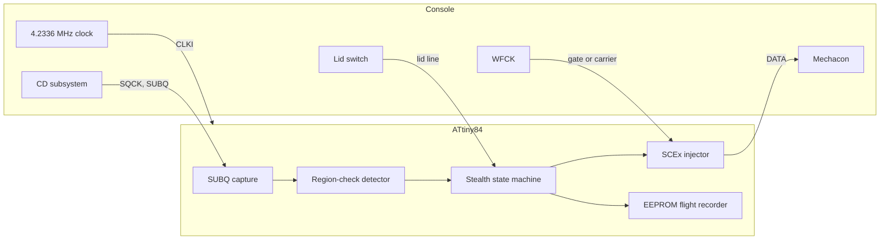

English | [日本語](README.ja.md) | [中文](README.zh.md)

<div align="center">

<h1>openscex-modchip</h1>

<strong>Stealth SCEx region unlock for the PlayStation and PSone, on an ATtiny84 clocked by the console itself.</strong>

<br><br>

[](https://github.com/gufranco/openscex-modchip/actions/workflows/ci.yml)
[](https://github.com/gufranco/openscex-modchip/releases)
[](AGENTS.md)
[](LICENSE)

</div>

<p align="center">
  <a href="#quick-start">Quick start</a> &nbsp;|&nbsp;
  <a href="#console-tap-points">Wiring</a> &nbsp;|&nbsp;
  <a href="#diagnostics">Diagnostics</a> &nbsp;|&nbsp;
  <a href="../../issues/new?template=compatibility.yml">Report your console</a>
</p>

**1134** bytes of flash · **6** board families, PU-18 to PM-41(2) · **3** regions · **0** MISRA deviations · **100%** host line and branch coverage · **48/48** mutants killed

```bash
gh release download --repo gufranco/openscex-modchip --pattern 'openscex-modchip-attiny84.hex' --pattern SHA256SUMS
sha256sum -c SHA256SUMS --ignore-missing
avrdude -c <programmer> -p attiny84 -U flash:w:openscex-modchip-attiny84.hex:i
```

> [!IMPORTANT]
> The ATtiny84 redesign (v0.3.0) passes the full simulation gate and has not yet run on a console. Measure the clock and lid points before wiring.

Region-unlock firmware for the original Sony PlayStation (fat) and PSone, on an ATtiny84 clocked by the console itself. It emits the configured region string inside the SUBQ region-check window, stops the moment the console accepts it, and leaves the data line high-impedance during play. A wire to the lid switch tells it exactly when a disc is swapped. It does not patch the boot ROM, so Japanese fat consoles and the PAL PSone keep their second region check; install a patched BIOS if you need that bypassed. It is not an optical-drive emulator, does not support PS2 or Saturn, and does not defeat LibCrypt.

| | |
|:--|:--|
| **Silent after acceptance**<br>The first program-area frame stops injection, mid-string included, and the chip stays silent until the lid opens. | **Exact disc swaps**<br>A lid wire stops a string within 4 ms of opening and re-arms the chip on close, for every disc of a multi-disc game. |
| **Console-locked timing**<br>The chip runs from the console's 4.2336 MHz clock, never its own oscillator. | **One region, one window**<br>Only the configured region string, only inside the SUBQ region-check window, at most 16 strings per arming. |
| **Flight recorder**<br>A five-byte EEPROM record per disc (board, sessions, strings, confirmation), read back with avrdude. | **Proven in code**<br>MISRA C:2012 clean, 100% host coverage, a simavr console model, mutation testing, byte-identical rebuilds. |

## How it works



## Against other chips

| Capability | openscex | PsNee V9 | Mayumi V4 | MM3 |
|:-----------|:---------|:---------|:----------|:----|
| Stealth trigger | SUBQ check window plus acceptance latch | SUBQ decode | sense line plus lid line | same program as Mayumi V4 |
| Disc-swap detection | lid line | SUBQ counter decay | lid line | lid line |
| Clock | console | internal | console | internal RC |
| Boot-ROM BIOS patch | no, use a patched BIOS | yes, ATmega builds | no | no |
| Boards | PU-18 to PM-41(2) | PU-7 to PM-41(2) | PU-18 and later | PU-7 and later |
| Diagnostics | EEPROM recorder | serial debug | none | none |
| Tests and static analysis | host, simavr, mutation, MISRA | none | none | none |
| Field record | 2 boards, earlier firmware | years | decades | decades |

## Overview

| Property | Value |
|:---------|:------|
| Console targets | PlayStation fat PU-18 through PU-23, PSone PM-41 and PM-41(2) |
| MCU | ATtiny84 (14-pin DIP) |
| Method | SCEx injection |
| Region | one per build, `REGION=jp|us|eu` (default us) |
| Clock | the console's 4.2336 MHz clock on CLKI, never the internal oscillator |
| Wires | 6 signals (SQCK, SUBQ, DATA, WFCK, clock, lid) plus power; optional LED |
| Toolchain | C17, MISRA C:2012 zero deviations, pinned Docker image |

## Verified on hardware

Combinations that booted out of region on a real console (SCEx region unlock), with the firmware of 2026-10-05.

| Board family | Console | Clock | Injection | Status |
|:-------------|:--------|:------|:----------|:-------|
| PU-18 | fat, NTSC-U/C | console | SCEx | Verified 2026-10-05 |
| PM-41 | PSone | console | SCEx | Verified 2026-10-05 |

These results predate the ATtiny84-only redesign: the mandatory lid line, the console clock as the only clock, the acceptance latch, the bounded SUBQ waits, and every 2026-10-06 change. The redesign passes the full simulation gate and has not yet run on a console. Which chip carried the 2026-10-05 console-clock builds, the exact SCPH of each unit, and the frequency they were built for are not recorded. Not confirmed on hardware: PU-20, PU-22, PU-23, PM-41(2), and PAL or NTSC-J on any family.

Per-console validation is community-driven. Tested it on your console? Open a [compatibility report](../../issues/new?template=compatibility.yml) and this table grows from confirmed installs.

## What's included

| Feature | Detail |
|:--------|:-------|
| SCEx injection | 44-bit LSB-first region string, the PU-18 and PU-20 static-gate method and the PU-22-and-later WFCK-carrier method |
| Board auto-detect | WFCK behaviour at boot selects gate or carrier mode; one build fits every family |
| Console clock | the chip runs from the console's own 4.2336 MHz clock, so every delay is locked to the console crystal, as on Mayumi V4 |
| Lid line | a mandatory wire to the lid switch: an open lid stops a string within one 4 ms bit cell, and a close re-arms the chip for the next disc, so every swap in a multi-disc game is seen, never inferred |
| Stealth | injects only inside the SUBQ region-check window, capped per arming, then DATA high-Z and LED off; stops the moment the console reads the program area and stays silent through every later lead-in read until the lid opens |
| Single configured region | emits only `REGION`, never all three |
| Adaptive timing | on WFCK-carrier boards the injection bit is timed by counting WFCK periods; `TIMING=fixed` uses the console-clocked delay instead |
| Self-recovery | each SUBQ capture realigns on the gap between frames and gives up after 30 ms; a WFCK carrier that stalls mid-injection lets the watchdog release DATA; a missing lid wire reads as open, so the chip stays silent instead of injecting blind |
| Optional LED | status output on its own pin; firmware is correct with no LED fitted |
| In-field diagnostics | a five-byte flight recorder written to EEPROM once per session, one session per disc the chip answers (detected board, session count, injection count, confirmation), read back with avrdude |
| Closed-loop confirmation | after injecting, the chip watches SUBQ for a program-area frame (a real track number), which the mechacon only allows once it accepts the region string, and records whether the region check passed |
| Verification | host tests 100% line and branch coverage, simavr console model at the console clock, mutation testing, reproducible builds |

## Confidence tags

| Tag | Meaning |
|:----|:--------|
| Read | taken from a primary source (PsNee source, the Mayumi V4 binary, quade.co, consolemods, psdevwiki, the ATtiny24A/44A/84A datasheet) |
| Concluded | inferred from sources, not stated by any one of them |
| Verified | confirmed on hardware or in the simavr model by this project |
| Unknown | no source gives it; measure on the console |

| Fact | Tag |
|:-----|:----|
| SCEx pin order | Read (PsNee `MCU.h`), owner-confirmed as field-proven |
| Clock and lid tap points | Read, the Mayumi V4 points 2 and 7 on quade.co, whose PM-41(2) page names them "Clock: Pin 2" and "CD Door: Pin 7" |
| Lid polarity, high while open | Read, the Mayumi V4 binary waits on its door input while it reads high |
| Console clock 4.2336 MHz | Concluded, 16.9344 MHz divided by four, consistent with the Mayumi V4 delay loops (182 passes where MM3 on a 4 MHz RC uses 170) |
| Mechacon pin numbers | Unknown, forum relay, re-confirm against a board diagram |
| Per-pad voltages | Concluded from the PsNee and Mayumi installs (fat around 5 V, PSone lower and noise-sensitive); measure to confirm |
| SCEx unlock on PU-18 and PSone | Verified 2026-10-05 with the earlier firmware (see table above) |

## Supported build per console

| Console | Board | `REGION` | Second region check |
|:--------|:------|:---------|:--------------------|
| Fat US/Canada, SCPH-550x1/700x1/900x1 | PU-18 to PU-23 | `us` | none |
| Fat PAL, SCPH-550x2/900x2 | PU-18 to PU-22 | `eu` | none |
| PSone US/Canada, SCPH-101 | PM-41 / PM-41(2) | `us` | none |
| PSone PAL, SCPH-102 | PM-41 / PM-41(2) | `eu` | in the boot ROM; needs a patched BIOS |
| PSone Japan, SCPH-100 | PM-41 | `jp` | in the boot ROM; needs a patched BIOS |
| Fat Japan, SCPH-5000/5500/7000/7500/9000 | PU-18 to PU-23 | `jp` | in the boot ROM; needs a patched BIOS |
| Asia, SCPH-xxx3 | not recorded | `jp` | none |
| Asia Video CD, SCPH-5903 | not recorded | `jp` + `VCD_FILTER=on` | none |

Boards older than the PU-18 (PU-7 and PU-8, SCPH-1000 to SCPH-500x) are not supported. The boot-ROM check is not handled by this chip: on the consoles marked above, imports may still be refused until a patched BIOS is installed. The Asian models need no patch: PsNee V9.0 targets SCPH-xxx3 and SCPH-5903 with the NTSC-J string alone. The SCPH-5903 also plays Video CDs, so its build adds `VCD_FILTER=on`, which arms injection only on a game's lead-in and never on a Video CD's. Neither Asian row has been confirmed on a console here. Dev boards (DTL-H120x, PU-9) read burned discs natively and need no chip.

## Configuration

One source builds every variant; the knobs are passed to `make`.

| Knob | Values | Default | Selects |
|:-----|:-------|:--------|:--------|
| `REGION` | `jp`, `us`, `eu` | `us` | the one region string the chip emits |
| `TIMING` | `adaptive`, `fixed` | `adaptive` | adaptive times the WFCK-carrier injection bit by counting WFCK periods; fixed uses the compile-time delay, which the console clock also locks |
| `VCD_FILTER` | `off`, `on` | `off` | on for the SCPH-5903 only: injection arms on a game's lead-in TOC and never on a Video CD's, following PsNee V9.0's SCPH-5903 filter |

A non-default region or filter tags the artifact name, for example `openscex-modchip-attiny84-jp.hex` or `openscex-modchip-attiny84-jp-vcd.hex`.

## MCU pinout

The SCEx signals keep PsNee's tested order, read from PsNee `MCU.h`; the clock and lid sit on PORTB. The physical pin numbers are the standard PDIP pinout; verify against the datasheet for SOIC or QFN.

| DIP pin | Port | Signal | Direction | Connect to |
|:-------:|:-----|:-------|:----------|:-----------|
| 1 | VCC | VCC | - | console supply, measure first |
| 2 | PB0 | CLKI | in | console clock, Mayumi V4 point 2; keep this wire the shortest |
| 3 | PB1 | LID | in, pull-up | lid switch, Mayumi V4 point 7 |
| 4 | PB3 | RESET | - | leave as reset |
| 5 | PB2 | - | - | unused |
| 6 | PA7 | - | - | unused |
| 7 | PA6 | - | - | unused |
| 8 | PA5 | - | - | unused |
| 9 | PA4 | LED | out, optional | status LED through a resistor, or leave off |
| 10 | PA3 | WFCK | in and out | static gate, or PU-22+ live carrier |
| 11 | PA2 | DATA | out, drive-low or high-Z | SCEx injection into the mechacon |
| 12 | PA1 | SUBQ | in | SUBQ serial data |
| 13 | PA0 | SQCK | in | SUBQ serial clock |
| 14 | GND | GND | - | console ground |

## Console tap points

DATA carries the SCEx bitstream and WFCK is the gate or carrier; these are the PsNee and Mayumi tap points. The clock and lid wires go where a Mayumi V4 chip puts its pins 2 and 7, shown per board on the quade.co diagrams: [PU-18](https://quade.co/ps1-modchip-guide/mayumi-v4/pu-18/), [PU-20](https://quade.co/ps1-modchip-guide/mayumi-v4/pu-20/), [PU-22](https://quade.co/ps1-modchip-guide/mayumi-v4/pu-22/), [PU-23](https://quade.co/ps1-modchip-guide/mayumi-v4/pu-23/), [PM-41](https://quade.co/ps1-modchip-guide/mayumi-v4/pm-41/), [PM-41(2)](https://quade.co/ps1-modchip-guide/mayumi-v4/pm-41-2/).

On these diagrams, point 2 is the console clock and point 7 is the lid line; those are the only two points this chip takes from them. Points 1 and 8 are power and ground, 5 and 6 are the WFCK and DATA points this chip also uses, and points 3 and 4 belong to Mayumi's own stealth and reset wiring, which this chip does not use. SQCK and SUBQ are not on these diagrams; see the mechacon pins below.

<table>
<tr><td align="center" width="33%"><a href="https://quade.co/ps1-modchip-guide/mayumi-v4/pu-18/"></a><br><sub><b>PU-18</b>. Diagram by William Quade, <a href="https://quade.co/ps1-modchip-guide/mayumi-v4/pu-18/">quade.co</a></sub></td><td align="center" width="33%"><a href="https://quade.co/ps1-modchip-guide/mayumi-v4/pu-20/"></a><br><sub><b>PU-20</b>. Diagram by William Quade, <a href="https://quade.co/ps1-modchip-guide/mayumi-v4/pu-20/">quade.co</a></sub></td><td align="center" width="33%"><a href="https://quade.co/ps1-modchip-guide/mayumi-v4/pu-22/"></a><br><sub><b>PU-22</b>. Diagram by William Quade, <a href="https://quade.co/ps1-modchip-guide/mayumi-v4/pu-22/">quade.co</a></sub></td></tr>
<tr><td align="center" width="33%"><a href="https://quade.co/ps1-modchip-guide/mayumi-v4/pu-23/"></a><br><sub><b>PU-23</b>. Diagram by William Quade, <a href="https://quade.co/ps1-modchip-guide/mayumi-v4/pu-23/">quade.co</a></sub></td><td align="center" width="33%"><a href="https://quade.co/ps1-modchip-guide/mayumi-v4/pm-41/"></a><br><sub><b>PM-41</b>. Diagram by William Quade, <a href="https://quade.co/ps1-modchip-guide/mayumi-v4/pm-41/">quade.co</a></sub></td><td align="center" width="33%"><a href="https://quade.co/ps1-modchip-guide/mayumi-v4/pm-41-2/"></a><br><sub><b>PM-41(2)</b>. Diagram by William Quade, <a href="https://quade.co/ps1-modchip-guide/mayumi-v4/pm-41-2/">quade.co</a></sub></td></tr>
</table>

The six diagrams are William Quade's and are shown from quade.co with credit; they are not part of this repository or its MIT license. Click a diagram for the full page and its comments.

| Board family | SCPH era | DATA injection point | WFCK role | Confidence |
|:-------------|:---------|:---------------------|:----------|:-----------|
| PU-18, PU-20 | 550x-750x | digital NRZ output of the wobble ASIC into the mechacon | static gate | Read |
| PU-22, PU-23 | 7500-900x | CD-processor tracking line, WFCK as a fake carrier, three-wire-plus-link | live clock, sync required | Read |
| PM-41, PM-41(2) | PSone 100-103 | same tracking-line carrier method; float the chip I/O when idle on PM-41(2) | live clock | Read |

The clock wire carries the console's 4.2336 MHz clock into the chip, so its length matters: quade.co traced Mayumi V4 failures to that wire picking up noise, and recommends making it the shortest of all. Mount the chip close to the clock point. The datasheet warns that a clock varying more than 2% from one cycle to the next can make the chip behave unpredictably.

Mechacon SUBQ and SQCK pins, forum relay, tagged Unknown because psxdev.net is offline since October 2025: PU-22 and later, SUBQ on pin 24 and SQCK on pin 26. Confirm against a consolemods board diagram before cutting.

## Quick start

Prebuilt per-console `.hex` images are attached to each [release](../../releases), so you can skip the toolchain and go straight to flashing with the `avrdude` steps below. Each release carries the three ATtiny84 images (`us`, `eu`, `jp`), the SCPH-5903 image (`jp-vcd`), a `SHA256SUMS` file, the license, and a build-provenance attestation. Releases up to v0.2.0 carried ATtiny85 images for the earlier four-wire design. Check a download before flashing it:

```bash
sha256sum -c SHA256SUMS --ignore-missing
gh attestation verify openscex-modchip-attiny84.hex --repo gufranco/openscex-modchip
```

Releases are versioned automatically from the commit history, and only from a commit whose CI run passed; the `0.x` line marks the firmware as pre-hardware-validation. To build from source instead: every build, check and test runs in the pinned Docker toolchain through `make`, and only `avrdude` runs on the host.

| Tool | Purpose |
|:-----|:--------|
| Docker | runs the pinned toolchain |
| Git | clones the repository |
| avrdude | flashes the image to the chip |

```bash
git clone https://github.com/gufranco/openscex-modchip.git
cd openscex-modchip
make REGION=us                                        # America
make REGION=jp VCD_FILTER=on                          # SCPH-5903
avrdude -c <programmer> -p attiny84 -U flash:w:openscex-modchip-attiny84.hex:i
avrdude -c <programmer> -p attiny84 -U lfuse:w:0xE0:m -U hfuse:w:0xDF:m -U efuse:w:0xFF:m
```

Any ISP works, including an Arduino as ISP. Write the flash first and the fuses last. The low fuse `0xE0` selects an external clock on CLKI with the slow-rising-power start-up delay and no clock divider (Read: ATtiny24A/44A/84A datasheet DS40002269A, Table 19-5 and Table 6-3, CKSEL 0000, SUT 10). From then on the chip has no clock of its own: to read or reprogram it, program it in place with the console powered, or feed a clock to pin 2 from the programmer. The firmware also clears the clock prescaler at boot, so the CKDIV8 fuse cannot slow it.

| Build | Fuses (low / high / extended) |
|:------|:------------------------------|
| Console clock | `0xE0` / `0xDF` / `0xFF` |
| Console clock with brown-out detection at 2.7 V | `0xE0` / `0xDD` / `0xFF` |

Brown-out detection holds the chip in reset while the supply is below 2.7 V, so a power-off during a diagnostics write cannot tear the EEPROM record; it is not yet exercised on a console. The ATtiny84 runs at 4.2336 MHz from 1.8 V upward by its speed grade (Read: the same datasheet, 0 to 4 MHz at 1.8 V, 0 to 10 MHz at 2.7 V), which covers the PSone's lower supply.

Verify:

```bash
make test        # host tests, simavr console model, static analysis, MISRA
make repro       # two fresh builds, byte-identical
make mutate      # mutation testing on the logic layer
```

The same gates run in CI on every push and pull request, defined in [`.github/workflows/ci.yml`](.github/workflows/ci.yml). Contributors can run `make hooks` once to enable the commit-message and formatting checks locally.

## Diagnostics

The chip writes a five-byte flight recorder to EEPROM after each session, a session being one disc's region check from the first injected string until the check resolves, so an install can be diagnosed rather than guessed. The write never happens at boot or inside the region-check window, so it does not affect injection timing, and only bytes whose value changed are written, so EEPROM endurance is not a concern. Read it back with the programmer, with the console powered so the chip has its clock:

```bash
avrdude -c <programmer> -p attiny84 -U eeprom:r:diag.bin:r
```

| Byte | Meaning |
|:-----|:--------|
| 0 | magic `0x50`; any other value means no record was written yet |
| 1 | detected board: `0` static gate, `1` WFCK carrier |
| 2 | sessions recorded, one per disc the chip answered; wraps at 255 |
| 3 | region strings emitted in the latest session |
| 4 | region check confirmed: 1 if the console reached the program area after the latest session's injection, else 0 |

## Safety

- Measure the logic voltage at every tap point before wiring, the clock and lid points included. The values are taken from the established PsNee and Mayumi installs (fat boards around 5 V, the PSone PM-41(2) lower and noise-sensitive), but assumption is not measurement.
- Never feed a console signal into the clock pin before measuring its voltage and frequency.
- Opening a console and soldering to the CD subsystem can destroy it. Build at your own risk.

## Versioning

Releases follow [Semantic Versioning](https://semver.org/) on the `0.x` line, which means a minor release can break compatibility: v0.3.0 replaced the ATtiny85 four-wire design with the ATtiny84. Every release is tagged and built from a commit whose CI passed; see [releases](../../releases) for the notes.

## Support

| Need | Where |
|:-----|:------|
| Bug report | [bug template](../../issues/new?template=bug.yml) |
| Result on your console | [compatibility report](../../issues/new?template=compatibility.yml) |
| Security report | [security policy](SECURITY.md), reported privately |
| Contributing | [contribution guide](CONTRIBUTING.md) |

## License

[MIT](LICENSE) for firmware and documentation.
