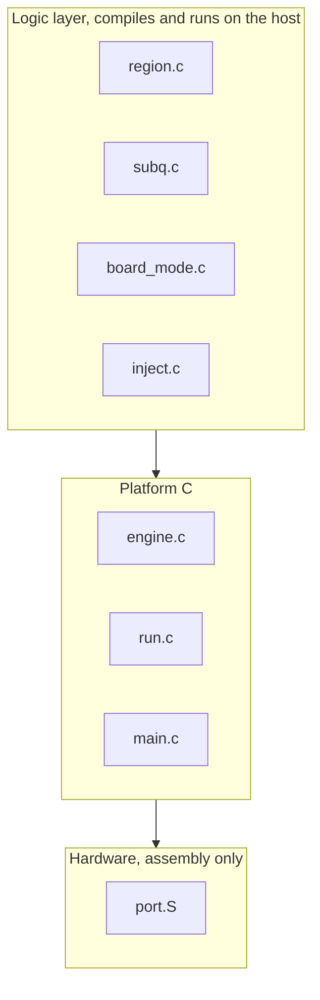
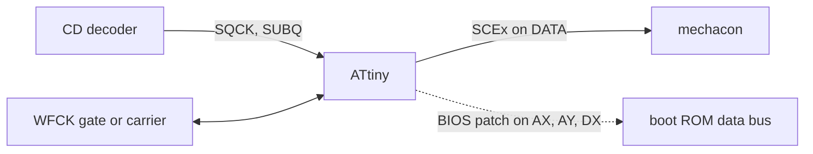

<div align="center">

# openscex-modchip

**Region unlock for the original Sony PlayStation and PSone, one firmware for the ATtiny85 and the ATtiny84.**

[](https://github.com/gufranco/openscex-modchip/actions/workflows/ci.yml)
[](AGENTS.md)
[](LICENSE)

English | [日本語](README.ja.md) | [中文](README.zh.md)

</div>

**572 B** ATtiny85 image · **2** chips, one source · **3** regions · **8** console classes · MISRA C:2012 **0** deviations · **100%** host line and branch coverage · **1** console verified, PU-8 NTSC-U/C (SCEx)

```bash
git clone https://github.com/gufranco/openscex-modchip.git
cd openscex-modchip
make REGION=us                                        # builds in the pinned Docker toolchain
avrdude -c <programmer> -p attiny85 -U flash:w:openscex-modchip-attiny85.hex:i
```

> [!IMPORTANT]
> SCEx region unlock is Verified on one console: a PU-8 NTSC-U/C fat unit with the ATtiny85 internal build booted out of region on 2026-10-05. Everything else is built and passes the full in-container gate set but is not yet confirmed on hardware: the boot-ROM BIOS patch on every model, the external-clock path, and all other board families and regions. Per-pad voltages and the BIOS timing values stay Unknown until measured. Every hardware fact below carries a confidence tag.

## What it does

A PlayStation checks a physical fingerprint pressed into the disc lead-in, the wobble groove, which decodes to a four-character region string (SCEI for Japan, SCEA for the Americas, SCEE for Europe). The console boots only discs carrying the string it expects. This modchip injects the string the console wants, only in the window the console asks for, and re-arms when it detects a disc change, so out-of-region and backup discs boot.

The build is region-specific and emits only that one configured region string, only during the short region-check window, and leaves the data line high-impedance and silent for the rest of the session, so the chip is electrically silent during play. Pick the region at build time with `make REGION=jp|us|eu` (default America).

Pick the chip by what the console needs. The ATtiny85 is the minimal, lowest-cost build: four signal wires and power, one optional status LED, no modes or reset or lid wiring. Japanese fat consoles and the PAL PSone run a second region check inside the boot ROM; for those, the ATtiny84 build adds the boot-ROM patch on its extra pins, every model including the oldest two-phase SCPH-1000 and SCPH-3000.

This is not an optical-drive emulator. It does not replace the drive, does not support PS2 or Saturn, and cannot defeat data-layer protections such as LibCrypt.

## Highlights

<table>
<tr>
<td width="50%" valign="top">

### Two chips, one source
The same firmware builds for the 8-pin ATtiny85 (SCEx only, lowest cost) and the 14-pin ATtiny84 (adds the boot-ROM patch), selected with `MCU=`.

</td>
<td width="50%" valign="top">

### Stealth by construction
Emits one configured region string, only inside the SUBQ region-check window, capped per arming, then holds DATA high-Z and the LED off for the rest of the session.

</td>
</tr>
<tr>
<td width="50%" valign="top">

### Full region unlock
SCEx on every board family PU-7 through PM-41(2), plus the boot-ROM BIOS patch for Japanese fat and PAL PSone, every model including the two-phase SCPH-1000 and SCPH-3000.

</td>
<td width="50%" valign="top">

### Board auto-detect
One build fits every family: the firmware reads WFCK behaviour at boot to tell a legacy static gate from a PU-22-and-later live carrier. No per-board variants.

</td>
</tr>
<tr>
<td width="50%" valign="top">

### Verified without hardware
Host tests at 100% line and branch coverage, a simavr console model across the oscillator tolerance band, mutation testing, and byte-identical reproducible builds.

</td>
<td width="50%" valign="top">

### MISRA C:2012, zero deviations
C17 with registers confined to assembly, checked in a pinned Docker toolchain so every build, analysis and test runs identically.

</td>
</tr>
</table>

## The problem and the engineering gap

Region lockout and its workarounds are decades-old community knowledge, and PsNee is the modern open synthesis that most installs build on. What no existing PS1 chip has is host tests, a simulation model, static analysis at a fixed standard, or reproducible builds; their injection and BIOS-patch timing rest on empirical constants and compiler-sensitive delays. This project's contribution is that engineering quality, not protocol novelty. The protocol is read from PsNee and credited below.

| Capability | openscex-modchip | PsNee | Classic chips |
|:-----------|:----------------:|:-----:|:-------------:|
| Protocol coverage | SCEx + BIOS patch | SCEx + BIOS (ATmega only) | SCEx only |
| Host tests | Yes | No | No |
| Simulation model | Yes | No | No |
| MISRA C:2012 | Yes, 0 deviations | No | No |
| Reproducible builds | Yes | No | No |
| Proven on real hardware | No | Yes | Yes |

The last row is the honest trade: this project matches PsNee's protocol at higher engineering quality, and PsNee has years of field proof this project has none of yet.

## Architecture

Three layers, so the protocol logic is tested on the host and only register access touches hardware. A layer check fails the build if a logic file reaches the platform or a C file includes a hardware header.



Signal flow on the board. SCEx injection is on every build; the BIOS-patch path is the ATtiny84 only.



The logic layer lives in [`src/inject.c`](src/inject.c) and its peers; the register access is isolated in [`src/port.S`](src/port.S); the board-to-pin mapping is the single profile in [`include/port/registers.h`](include/port/registers.h).

## Confidence tags

Every hardware fact in this document carries one tag, and nothing is presented as measured when it is not.

| Tag | Meaning |
|:----|:--------|
| Read | Taken directly from a primary source, above all the PsNee source and the consolemods and psdevwiki documentation |
| Concluded | Inferred from sources, not stated by any one of them |
| Verified | Confirmed on hardware or in the simulation model by this project |
| Unknown | No source gives it; it must be measured on the console |

The MCU pin assignment is Read from PsNee and confirmed by the owner as the field-proven map. The console-side tap points are Read at the signal level and field-proven in PsNee and Mayumi installs; the exact mechacon pin numbers are a forum relay and tagged Unknown until re-confirmed against a board diagram. Per-pad voltages are Unknown everywhere and must be measured. The BIOS-patch timing is Read from PsNee and mechanically exercised in simavr, never Verified on a console. SCEx region unlock is Verified on one PU-8 NTSC-U/C console (2026-10-05); no other board family, region, or the BIOS patch is Verified yet.

## Safety first

> [!CAUTION]
> Opening a console and soldering to the CD subsystem can destroy it. This is a build-at-your-own-risk project.

- You must measure the logic voltage at every tap point before wiring. No source gives a per-pad voltage, so it is Unknown. Fat boards are assumed around 5 V and the PSone PM-41(2) lower and noise-sensitive, but assumption is not measurement.
- Never feed a console signal into a clock pin before measuring it.

## Which build for which console

Pick the chip and the build knobs from the console. The BIOS model follows the console's actual BIOS version, which matters more than the SCPH number.

| Console | Board | Region | `MCU` | `REGION` | `BIOS` | Wiring |
|:--------|:------|:-------|:------|:---------|:-------|:-------|
| Fat US/Canada, SCPH-100x1/550x1/700x1/900x1 | PU-7 to PU-23 | us | `attiny85` | `us` | `none` | SCEx, 4 wires |
| Fat PAL, SCPH-100x2/550x2/900x2 | PU-8 to PU-22 | eu | `attiny85` | `eu` | `none` | SCEx, 4 wires |
| PSone US/Canada, SCPH-101 | PM-41 / PM-41(2) | us | `attiny85` | `us` | `none` | SCEx, 4 wires |
| PSone PAL, SCPH-102 | PM-41 / PM-41(2) | eu | `attiny84` | `eu` | `scph_102` | SCEx + BIOS patch |
| PSone Japan, SCPH-100 | PM-41 | jp | `attiny84` | `jp` | `scph_100` | SCEx + BIOS patch |
| Fat Japan, SCPH-5000/5500/3500 | PU-18 / PU-8 | jp | `attiny84` | `jp` | `scph_3500_5500` | SCEx + BIOS patch |
| Fat Japan, SCPH-7000/7500/9000 | PU-20 to PU-23 | jp | `attiny84` | `jp` | `scph_7000_9000` | SCEx + BIOS patch |
| Fat Japan, SCPH-3000 | PU-8 | jp | `attiny84` | `jp` | `scph_3000` | SCEx + two-phase BIOS patch |
| Fat Japan, SCPH-1000 | PU-7 | jp | `attiny84` | `jp` | `scph_1000` | SCEx + two-phase BIOS patch |

Example: a PAL PSone is `make MCU=attiny84 REGION=eu BIOS=scph_102`; a US fat console is `make REGION=us` (the default ATtiny85).

> [!NOTE]
> Two known cases this firmware does not cover with a BIOS model: Asian models (SCPH-xxx3, for example SCPH-5003/5903) carry an English ROM with no second check but an NTSC-J CD controller with no backdoor, so SCEx alone is insufficient; and the dev boards (DTL-H120x, PU-9) read burned discs natively and need no chip.

## MCU pinout, where each wire lands on the chip

The pin assignment is PsNee's tested ATtiny85 (`ATTINY_X5`) map, read from PsNee `MCU.h` and confirmed by the owner, so an existing PsNee or Mayumi install guide for your board matches this chip wire for wire. These physical pin numbers are the standard PDIP pinouts for the parts; verify against the datasheet for your exact package, since SOIC and QFN renumber.

### ATtiny85, 8-pin DIP, minimal build (SCEx only)

| DIP pin | Port | Signal | Direction | Connect to |
|:-------:|:-----|:-------|:----------|:-----------|
| 1 | PB5 | RESET | - | leave as reset, unused |
| 2 | PB3 | LED | output, optional | status LED anode through a resistor, or leave off |
| 3 | PB4 | WFCK | input and output | board gate on legacy boards, live carrier on PU-22 and later |
| 4 | GND | GND | - | console ground |
| 5 | PB0 | SQCK | input | SUBQ serial clock from the CD decoder |
| 6 | PB1 | SUBQ | input | SUBQ serial data from the CD decoder |
| 7 | PB2 | DATA | output, drive-low or high-Z | SCEx injection into the mechacon |
| 8 | VCC | VCC | - | console 5 V, measure first |

### ATtiny84, 14-pin DIP, full build (SCEx plus boot-ROM BIOS patch)

The SCEx signals sit on PORTA in the same order as the 85, so the wiring transfers; the spare pins carry the BIOS patch and are wired only on Japanese fat and PAL PSone consoles.

| DIP pin | Port | Signal | Direction | Connect to |
|:-------:|:-----|:-------|:----------|:-----------|
| 1 | VCC | VCC | - | console 5 V, measure first |
| 2 | PB0 | - | - | unused, XTAL1 input if external clock is ever enabled |
| 3 | PB1 | - | - | unused, XTAL2 |
| 4 | PB3 | RESET | - | leave as reset, unused |
| 5 | PB2 | AX | input | BIOS patch: first boot-ROM address line, pulses counted |
| 6 | PA7 | - | - | unused |
| 7 | PA6 | AY | input | BIOS patch: second address line, two-phase models only, SCPH-1000/3000 |
| 8 | PA5 | DX | output, drive-low or high-Z | BIOS patch: boot-ROM data-bus override |
| 9 | PA4 | LED | output, optional | status LED anode through a resistor, or leave off |
| 10 | PA3 | WFCK | input and output | board gate on legacy boards, live carrier on PU-22 and later |
| 11 | PA2 | DATA | output, drive-low or high-Z | SCEx injection into the mechacon |
| 12 | PA1 | SUBQ | input | SUBQ serial data from the CD decoder |
| 13 | PA0 | SQCK | input | SUBQ serial clock from the CD decoder |
| 14 | GND | GND | - | console ground |

On an SCEx-only console the ATtiny84 uses the same four signals as the 85 (SQCK, SUBQ, DATA, WFCK) plus power and the optional LED; AX, AY and DX stay unconnected. The LED is always optional: the firmware is correct whether it is fitted or not.

## Console-side tap points, where each wire lands on the board

The DATA line carries the SCEx bitstream and the gate or carrier line (WFCK) enables or clocks it. These are the established PsNee and Mayumi tap points, documented on consolemods.org and psdevwiki.com and proven in the field. The board family is auto-detected, so the chip is the same; only the tap points differ per family.

| Board family | SCPH era | DATA injection point | Gate or carrier (WFCK) | Confidence |
|:-------------|:---------|:---------------------|:-----------------------|:-----------|
| PU-7, PU-8 | 1000-5003 | demodulated wobble NRZ serial into the mechacon, historically "point 6" | WFCK held static high | Read; exact point from a forum snippet, confirm on your board |
| PU-18, PU-20 | 550x-750x | digital NRZ output of the custom wobble ASIC into the mechacon | WFCK static gate | Read |
| PU-22, PU-23 | 7500-900x | CD-processor tracking line via WFCK as a fake carrier, the three-wire-plus-link method | WFCK live clock, sync required | Read |
| PM-41, PM-41(2) | PSone 100-103 | same tracking-line carrier method; float the chip I/O when idle on PM-41(2) for pickup noise | WFCK live clock | Read |

SUBQ and SQCK mechacon pins, from a forum relay and tagged Unknown because psxdev.net has been offline since October 2025: on PU-22 and later, SUBQ on mechacon pin 24 and SQCK on pin 26; on PU-7 and early PU-8, SUBQ on pin 39 and SQCK on pin 41. Confirm against a consolemods board diagram before cutting.

### BIOS-patch tap points (ATtiny84 only)

For a Japanese fat console or a PAL PSone, SCEx alone does not satisfy the boot-ROM region check, so the ATtiny84 patch counts pulses on a boot-ROM address line (AX), briefly overrides a data-bus line (DX), and on the two oldest models overrides a second time after counting a second address line (AY). The MCU-side pins are fixed and listed above, driven by [`src/bios.c`](src/bios.c) and [`src/port.S`](src/port.S). The console-side pads for AX, AY and DX are per board and per BIOS revision, and no public source in this project gives a verified per-pad mapping. Identify them against PsNee's wiring notes for your exact model and a consolemods board diagram, and treat every BIOS-patch install as unconfirmed until it boots. The patch timing is ported from PsNee and has not been confirmed on hardware here.

## Configuration

One source builds every variant; the build knobs are passed to `make`.

| Knob | Values | Default | What it selects |
|:-----|:-------|:--------|:----------------|
| `MCU` | `attiny85`, `attiny84` | `attiny85` | The 8-pin chip (SCEx only, lowest cost) or the 14-pin chip (adds the BIOS patch) |
| `REGION` | `jp`, `us`, `eu` | `us` | The one region string the chip emits, which is the console's own region |
| `CLOCK` | `internal`, `external` | `internal` | Internal 8 MHz oscillator, or the console's own clock (`CLOCK=external EXT_F_CPU=<hz>`), gated on measuring that clock and the pin voltage first |
| `BIOS` | `none`, `scph_102`, `scph_100`, `scph_7000_9000`, `scph_3500_5500`, `scph_1000`, `scph_3000` | `none` | ATtiny84 only: the boot-ROM patch tuned to that console's BIOS version |

The status LED is always optional. Stealth, single-region injection and disc-swap re-arming are in every build. A non-default region tags the artifact name, for example `openscex-modchip-attiny85-jp.hex`.

## Quick start

### Prerequisites

| Tool | Why | Install |
|:-----|:----|:--------|
| Docker | Runs the pinned toolchain; every build, check and test happens inside it | [docker.com](https://www.docker.com) |
| Git | Clone the repository | [git-scm.com](https://git-scm.com) |
| avrdude | Flash the built image to the chip, the only step that runs on the host | [github.com/avrdudes/avrdude](https://github.com/avrdudes/avrdude) |

### Build and program

```bash
git clone https://github.com/gufranco/openscex-modchip.git
cd openscex-modchip
make REGION=us                                        # ATtiny85, America, internal clock
make MCU=attiny84 REGION=eu BIOS=scph_102             # PAL PSone, with the boot-ROM patch
avrdude -c <programmer> -p attiny85 -U flash:w:openscex-modchip-attiny85.hex:i
```

Any ISP works, including an Arduino as ISP. The firmware resets the clock prescaler to divide-by-one at boot, so a factory CKDIV8 fuse does not change the timing. Fuses for the internal 8 MHz RC build, the only build verified in simulation: low `0xE2`, high `0xDF`, extended `0xFF`.

> [!WARNING]
> The external-clock build is unverified and hardware-gated. Build it with the measured mechacon frequency, `make CLOCK=external EXT_F_CPU=<hz>UL`; the output name carries `-extclk`. The candidate frequency is 4.2336 MHz, equal to 16.9344 MHz divided by four, but it is Concluded from a snippet, not measured. The external-clock fuse bits depend on the measured frequency and must be read from the chip datasheet. Do not program external-clock fuses before measuring the clock pin voltage.

### Verify

```bash
make test        # host tests, the simavr console model, static analysis, MISRA
make repro       # two fresh builds, byte-identical
make mutate      # mutation testing on the logic layer
```

The same gates run in CI on every push and pull request, defined in [`.github/workflows/ci.yml`](.github/workflows/ci.yml).

## Design principles

- Portable, layered C: a host-testable logic layer, a thin platform layer, and register access isolated to assembly, so the protocol logic is tested without hardware.
- Timing with stated origins: every timing constant traces to a measured bit cell, a datasheet figure, or a simulation, never copied from another chip without derivation.
- Verified before claimed: host tests at full coverage, simulation across the oscillator tolerance band, mutation testing, and reproducible builds from a pinned toolchain, with a documented set of claims that only real hardware can settle.
- Derive timing from the console where the hardware allows it, for precision, as the Mayumi design did.
- Inexpensive, through-hole-preferred, genuinely open source, with no proprietary ROM content in the tree.

## Documentation

- [`AGENTS.md`](AGENTS.md): the contract and hard rules for anyone working in this repository.

This README is the single source of truth for the project description, the wiring, and the programming steps. The full specification, hardware model, research corpus, and decision records are development material kept outside the published tree.

## Prior art and credit

The protocol and compatibility knowledge here is synthesized from decades of community work: Old Crow's open-source chip, the Mayumi and MM3 lineage, OneChip, and above all PsNee, the modern open-source synthesis whose source is the primary protocol reference. This project's contribution is engineering quality, not protocol novelty. Sources are cited per claim in the research documents.

## License

[MIT](LICENSE) for firmware and documentation, matching the reference project. Third-party source is studied, not copied; research informs architecture without taking implementation from any license that forbids it.
