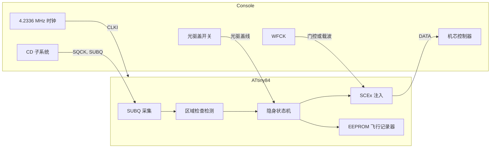

[English](README.md) | [日本語](README.ja.md) | 中文

<div align="center">

<h1>openscex-modchip</h1>

<strong>面向 PlayStation 与 PSone 的隐身 SCEx 区域解锁，运行在由主机自身时钟驱动的 ATtiny84 上。</strong>

<br><br>

[](https://github.com/gufranco/openscex-modchip/actions/workflows/ci.yml)
[](https://github.com/gufranco/openscex-modchip/releases)
[](AGENTS.md)
[](LICENSE)

</div>

<p align="center">
  <a href="#快速开始">快速开始</a> &nbsp;|&nbsp;
  <a href="#主机接点">接线</a> &nbsp;|&nbsp;
  <a href="#诊断">诊断</a> &nbsp;|&nbsp;
  <a href="../../issues/new?template=compatibility.yml">报告你的主机</a>
</p>

闪存 **1134** 字节 · **6** 个主板系列，PU-18 至 PM-41(2) · **3** 个区域 · MISRA 偏离 **0** · 主机测试行与分支覆盖率 **100%** · 变异体 **48/48** 被杀死

```bash
gh release download --repo gufranco/openscex-modchip --pattern 'openscex-modchip-attiny84.hex' --pattern SHA256SUMS
sha256sum -c SHA256SUMS --ignore-missing
avrdude -c <programmer> -p attiny84 -U flash:w:openscex-modchip-attiny84.hex:i
```

> [!IMPORTANT]
> ATtiny84 重新设计（v0.3.0）通过了全部仿真关卡，尚未在实机上运行。接线前请测量时钟与光驱盖接点。

面向初代索尼 PlayStation（厚机）与 PSone 的区域解锁固件，运行在由主机自身时钟驱动的 ATtiny84 上。它只在 SUBQ 区域检查窗口内送出配置好的区域字符串，主机一接受就立即停止，游戏运行时让数据线保持高阻。一根接到光驱盖开关的线让它准确知道何时换盘。它不修补引导 ROM，因此日本厚机与 PAL 的 PSone 仍保留第二道区域检查；如需绕过，请安装已修补的 BIOS。它不是光驱模拟器，不支持 PS2 或土星，也不破解 LibCrypt。

| | |
|:--|:--|
| **接受后保持静默**<br>第一个程序区帧即停止注入（字符串中途也一样），并保持静默直到光驱盖打开。 | **准确的换盘**<br>光驱盖线在打开后 4 ms 内停止字符串，关闭时重新武装，适用于多光盘游戏的每张光盘。 |
| **锁定主机的时序**<br>芯片由主机的 4.2336 MHz 时钟驱动，从不使用自身振荡器。 | **一个区域，一个窗口**<br>只送出配置的区域字符串，只在 SUBQ 区域检查窗口内，每次武装最多 16 次。 |
| **飞行记录器**<br>每张光盘一份 5 字节的 EEPROM 记录（主板、会话、字符串、确认），用 avrdude 读回。 | **代码实证**<br>MISRA C:2012 合规，主机覆盖率 100%，simavr 主机模型，变异测试，逐字节一致的重新构建。 |

## 工作原理



## 与其他芯片对比

| 能力 | openscex | PsNee V9 | Mayumi V4 | MM3 |
|:-----|:---------|:---------|:----------|:----|
| 隐身触发 | SUBQ 检查窗口加接受锁存 | SUBQ 解码 | 感应线加光驱盖线 | 与 Mayumi V4 相同的程序 |
| 换盘检测 | 光驱盖线 | SUBQ 计数器衰减 | 光驱盖线 | 光驱盖线 |
| 时钟 | 主机 | 内部 | 主机 | 内部 RC |
| 引导 ROM BIOS 补丁 | 无，使用已修补的 BIOS | 有，ATmega 版本 | 无 | 无 |
| 主板 | PU-18 至 PM-41(2) | PU-7 至 PM-41(2) | PU-18 及以后 | PU-7 及以后 |
| 诊断 | EEPROM 记录器 | 串口调试 | 无 | 无 |
| 测试与静态分析 | 主机、simavr、变异、MISRA | 无 | 无 | 无 |
| 实战记录 | 2 块主板，旧固件 | 数年 | 数十年 | 数十年 |

## 概览

| 项目 | 值 |
|:-----|:---|
| 目标机型 | PlayStation 厚机 PU-18 至 PU-23，PSone PM-41 与 PM-41(2) |
| MCU | ATtiny84（14 脚 DIP） |
| 方式 | SCEx 注入 |
| 区域 | 每次构建一个，`REGION=jp|us|eu`（默认 us） |
| 时钟 | 主机的 4.2336 MHz 时钟接入 CLKI，从不使用内部振荡器 |
| 连线 | 6 根信号线（SQCK、SUBQ、DATA、WFCK、时钟、光驱盖）加电源；LED 可选 |
| 工具链 | C17，MISRA C:2012 零偏离，版本固定的 Docker 镜像 |

## 已在实机验证

在真实主机上成功启动外区光盘的组合（SCEx 区域解锁），使用 2026-10-05 的固件。

| 主板系列 | 主机 | 时钟 | 注入 | 状态 |
|:---------|:-----|:-----|:-----|:-----|
| PU-18 | 厚机，NTSC-U/C | 主机 | SCEx | Verified 2026-10-05 |
| PM-41 | PSone | 主机 | SCEx | Verified 2026-10-05 |

这些结果早于改为仅支持 ATtiny84 的重新设计：必接的光驱盖线、仅使用主机时钟、接受锁存、有上限的 SUBQ 等待，以及 2026-10-06 的全部改动。重新设计通过了全部仿真关卡，尚未在实机上运行。2026-10-05 主机时钟构建所用的芯片、各台机器的确切 SCPH 以及构建时的频率均未记录。尚未在实机确认：PU-20、PU-22、PU-23、PM-41(2)，以及任何主板上的 PAL 与 NTSC-J。

逐机型验证由社区推动。在你的主机上试过了吗？请提交[兼容性报告](../../issues/new?template=compatibility.yml)，此表将随确认的安装而增长。

## 包含内容

| 功能 | 说明 |
|:-----|:-----|
| SCEx 注入 | 44 位 LSB 优先的区域字符串，PU-18 与 PU-20 的静态门控方式，以及 PU-22 及以后的 WFCK 载波方式 |
| 主板自动识别 | 启动时 WFCK 的行为决定门控或载波模式；一个构建适用所有主板 |
| 主机时钟 | 芯片由主机自身的 4.2336 MHz 时钟驱动，所有延时都锁定在主机的晶振上，与 Mayumi V4 相同 |
| 光驱盖线 | 接到光驱盖开关的必接线：盖子打开时在一个 4 ms 位单元内停止字符串，关闭时为下一张光盘重新武装，因此多光盘游戏的每次换盘都被检测到，而非推测 |
| 隐身 | 只在 SUBQ 区域检查窗口内、每次武装有上限地注入，之后 DATA 高阻、LED 关闭；主机一读到程序区即停止，并在盖子打开前对之后的所有导入区读取保持静默 |
| 单一区域 | 只送出 `REGION`，从不送出全部三个 |
| 自适应时序 | 在 WFCK 载波主板上通过计数 WFCK 周期为注入位计时；`TIMING=fixed` 改用由主机时钟计时的延时 |
| 自我恢复 | 每次 SUBQ 采集都在帧间空隙重新对齐，并在 30 ms 后放弃；注入中 WFCK 载波停止时看门狗会释放 DATA；光驱盖线缺失时读作打开，芯片保持静默而不会盲目注入 |
| 可选 LED | 独立引脚上的状态输出；不装 LED 固件也正确运行 |
| 现场诊断 | 每次会话向 EEPROM 写入一次 5 字节飞行记录器，芯片应答的每张光盘一次会话（识别的主板、会话数、注入数、确认），用 avrdude 读回 |
| 闭环确认 | 注入后，芯片在 SUBQ 中等待程序区帧（真实的音轨号），机芯控制器只有在接受区域字符串后才允许读取它，因此记录区域检查是否通过 |
| 验证 | 主机测试行与分支覆盖率 100%，在主机时钟下的 simavr 主机模型，变异测试，可复现构建 |

## 可信度标签

| 标签 | 含义 |
|:-----|:-----|
| Read | 取自一手资料（PsNee 源码、Mayumi V4 二进制、quade.co、consolemods、psdevwiki、ATtiny24A/44A/84A 数据手册） |
| Concluded | 由资料推断，并非任何一份资料直接陈述 |
| Verified | 本项目在实机或 simavr 模型中确认 |
| Unknown | 没有资料给出，请在主机上测量 |

| 事实 | 标签 |
|:-----|:-----|
| SCEx 引脚顺序 | Read（PsNee `MCU.h`），所有者确认已经实战验证 |
| 时钟与光驱盖的接点 | Read，quade.co 上 Mayumi V4 的 2 号与 7 号点，其 PM-41(2) 页面写明 "Clock: Pin 2" 与 "CD Door: Pin 7" |
| 光驱盖极性，打开时为高 | Read，Mayumi V4 二进制在其门输入为高时等待 |
| 主机时钟 4.2336 MHz | Concluded，16.9344 MHz 的四分之一，与 Mayumi V4 的延时循环一致（MM3 在 4 MHz RC 上用 170 次，此处 182 次） |
| 机芯控制器引脚号 | Unknown，论坛转述，请对照主板图再确认 |
| 各焊点电压 | 由 PsNee 与 Mayumi 的安装 Concluded（厚机约 5 V，PSone 较低且对噪声敏感）；测量以确认 |
| PU-18 与 PSone 上的 SCEx 解锁 | 以旧固件 Verified 2026-10-05（见上表） |

## 各机型的构建

| 主机 | 主板 | `REGION` | 第二道区域检查 |
|:-----|:-----|:---------|:---------------|
| 厚机 US/加拿大，SCPH-550x1/700x1/900x1 | PU-18 至 PU-23 | `us` | 无 |
| 厚机 PAL，SCPH-550x2/900x2 | PU-18 至 PU-22 | `eu` | 无 |
| PSone US/加拿大，SCPH-101 | PM-41 / PM-41(2) | `us` | 无 |
| PSone PAL，SCPH-102 | PM-41 / PM-41(2) | `eu` | 在引导 ROM 中；需要已修补的 BIOS |
| PSone 日本，SCPH-100 | PM-41 | `jp` | 在引导 ROM 中；需要已修补的 BIOS |
| 厚机日本，SCPH-5000/5500/7000/7500/9000 | PU-18 至 PU-23 | `jp` | 在引导 ROM 中；需要已修补的 BIOS |
| 亚洲，SCPH-xxx3 | 未记录 | `jp` | 无 |
| 亚洲 Video CD，SCPH-5903 | 未记录 | `jp` + `VCD_FILTER=on` | 无 |

不支持早于 PU-18 的主板（PU-7 与 PU-8，SCPH-1000 至 SCPH-500x）。引导 ROM 中的检查不由本芯片处理：在上表标出的机型上，安装已修补的 BIOS 之前外区游戏仍可能被拒绝。亚洲型号无需修补：PsNee V9.0 仅用 NTSC-J 字符串支持 SCPH-xxx3 与 SCPH-5903。SCPH-5903 还能播放 Video CD，因此其构建加上 `VCD_FILTER=on`，使注入只在游戏的导入区触发，不会在 Video CD 上触发。这两行亚洲机型尚未在本项目的实机上确认。开发机（DTL-H120x、PU-9）原生即可读刻录盘，无需芯片。

## 配置

同一套源码构建所有变体；参数传给 `make`。

| 参数 | 取值 | 默认 | 选择 |
|:-----|:-----|:-----|:-----|
| `REGION` | `jp`、`us`、`eu` | `us` | 芯片送出的唯一区域字符串 |
| `TIMING` | `adaptive`、`fixed` | `adaptive` | adaptive 通过计数 WFCK 周期为 WFCK 载波注入位计时；fixed 使用编译期延时，同样锁定在主机时钟上 |
| `VCD_FILTER` | `off`、`on` | `off` | 仅 SCPH-5903 设为 on：注入只在游戏的导入区 TOC 触发，不在 Video CD 上触发，遵循 PsNee V9.0 的 SCPH-5903 过滤器 |

非默认区域或过滤器会在产物名上加标签，例如 `openscex-modchip-attiny84-jp.hex` 或 `openscex-modchip-attiny84-jp-vcd.hex`。

## MCU 引脚

SCEx 信号保持 PsNee 经验证的顺序（Read 自 PsNee `MCU.h`）；时钟与光驱盖位于 PORTB。物理引脚号为标准 PDIP 配置，SOIC 或 QFN 请查数据手册。

| DIP 脚 | 端口 | 信号 | 方向 | 连接到 |
|:------:|:-----|:-----|:-----|:-------|
| 1 | VCC | VCC | - | 主机电源，先测量 |
| 2 | PB0 | CLKI | 输入 | 主机时钟，Mayumi V4 的 2 号点；这根线要最短 |
| 3 | PB1 | LID | 输入，上拉 | 光驱盖开关，Mayumi V4 的 7 号点 |
| 4 | PB3 | RESET | - | 保持为复位 |
| 5 | PB2 | - | - | 未使用 |
| 6 | PA7 | - | - | 未使用 |
| 7 | PA6 | - | - | 未使用 |
| 8 | PA5 | - | - | 未使用 |
| 9 | PA4 | LED | 输出，可选 | 经电阻的状态 LED，或不接 |
| 10 | PA3 | WFCK | 输入输出 | 静态门控，或 PU-22 及以后的实时载波 |
| 11 | PA2 | DATA | 输出，拉低或高阻 | 向机芯控制器注入 SCEx |
| 12 | PA1 | SUBQ | 输入 | SUBQ 串行数据 |
| 13 | PA0 | SQCK | 输入 | SUBQ 串行时钟 |
| 14 | GND | GND | - | 主机地 |

## 主机接点

DATA 承载 SCEx 位流，WFCK 是门控或载波；这些是 PsNee 与 Mayumi 的接点。时钟线与光驱盖线接到 Mayumi V4 芯片的 2 号与 7 号脚所接的位置，各主板的位置见 quade.co 的图：[PU-18](https://quade.co/ps1-modchip-guide/mayumi-v4/pu-18/)、[PU-20](https://quade.co/ps1-modchip-guide/mayumi-v4/pu-20/)、[PU-22](https://quade.co/ps1-modchip-guide/mayumi-v4/pu-22/)、[PU-23](https://quade.co/ps1-modchip-guide/mayumi-v4/pu-23/)、[PM-41](https://quade.co/ps1-modchip-guide/mayumi-v4/pm-41/)、[PM-41(2)](https://quade.co/ps1-modchip-guide/mayumi-v4/pm-41-2/)。

| 主板系列 | SCPH 年代 | DATA 注入点 | WFCK 作用 | 可信度 |
|:---------|:----------|:------------|:----------|:-------|
| PU-18、PU-20 | 550x-750x | 摆动 ASIC 送入机芯控制器的数字 NRZ 输出 | 静态门控 | Read |
| PU-22、PU-23 | 7500-900x | CD 处理器的循迹线，WFCK 作伪载波，三线加跳线 | 实时时钟，需同步 | Read |
| PM-41、PM-41(2) | PSone 100-103 | 同样的循迹线载波方式；PM-41(2) 空闲时让芯片 I/O 浮空 | 实时时钟 | Read |

时钟线把主机的 4.2336 MHz 时钟送进芯片，因此长度很重要：quade.co 将 Mayumi V4 的故障归因于这根线拾取的噪声，并建议让它成为最短的一根。请把芯片装在靠近时钟点的位置。数据手册警告，相邻周期之间变化超过 2% 的时钟会使芯片行为不可预测。

机芯控制器的 SUBQ 与 SQCK 引脚，论坛转述，因 psxdev.net 自 2025 年 10 月起离线而标为 Unknown：PU-22 及以后，SUBQ 在 24 脚，SQCK 在 26 脚。动刀前请对照 consolemods 的主板图确认。

## 快速开始

各[发布](../../releases)都附有按机型预构建的 `.hex`，可跳过工具链，直接用下面的 `avrdude` 步骤烧录。每个发布附带三份 ATtiny84 镜像（`us`、`eu`、`jp`）、SCPH-5903 镜像（`jp-vcd`）、`SHA256SUMS` 文件、许可证与构建来源证明。v0.2.0 及之前的发布附带的是旧四线设计的 ATtiny85 镜像。烧录前请先校验下载文件：

```bash
sha256sum -c SHA256SUMS --ignore-missing
gh attestation verify openscex-modchip-attiny84.hex --repo gufranco/openscex-modchip
```

发布版本由提交历史自动生成，且只来自 CI 通过的提交；`0.x` 系列表示固件尚未经实机验证。若要从源码构建：所有构建、检查与测试都通过 `make` 在版本固定的 Docker 工具链中运行，主机上只运行 `avrdude`。

| 工具 | 用途 |
|:-----|:-----|
| Docker | 运行固定的工具链 |
| Git | 克隆仓库 |
| avrdude | 把镜像烧进芯片 |

```bash
git clone https://github.com/gufranco/openscex-modchip.git
cd openscex-modchip
make REGION=us                                        # 美洲
make REGION=jp VCD_FILTER=on                          # SCPH-5903
avrdude -c <programmer> -p attiny84 -U flash:w:openscex-modchip-attiny84.hex:i
avrdude -c <programmer> -p attiny84 -U lfuse:w:0xE0:m -U hfuse:w:0xDF:m -U efuse:w:0xFF:m
```

任何 ISP 都可以，包括 Arduino as ISP。先写闪存，最后写熔丝。low 熔丝 `0xE0` 选择 CLKI 上的外部时钟、适合缓慢上电的启动延时，且不分频（Read：ATtiny24A/44A/84A 数据手册 DS40002269A，Table 19-5 与 Table 6-3，CKSEL 0000，SUT 10）。此后芯片没有自己的时钟：要读取或重新烧录，请在主机通电时在板上烧录，或由编程器向 2 号脚提供时钟。固件在启动时也会清除时钟预分频器，因此 CKDIV8 熔丝不会让它变慢。

| 构建 | 熔丝（low / high / extended） |
|:-----|:------------------------------|
| 主机时钟 | `0xE0` / `0xDF` / `0xFF` |
| 主机时钟，带 2.7 V 欠压检测 | `0xE0` / `0xDD` / `0xFF` |

欠压检测在电源低于 2.7 V 时使芯片保持复位，因此诊断写入期间断电也不会写坏 EEPROM 记录；尚未在主机上实测。按速度等级，ATtiny84 在 1.8 V 以上即可以 4.2336 MHz 运行（Read：同一数据手册，1.8 V 时 0 至 4 MHz，2.7 V 时 0 至 10 MHz），涵盖 PSone 较低的电源。

验证：

```bash
make test        # 主机测试、simavr 主机模型、静态分析、MISRA
make repro       # 两次全新构建逐字节一致
make mutate      # 逻辑层的变异测试
```

同样的关卡在每次 push 与拉取请求时于 CI 运行，定义在 [`.github/workflows/ci.yml`](.github/workflows/ci.yml)。贡献者可运行一次 `make hooks`，在本地启用提交信息与格式检查。

## 诊断

芯片在每次会话后向 EEPROM 写入 5 字节飞行记录器。一次会话是一张光盘的区域检查，从第一次注入字符串到检查有结果为止，这样安装可以被诊断而不是靠猜。写入从不发生在启动时或区域检查窗口内，因此不影响注入时序，且只写入值有变化的字节，EEPROM 寿命不成问题。在主机通电、芯片有时钟的状态下，用编程器读回：

```bash
avrdude -c <programmer> -p attiny84 -U eeprom:r:diag.bin:r
```

| 字节 | 含义 |
|:-----|:-----|
| 0 | 魔数 `0x50`；其他值表示尚未写入记录 |
| 1 | 识别的主板：`0` 静态门控，`1` WFCK 载波 |
| 2 | 已记录的会话数，芯片应答的每张光盘一次；255 后回绕 |
| 3 | 最新会话中送出的区域字符串数 |
| 4 | 区域检查确认：最新会话注入后主机到达程序区则为 1，否则为 0 |

## 安全

- 接线前测量每个接点的逻辑电压，包括时钟与光驱盖接点。数值取自成熟的 PsNee 与 Mayumi 安装（厚机约 5 V，PSone PM-41(2) 较低且对噪声敏感），但假设不等于测量。
- 在测量电压与频率之前，绝不要把主机信号送入时钟脚。
- 打开主机并焊接 CD 子系统可能损坏主机。风险自负。

## 版本

发布遵循 `0.x` 系列的[语义化版本](https://semver.org/)，这意味着次版本也可能破坏兼容性：v0.3.0 用 ATtiny84 取代了 ATtiny85 四线设计。每个发布都打了标签，并从 CI 通过的提交构建；说明见[发布](../../releases)。

## 支持

| 需求 | 渠道 |
|:-----|:-----|
| 报告缺陷 | [缺陷模板](../../issues/new?template=bug.yml) |
| 你的主机上的结果 | [兼容性报告](../../issues/new?template=compatibility.yml) |
| 安全报告 | [安全策略](SECURITY.md)，私下报告 |
| 贡献 | [贡献指南](CONTRIBUTING.md) |

## 许可证

固件与文档采用 [MIT](LICENSE)。
