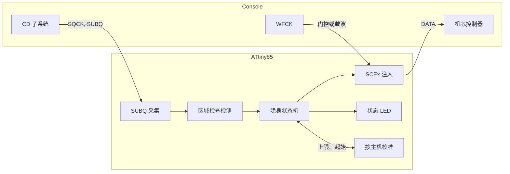

[English](README.md) | [日本語](README.ja.md) | 中文

<div align="center">

<h1>openscex-modchip</h1>

<strong>面向 PlayStation 与 PSone 的隐身 SCEx 区域解锁，运行在按主机校正自身时钟的 ATtiny85 上。</strong>

<br><br>

[](https://github.com/gufranco/openscex-modchip/actions/workflows/ci.yml)
[](https://github.com/gufranco/openscex-modchip/releases)
[](AGENTS.md)
[](LICENSE)

</div>

<p align="center">
  <a href="#快速开始">快速开始</a> &nbsp;|&nbsp;
  <a href="#主机接点">接线</a> &nbsp;|&nbsp;
  <a href="#状态-led">状态 LED</a> &nbsp;|&nbsp;
  <a href="../../issues/new?template=compatibility.yml">报告你的主机</a>
</p>

闪存 **7654** 字节 · **8** 个主板系列，PU-7 至 PM-41(2) · **3** 个区域 · MISRA 偏离 **0** · 主机测试行与分支覆盖率 **100%** · 变异体 **178/178** 被杀死

```bash
gh release download --repo gufranco/openscex-modchip --pattern 'openscex-modchip-attiny85.hex' --pattern SHA256SUMS
sha256sum -c SHA256SUMS --ignore-missing
avrdude -c <programmer> -p attiny85 -U flash:w:openscex-modchip-attiny85.hex:i
```

> [!IMPORTANT]
> 当前固件通过了全部仿真关卡，尚未在实机上运行。接线前请测量各接点电压。

面向初代索尼 PlayStation（厚机）与 PSone 的区域解锁固件，运行在使用内部振荡器的 ATtiny85 上，并按主机自身的 SUBQ 帧率校正该振荡器。它只在 SUBQ 区域检查窗口内送出配置好的区域字符串，主机一接受就立即停止，游戏运行时让数据线保持高阻。它不需要光驱盖线：光驱停转时 SUBQ 变得安静，它由此知道已经换盘。它不修补引导 ROM，因此日本厚机与 PAL 的 PSone 仍保留第二道区域检查；如需绕过，请安装已修补的 BIOS。它不是光驱模拟器，不支持 PS2 或土星，也不破解 LibCrypt。

| | |
|:--|:--|
| **接受后保持静默**<br>第一个程序区帧即停止注入（字符串中途也一样），并在光盘取出前的每次重读中保持静默。 | **无需光驱盖线的换盘**<br>芯片把光驱安静 1.5 s 视为换盘，并为多光盘游戏的每张光盘重新武装。 |
| **自校正的时序**<br>芯片对主机 75 Hz 的 SUBQ 帧计时，把内部振荡器校正到约 1% 以内，无需时钟线。 | **一个区域，一个窗口**<br>只送出配置的区域字符串，只在 SUBQ 区域检查窗口内，每次武装最多 16 次。 |
| **状态 LED 代码**<br>一个 LED 用闪烁次数显示每个启动阶段、每张光盘的结果和当前的接线故障。 | **代码实证**<br>MISRA C:2012 合规，主机覆盖率 100%，simavr 主机模型，变异测试，逐字节一致的重新构建。 |

## 工作原理



## 与其他芯片对比

| 能力 | openscex | PsNee V9 | Mayumi V4 | MM3 |
|:-----|:---------|:---------|:----------|:----|
| 隐身触发 | SUBQ 检查窗口加接受锁存 | SUBQ 解码 | 感应线加光驱盖线 | 与 Mayumi V4 相同的程序 |
| 换盘检测 | 光驱停转时 SUBQ 的静默 | SUBQ 计数器衰减 | 光驱盖线 | 光驱盖线 |
| 时钟 | 内部，按 SUBQ 校正 | 内部 | 主机 | 内部 RC |
| 引导 ROM BIOS 补丁 | 无，使用已修补的 BIOS | 有，ATmega 版本 | 无 | 无 |
| 主板 | PU-7 至 PM-41(2) | PU-7 至 PM-41(2) | PU-18 及以后 | PU-7 及以后 |
| 诊断 | LED 阶段与结果代码 | 串口调试 | 无 | 无 |
| 按主机学习 | 字符串上限与起始位置 | 无 | 无 | 无 |
| 测试与静态分析 | 主机、simavr、变异、MISRA | 无 | 无 | 无 |
| 实战记录 | 2 块主板，旧固件 | 数年 | 数十年 | 数十年 |

## 概览

| 项目 | 值 |
|:-----|:---|
| 目标机型 | PlayStation 厚机 PU-7 至 PU-23，PSone PM-41 与 PM-41(2) |
| MCU | ATtiny85（8 脚 DIP） |
| 方式 | SCEx 注入 |
| 区域 | 每次构建一个，`REGION=jp|us|eu`（默认 us） |
| 时钟 | 内部 8 MHz RC 振荡器，按主机的 SUBQ 帧率校正 |
| 连线 | 4 根信号线（SQCK、SUBQ、DATA、WFCK）加电源；LED 可选 |
| 工具链 | C17，MISRA C:2012 零偏离，版本固定的 Docker 镜像 |

## 已在实机验证

在真实主机上成功启动外区光盘的组合（SCEx 区域解锁），使用 2026-10-05 的固件。

| 主板系列 | 主机 | 时钟 | 注入 | 状态 |
|:---------|:-----|:-----|:-----|:-----|
| PU-18 | 厚机，NTSC-U/C | 主机 | SCEx | Verified 2026-10-05 |
| PM-41 | PSone | 主机 | SCEx | Verified 2026-10-05 |

这些结果早于当前设计：无需光驱盖线、由 SUBQ 判断的换盘，带校正的内部振荡器、接受锁存、有上限的 SUBQ 等待，以及 2026-10-06 以来的全部改动。当前固件通过了全部仿真关卡，尚未在实机上运行。2026-10-05 主机时钟构建所用的芯片、各台机器的确切 SCPH 以及构建时的频率均未记录。尚未在实机确认：PU-7、PU-8、PU-20、PU-22、PU-23、PM-41(2)，以及任何主板上的 PAL 与 NTSC-J。

逐机型验证由社区推动。在你的主机上试过了吗？请提交[兼容性报告](../../issues/new?template=compatibility.yml)，此表将随确认的安装而增长。

## 包含内容

| 功能 | 说明 |
|:-----|:-----|
| SCEx 注入 | 44 位 LSB 优先的区域字符串，PU-7 至 PU-20 的静态门控方式（与 PsNee 和 Mayumi V4 一样，每个字符串期间把 WFCK 门控拉低），以及 PU-22 及以后的 WFCK 载波方式 |
| 主板自动识别 | 启动时 WFCK 的行为决定门控或载波模式；一个构建适用所有主板。在识别为门控的主板上，每个字符串前再观测 WFCK 9.4 ms，因此启动后才出现的载波绝不会被拉低 |
| 电源保护 | 每个字符串前芯片用 1.1 V 带隙测量自身电源；低于约 2.75 V，或读数不可能来自真实电源时，不发送任何内容并显示代码 7；短暂的电压下降只暂停一轮发送而不重新计数，被关闭的窗口不会让校准学到任何东西 |
| 振荡器校正 | 芯片使用内部 8 MHz 振荡器，对主机 75 Hz 的 SUBQ 帧计时，每次把 OSCCAL 调一级，直到误差在 1% 以内，且离出厂值不超过 16 级；校正值保存在 EEPROM 中，启动时应用 |
| 换盘 | 无需光驱盖线：停转的光驱带来 1.5 s 没有有效 SUBQ 帧，这会解除接受锁存，并为下一张光盘重新武装；旋转中光盘的寻道或重读会持续产生帧，因此不会被当作换盘 |
| 隐身 | 只在 SUBQ 区域检查窗口内、每次武装有上限地注入，与 PsNee 和 Mayumi V4 一样在字符串之间间隔 5 帧即 67 ms，之后 DATA 高阻、LED 关闭；主机一读到程序区即停止，并在光盘取出前对之后的所有导入区读取保持静默 |
| 单一区域 | 只送出 `REGION`，从不送出全部三个 |
| 自适应时序 | 在 WFCK 载波主板上通过计数 WFCK 周期为注入位计时；`TIMING=fixed` 改用由校正后振荡器计时的延时 |
| 自我恢复 | 每次 SUBQ 采集都在帧间空隙重新对齐，并在 30 ms 后放弃；注入中 WFCK 载波停止时看门狗会释放 DATA；所有未使用的引脚都开启上拉，不会悬空 |
| 状态 LED | 独立引脚上的可选 LED 用闪烁次数显示启动阶段、每张光盘的结果和当前故障；固件从不等待它，不装 LED 也正确运行 |
| 现场诊断 | 无需编程器：LED 代码指出失败的阶段，从没有时钟的 SUBQ 到始终没有区域检查的 SUBQ；无需用编程器读回任何内容 |
| 按主机校准 | 学习本主机需要多少字符串、最晚可在何时开始以及自身振荡器的快慢，保存在 7 字节的 EEPROM 记录中，缺失或损坏时回退到默认值 |
| 闭环确认 | 注入后，芯片在 SUBQ 中等待程序区帧（真实的音轨号），机芯控制器只有在接受区域字符串后才允许读取它，因此显示区域检查是否通过 |
| 验证 | 主机测试行与分支覆盖率 100%，包含偏快与偏慢振荡器的 simavr 主机模型，变异测试，可复现构建 |

## 可信度标签

| 标签 | 含义 |
|:-----|:-----|
| Read | 取自一手资料（PsNee 源码、Mayumi V4 二进制、quade.co、consolemods、psdevwiki、ATtiny25/45/85 数据手册） |
| Concluded | 由资料推断，并非任何一份资料直接陈述 |
| Verified | 本项目在实机或 simavr 模型中确认 |
| Unknown | 没有资料给出，请在主机上测量 |

| 事实 | 标签 |
|:-----|:-----|
| SCEx 引脚顺序 | Read（PsNee `MCU.h`），所有者确认已经实战验证 |
| 由 SUBQ 静默判断换盘 | Concluded：打开光驱盖会使光驱停转，有效的模式 1 帧随之停止；1.5 s 的界限是设计选择，在实机验证前为 Unknown |
| 内部振荡器精度 | Read：出厂校准 ±10%，用户校准 ±1%（ATtiny25/45/85 数据手册，Table 21-2）。校正能否在主机上达到该精度为 Unknown |
| SQCK 与 SUBQ 接点 | Read，在每块受支持主板的 PsNee 照片上标出；其背后的机芯控制器引脚号仍为 Unknown |
| 各焊点电压 | 由 PsNee 与 Mayumi 的安装 Concluded（厚机约 5 V，PSone 较低且对噪声敏感）；测量以确认 |
| PU-18 与 PSone 上的 SCEx 解锁 | 以旧固件 Verified 2026-10-05（见上表） |

## 各机型的构建

| 主机 | 主板 | `REGION` | 第二道区域检查 |
|:-----|:-----|:---------|:---------------|
| 厚机 US/加拿大，SCPH-1001 | PU-8 | `us` | 无 |
| 厚机 US/加拿大，SCPH-550x1/700x1/900x1 | PU-18 至 PU-23 | `us` | 无 |
| 厚机 PAL，SCPH-1002 | PU-8 | `eu` | 无 |
| 厚机 PAL，SCPH-550x2/900x2 | PU-18 至 PU-22 | `eu` | 无 |
| PSone US/加拿大，SCPH-101 | PM-41 / PM-41(2) | `us` | 无 |
| PSone PAL，SCPH-102 | PM-41 / PM-41(2) | `eu` | 在引导 ROM 中；需要已修补的 BIOS |
| PSone 日本，SCPH-100 | PM-41 | `jp` | 在引导 ROM 中；需要已修补的 BIOS |
| 厚机日本，SCPH-1000/3000/3500/5000/5500/7000/7500/9000 | PU-7 至 PU-23 | `jp` | 在引导 ROM 中；需要已修补的 BIOS |
| 亚洲，SCPH-xxx3 | 未记录 | `jp` | 无 |
| 亚洲 Video CD，SCPH-5903 | 未记录 | `jp` + `VCD_FILTER=on` | 无 |

PU-7 与 PU-8 使用与 PU-18、PU-20 相同的静态门控方式，PsNee V9.0 在这些主板上也是如此；PsNee 还把 SCPH-1000 与 SCPH-3000 列为第二道检查需要 BIOS 补丁的机型（Read：PSNee.ino:33-38）。引导 ROM 中的检查不由本芯片处理：在上表标出的机型上，安装已修补的 BIOS 之前外区游戏仍可能被拒绝。亚洲型号无需修补：PsNee V9.0 仅用 NTSC-J 字符串支持 SCPH-xxx3 与 SCPH-5903。SCPH-5903 还能播放 Video CD，因此其构建加上 `VCD_FILTER=on`，使注入只在游戏的导入区触发，不会在 Video CD 上触发。这两行亚洲机型尚未在本项目的实机上确认。开发机（DTL-H120x、PU-9）原生即可读刻录盘，无需芯片。

## 配置

同一套源码构建所有变体；参数传给 `make`。

| 参数 | 取值 | 默认 | 选择 |
|:-----|:-----|:-----|:-----|
| `REGION` | `jp`、`us`、`eu` | `us` | 芯片送出的唯一区域字符串 |
| `TIMING` | `adaptive`、`fixed` | `adaptive` | adaptive 通过计数 WFCK 周期为 WFCK 载波注入位计时；fixed 使用编译期延时，由校正后的内部振荡器计时 |
| `VCD_FILTER` | `off`、`on` | `off` | 仅 SCPH-5903 设为 on：注入只在游戏的导入区 TOC 触发，不在 Video CD 上触发，遵循 PsNee V9.0 的 SCPH-5903 过滤器 |

非默认区域或过滤器会在产物名上加标签，例如 `openscex-modchip-attiny85-jp.hex` 或 `openscex-modchip-attiny85-jp-vcd.hex`。

## MCU 引脚

4 路 SCEx 信号与 LED 保持 PsNee 经验证的 ATtiny85 分配（Read 自 PsNee `MCU.h`），因此与 PsNee 的接线指南逐脚一致；PB5 保持为复位，芯片仍可用 ISP 烧录。物理引脚号为标准 8 脚 PDIP 配置，SOIC 请查数据手册。

| DIP 脚 | 端口 | 信号 | 方向 | 连接到 |
|:------:|:-----|:-----|:-----|:-------|
| 1 | PB5 | RESET | - | 保持为复位 |
| 2 | PB3 | LED | 输出，可选 | 经 1 kΩ 电阻的状态 LED，或不接 |
| 3 | PB4 | WFCK | 输入输出 | 静态门控，或 PU-22 及以后的实时载波 |
| 4 | GND | GND | - | 主机地 |
| 5 | PB0 | SQCK | 输入 | SUBQ 串行时钟 |
| 6 | PB1 | SUBQ | 输入 | SUBQ 串行数据 |
| 7 | PB2 | DATA | 输出，拉低或高阻 | 向机芯控制器注入 SCEx |
| 8 | VCC | VCC | - | 主机电源，先测量 |

## 按主机校准

芯片会学习所装主机如何读取区域字符串，并把结果保存在 7 字节的 EEPROM 记录中，因此之后的光盘驱动数据线的时间更短。每个学到的值只会朝固定默认值回退，所以记录丢失、损坏或来自别处时，损失的只是隐蔽性，而不是光盘。

| 值 | 学习来源 | 效果 |
|:---|:---------|:-----|
| 字符串上限 | 被接受的光盘所需的字符串数加 4 | 之后的光盘最多发送这么多字符串而不是 16 个；一张被拒绝的光盘会让下一张起恢复为 16 |
| 起始位置 | 每张被接受的光盘把起始推迟 2 个导入区帧，即 27 ms，最多 20 帧；`jp` 构建保持默认值，因为 PsNee 告诫在日本主机上不要用更晚的触发 | 字符串更接近区域检查开始；被拒绝，或导入区读取在起始之前结束，则回退 2 帧并停止探索 |
| 主板 | 启动时识别的主板 | 主板不同则显示一次代码 6，并重新学习字符串上限与起始位置 |
| 振荡器 | 主机晶振以 75 Hz 排列的导入区帧间隔 | 每 64 帧把 OSCCAL 调一级，直到误差在 1% 以内；校正属于芯片本身，因此更换主板时保留 |

芯片只写入值有变化的字节，只在启动时或光盘检查有结果之后写入，从不在发送字符串时写入，因此稳定下来的主机不再写入任何内容。单元擦写寿命为 100,000 次（Read：ATtiny25/45/85 数据手册 2586Q）。校验字节能发现因断电只写了一半的记录，此时按默认值读取。重新烧录也会擦除记录，因为上面两组熔丝都让 EESAVE 保持未编程（Read：同一数据手册，Table 20-4，高熔丝位 3）。4 个字符串的余量、2 帧的步长和 20 帧的上限是设计选择，尚未在主机上调校。

## 主机接点

每个接点都在下方照片中标出名称：每块主板上都标有 SQCK、SUBQ、DATA、WFCK、VCC 与 GND，各线焊在这些照片标出的位置。PU-18 的照片是主板背面。图中也标有 AX、DX 与 RESET，但它们属于 PsNee 的引导 ROM 补丁，本芯片没有该功能，请不要连接。

<table>
<tr><td align="center" width="33%"><a href="assets/psnee/pu-7.jpg"></a><br><sub><b>PU-7</b>。照片来自 PsNee</sub></td><td align="center" width="33%"><a href="assets/psnee/pu-8a.jpg"></a><br><sub><b>PU-8</b>，1-658-467-22。照片来自 PsNee</sub></td><td align="center" width="33%"><a href="assets/psnee/pu-8b.jpg"></a><br><sub><b>PU-8</b>，1-658-467-12。照片来自 PsNee</sub></td></tr>
<tr><td align="center" width="33%"><a href="assets/psnee/pu-18.jpg"></a><br><sub><b>PU-18</b>。照片来自 PsNee</sub></td><td align="center" width="33%"><a href="assets/psnee/pu-20.jpg"></a><br><sub><b>PU-20</b>。照片来自 PsNee</sub></td><td align="center" width="33%"><a href="assets/psnee/pu-22.jpg"></a><br><sub><b>PU-22</b>。照片来自 PsNee</sub></td></tr>
<tr><td align="center" width="33%"><a href="assets/psnee/pu-23.jpg"></a><br><sub><b>PU-23</b>。照片来自 PsNee</sub></td><td align="center" width="33%"><a href="assets/psnee/pm-41.jpg"></a><br><sub><b>PM-41</b>。照片来自 PsNee</sub></td><td align="center" width="33%"><a href="assets/psnee/pm-41-2.jpg"></a><br><sub><b>PM-41(2)</b>。照片来自 PsNee</sub></td></tr>
</table>

这九张照片来自 kalymos 及其贡献者的 [PsNee](https://github.com/kalymos/PsNee) V9.0，以 [Unlicense](LICENSES/Unlicense.txt) 发布至公有领域，此处为缩小后的副本。有了它们，芯片的每一根线都有焊接位置的图片。

| 主板系列 | SCPH 年代 | DATA 注入点 | WFCK 作用 | 可信度 |
|:---------|:----------|:------------|:----------|:-------|
| PU-7、PU-8、PU-18、PU-20 | 1000-750x | 摆动 ASIC 送入机芯控制器的数字 NRZ 输出 | 静态门控 | Read |
| PU-22、PU-23 | 7500-900x | CD 处理器的循迹线，WFCK 作伪载波，三线加跳线 | 实时时钟，需同步 | Read |
| PM-41、PM-41(2) | PSone 100-103 | 同样的循迹线载波方式；PM-41(2) 空闲时让芯片 I/O 浮空 | 实时时钟 | Read |

没有时钟线，也没有光驱盖线：芯片使用自身的振荡器，并从 SUBQ 得知换盘，因此可以放在 4 根信号线够得着的任何位置。请让这些线尽量短；quade.co 将 Mayumi V4 的故障归因于长线拾取的噪声。为早期版本安装的芯片可以保留 2、3 号脚上的时钟线与光驱盖线：固件从不驱动它们，并用上拉保持，但拆掉更整洁。

上方照片在每块受支持主板上标出了 SQCK 与 SUBQ，请以照片为准。论坛转述的 PU-22 及以后的机芯控制器引脚号，SUBQ 在 24 脚、SQCK 在 26 脚，因 psxdev.net 自 2025 年 10 月起离线仍为 Unknown。

## 快速开始

各[发布](../../releases)都附有按机型预构建的 `.hex`，可跳过工具链，直接用下面的 `avrdude` 步骤烧录。每个发布附带三份 ATtiny85 镜像（`us`、`eu`、`jp`）、SCPH-5903 镜像（`jp-vcd`）、`SHA256SUMS` 文件、许可证与构建来源证明。v0.3.0 至 v0.8.0 的发布附带 ATtiny84 镜像，v0.2.0 及之前的发布附带旧四线设计的 ATtiny85 镜像。烧录前请先校验下载文件：

```bash
sha256sum -c SHA256SUMS --ignore-missing
gh attestation verify openscex-modchip-attiny85.hex --repo gufranco/openscex-modchip
```

发布版本由提交历史自动生成，且只来自 CI 通过的提交；`0.x` 系列表示固件尚未经实机验证。若要从源码构建：所有构建、检查与测试都通过 `make` 在版本固定的 Docker 工具链中运行，主机上只运行 `avrdude`。

| 工具 | 用途 |
|:-----|:-----|
| Docker | 运行固定的工具链 |
| Git | 克隆仓库 |
| avrdude | 把镜像烧进芯片 |

```bash
git clone https://github.com/gufranco/openscex-modchip.git
cd openscex-modchip
make REGION=us                                        # 美洲
make REGION=jp VCD_FILTER=on                          # SCPH-5903
avrdude -c <programmer> -p attiny85 -U flash:w:openscex-modchip-attiny85.hex:i
avrdude -c <programmer> -p attiny85 -U lfuse:w:0xE2:m -U hfuse:w:0xDD:m -U efuse:w:0xFF:m
```

任何 ISP 都可以，包括 Arduino as ISP。先写闪存，最后写熔丝。low 熔丝 `0xE2` 选择内部 8 MHz 振荡器、适合缓慢上电的启动延时，且不分频（Read：ATtiny25/45/85 数据手册 2586Q，Table 6-6 与 Table 6-7，CKSEL 0010，SUT 10），因此只用编程器就能在桌面上读取或重新烧录芯片。固件在启动时也会清除时钟预分频器，因此 CKDIV8 熔丝不会让它变慢。重新烧录会擦除校准记录及其振荡器校正，芯片会重新学习。

| 构建 | 熔丝（low / high / extended） |
|:-----|:------------------------------|
| 内部 8 MHz，带 2.7 V 欠压检测，推荐 | `0xE2` / `0xDD` / `0xFF` |
| 内部 8 MHz，不带欠压检测 | `0xE2` / `0xDF` / `0xFF` |

欠压检测在电源低于 2.7 V 时使芯片保持复位，因此芯片不会在断电时正在跌落的电源上运行；尚未在主机上实测。请保持开启：按速度等级，ATtiny85 在 2.7 V 以上运行 0 至 10 MHz（Read：同一数据手册；只有 ATtiny85V 可低至 1.8 V），低于 2.7 V 芯片即超出额定范围。熔丝容易忘记设置，因此固件也在每个字符串前测量电源，低于约 2.75 V 时不发送，并显示代码 7。该门限按带隙读数偏高的芯片设定，因此低 5% 的 3.3 V 电源仍能通过。

验证：

```bash
make test        # 主机测试、simavr 主机模型、静态分析、MISRA
make repro       # 两次全新构建逐字节一致
make mutate      # 逻辑层的变异测试
```

同样的关卡在每次 push 与拉取请求时于 CI 运行，定义在 [`.github/workflows/ci.yml`](.github/workflows/ci.yml)。贡献者可运行一次 `make hooks`，在本地启用提交信息与格式检查。

## 状态 LED

LED 是可选的，也是芯片唯一的诊断手段：它显示芯片处于哪个阶段、每张光盘是否通过区域检查，以及出问题时该检查哪根线。它从不延迟或阻碍任何功能，也不保存历史，所以除两个启动代码外，代码反映当前状态。

| 部件 | 选择 |
|:-----|:-----|
| LED | 3 mm 或 5 mm 的红、橙、黄、绿 LED，正向电压约 2 V；不要用蓝色或白色，其 3 V 正向电压在 PSone 较低的电源下几乎不给电阻留电压 |
| 电阻 | 1 kΩ，功率不限：5 V 时约 3 mA，3.5 V 时约 1.5 mA，室内足够亮，远低于引脚 40 mA 的绝对最大值（Read：ATtiny25/45/85 数据手册 2586Q） |
| 接线 | 2 号引脚（PB3）接电阻，电阻接 LED 阳极（长脚），阴极（平边）接地 |

| 阶段 | LED 表现 |
|:-----|:---------|
| 主板识别 | 上电后点亮约 0.4 s |
| 主板确定 | 静态门控主板（PU-18、PU-20）闪 1 次 300 ms，WFCK 载波主板（PU-22 及以后）闪 2 次 |
| 等待光盘 | 每 2 s 短闪 40 ms |
| 注入中 | 每个区域字符串闪 90 至 181 ms |
| 结果 | 代码显示 3 次，之后游戏时熄灭 |

代码是 700 ms 的长闪，间隔 300 ms，暂停 2 s 后重复。

| 代码 | 含义 | 检查 |
|:----:|:-----|:-----|
| 1 | 主机接受了区域字符串 | 无需处理，光盘正常运行 |
| 2 | 已送出字符串但主机未到达程序区 | DATA 与 WFCK 接线，以及构建的区域是否与光盘一致 |
| 3 | 上电后 5 s 内没有 SUBQ 帧；显示 15 s 后回到心跳闪烁 | SQCK、SUBQ、电源与地；没有光盘时也会显示 |
| 4 | 有帧但 20 s 内没有区域检查；持续期间重复 | SUBQ；音乐 CD 时也属正常 |
| 5 | 看门狗复位了芯片，下次启动时显示一次 | 注入中停止的 WFCK |
| 6 | 主板与校准记录中的不同，启动时显示一次；代码 5 优先 | 接触不良的 WFCK 线，除非芯片换到了另一台主机 |
| 7 | 测得电源低于约 2.75 V，或测量失败；持续期间不发送字符串，优先于代码 3 和 4 | 取电点的 VCC 与地，应在 3.3 V 以上 |

## 安全

- 接线前测量每个接点的逻辑电压。数值取自成熟的 PsNee 与 Mayumi 安装（厚机约 5 V，PSone PM-41(2) 较低且对噪声敏感），但假设不等于测量。
- 打开主机并焊接 CD 子系统可能损坏主机。风险自负。

## 版本

发布遵循 `0.x` 系列的[语义化版本](https://semver.org/)，这意味着次版本也可能破坏兼容性：v0.3.0 用 ATtiny84 取代了 ATtiny85 四线设计，v0.8.0 之后的发布在设计不再需要时钟线与光驱盖线后回到 ATtiny85。每个发布都打了标签，并从 CI 通过的提交构建；说明见[发布](../../releases)。

## 支持

| 需求 | 渠道 |
|:-----|:-----|
| 报告缺陷 | [缺陷模板](../../issues/new?template=bug.yml) |
| 你的主机上的结果 | [兼容性报告](../../issues/new?template=compatibility.yml) |
| 安全报告 | [安全策略](SECURITY.md)，私下报告 |
| 贡献 | [贡献指南](CONTRIBUTING.md) |

## 许可证

固件与文档采用 [MIT](LICENSE)。
