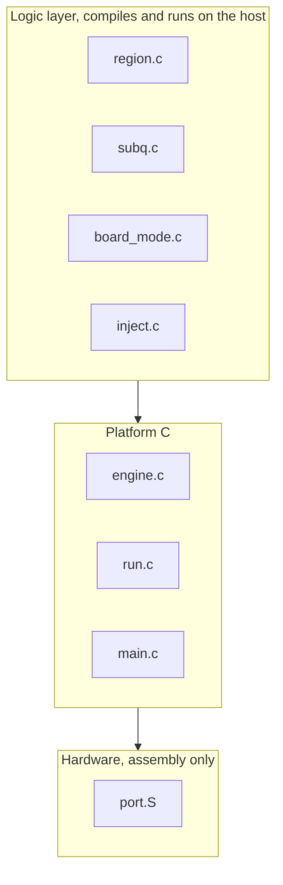
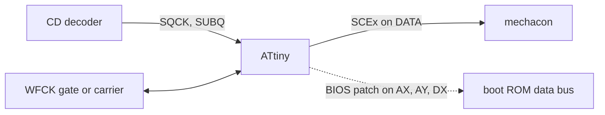

<div align="center">

# openscex-modchip

**面向初代索尼 PlayStation 与 PSone 的区域解锁，为 ATtiny85 与 ATtiny84 服务的单一固件。**

[](https://github.com/gufranco/openscex-modchip/actions/workflows/ci.yml)
[](AGENTS.md)
[](LICENSE)

[English](README.md) | [日本語](README.ja.md) | 中文

</div>

**572 B** ATtiny85 镜像 · **2** 种芯片，单一源码 · **3** 个区域 · **8** 类主机 · MISRA C:2012 零偏差 **0** · 主机行与分支覆盖率 **100%** · 实机验证 **1** 台，PU-8 NTSC-U/C（SCEx）

```bash
git clone https://github.com/gufranco/openscex-modchip.git
cd openscex-modchip
make REGION=us                                        # 在固定的 Docker 工具链中构建
avrdude -c <programmer> -p attiny85 -U flash:w:openscex-modchip-attiny85.hex:i
```

> [!IMPORTANT]
> SCEx 区域解锁已在一台主机上 Verified: 一台 PU-8 NTSC-U/C 厚机以 ATtiny85 内部时钟构建于 2026-10-05 跨区启动。其余一切都已编译并通过容器内的全部关卡集，但尚未在硬件上确认: 引导 ROM BIOS 补丁的所有型号、外部时钟路径，以及其他所有主板系列与区域。各焊盘电压与 BIOS 时序值在测量之前仍为 Unknown。下文每一条硬件事实都带置信度标签。

## 功能

PlayStation 会检查压制在光盘导入区上的物理指纹，即摆动纹（wobble groove），它解码为一个四字符的区域字符串（日本为 SCEI，美洲为 SCEA，欧洲为 SCEE）。主机只启动携带其所期望字符串的光盘。本改机芯片在主机所要求的那个窗口内注入主机想要的字符串，并在检测到换盘时重新武装，因此跨区光盘与备份光盘都能启动。

构建是区域专用的，只送出那一个配置好的区域字符串，只在短暂的区域检查窗口内送出，其余会话期间让数据线处于高阻并保持静默，因此在游戏运行时在电气上保持静默。区域在构建时用 `make REGION=jp|us|eu` 选择（默认美洲）。

按主机的需要选择芯片。ATtiny85 是最小、成本最低的构建: 四根信号线加电源，一个可选状态 LED，没有模式、复位或开盖接线。日本厚机与 PAL 制式的 PSone 会在引导 ROM 内运行第二道区域检查; 对这些机型，ATtiny84 构建在其多出的引脚上加入引导 ROM 补丁，覆盖所有型号，包括最老的两段式 SCPH-1000 与 SCPH-3000。

这不是光驱模拟器。它不替换光驱，不支持 PS2 或 Saturn，也无法破解诸如 LibCrypt 的数据层保护。

## 亮点

<table>
<tr>
<td width="50%" valign="top">

### 两种芯片，单一源码
同一套固件可为 8 脚的 ATtiny85（仅 SCEx，成本最低）与 14 脚的 ATtiny84（加入引导 ROM 补丁）编译，用 `MCU=` 选择。

</td>
<td width="50%" valign="top">

### 以结构实现隐身
只送出一个配置好的区域字符串，只在 SUBQ 区域检查窗口内、每次武装有上限地送出，之后在会话其余时间让 DATA 保持高阻、LED 关闭。

</td>
</tr>
<tr>
<td width="50%" valign="top">

### 完整区域解锁
在 PU-7 至 PM-41(2) 的所有主板系列上进行 SCEx，并为日本厚机与 PAL 的 PSone 提供引导 ROM BIOS 补丁，覆盖包含两段式 SCPH-1000 与 SCPH-3000 的所有型号。

</td>
<td width="50%" valign="top">

### 主板自动检测
一套构建适配所有系列: 固件在启动时读取 WFCK 行为，区分旧式静态门控与 PU-22 及以后的活动载波。没有按主板区分的变体。

</td>
</tr>
<tr>
<td width="50%" valign="top">

### 无需硬件即可验证
行与分支覆盖率 100% 的主机测试、跨振荡器容差带的 simavr 主机模型、变异测试，以及逐字节一致的可复现构建。

</td>
<td width="50%" valign="top">

### MISRA C:2012，零偏差
以 C17 将寄存器限定在汇编中，并在固定的 Docker 工具链中检查，使每次构建、分析与测试都以相同方式运行。

</td>
</tr>
</table>

## 问题与工程上的空缺

区域锁及其绕过办法是数十年的社区知识，PsNee 是大多数安装赖以为基础的现代开源综合。既有的任何 PS1 芯片都没有的，是主机测试、仿真模型、固定标准下的静态分析，以及可复现构建; 它们的注入与 BIOS 补丁时序依赖经验常量与对编译器敏感的延迟。本项目的贡献正是这种工程质量，而非协议上的新颖性。协议读自 PsNee，并在下文致谢。

| 能力 | openscex-modchip | PsNee | 旧式芯片 |
|:-----|:----------------:|:-----:|:-------:|
| 协议覆盖 | SCEx + BIOS 补丁 | SCEx + BIOS（仅 ATmega） | 仅 SCEx |
| 主机测试 | 有 | 无 | 无 |
| 仿真模型 | 有 | 无 | 无 |
| MISRA C:2012 | 有，零偏差 | 无 | 无 |
| 可复现构建 | 有 | 无 | 无 |
| 已在真实硬件上验证 | 无 | 有 | 有 |

最后一行是诚实的权衡。本项目以更高的工程质量满足 PsNee 的协议，而 PsNee 拥有本项目尚无的数年现场验证。

## 架构

三个层次，使协议逻辑在主机上测试，只有寄存器访问触及硬件。若逻辑文件触及平台层，或 C 文件包含硬件头文件，层检查会使构建失败。



板上信号流。SCEx 注入在所有构建中都有; BIOS 补丁路径仅限 ATtiny84。



逻辑层位于 [`src/inject.c`](src/inject.c) 及其同类; 寄存器访问隔离在 [`src/port.S`](src/port.S); 主板到引脚的映射是 [`include/port/registers.h`](include/port/registers.h) 中唯一的配置。

## 置信度标签

本文每一条硬件事实都带一个标签，绝不把未经测量的内容当作已测量来呈现。

| 标签 | 含义 |
|:-----|:-----|
| Read | 直接取自一手资料，尤其是 PsNee 源码以及 consolemods 与 psdevwiki 的资料 |
| Concluded | 从资料推断，而非其中任一资料明确陈述 |
| Verified | 本项目在真实硬件或仿真模型中已确认 |
| Unknown | 没有任何资料给出，必须在主机上测量 |

MCU 的引脚分配 Read 自 PsNee，并由所有者确认为经现场验证的映射。主机侧的搭接点在信号层面为 Read，并在 PsNee 与 Mayumi 的安装中经现场验证; 但精确的 mechacon 引脚号是论坛转述，在用板图重新确认之前标为 Unknown。各焊盘电压处处为 Unknown，必须测量。BIOS 补丁时序 Read 自 PsNee 并在 simavr 中机械地演练过，但在主机上从未 Verified。SCEx 区域解锁已在一台 PU-8 NTSC-U/C 主机上 Verified（2026-10-05）; 其他主板系列、区域与 BIOS 补丁尚未 Verified。

## 安全第一

> [!CAUTION]
> 打开主机并焊接到 CD 子系统可能将其损坏。这是一个自担风险自行制作的项目。

- 接线前必须在每个搭接点测量逻辑电压。没有资料给出各焊盘电压，故为 Unknown。厚机假定约 5 V，PSone 的 PM-41(2) 更低且对噪声敏感，但假定不是测量。
- 在测量之前，不要把主机信号接入时钟引脚。

## 哪种主机用哪种构建

按主机选择芯片与构建开关。BIOS 型号依据主机实际的 BIOS 版本，这比 SCPH 编号更重要。

| 主机 | 主板 | 区域 | `MCU` | `REGION` | `BIOS` | 接线 |
|:-----|:-----|:-----|:------|:---------|:-------|:-----|
| 厚机 US/加拿大，SCPH-100x1/550x1/700x1/900x1 | PU-7 至 PU-23 | us | `attiny85` | `us` | `none` | SCEx，4 根 |
| 厚机 PAL，SCPH-100x2/550x2/900x2 | PU-8 至 PU-22 | eu | `attiny85` | `eu` | `none` | SCEx，4 根 |
| PSone US/加拿大，SCPH-101 | PM-41 / PM-41(2) | us | `attiny85` | `us` | `none` | SCEx，4 根 |
| PSone PAL，SCPH-102 | PM-41 / PM-41(2) | eu | `attiny84` | `eu` | `scph_102` | SCEx + BIOS 补丁 |
| PSone 日本，SCPH-100 | PM-41 | jp | `attiny84` | `jp` | `scph_100` | SCEx + BIOS 补丁 |
| 厚机日本，SCPH-5000/5500/3500 | PU-18 / PU-8 | jp | `attiny84` | `jp` | `scph_3500_5500` | SCEx + BIOS 补丁 |
| 厚机日本，SCPH-7000/7500/9000 | PU-20 至 PU-23 | jp | `attiny84` | `jp` | `scph_7000_9000` | SCEx + BIOS 补丁 |
| 厚机日本，SCPH-3000 | PU-8 | jp | `attiny84` | `jp` | `scph_3000` | SCEx + 两段 BIOS 补丁 |
| 厚机日本，SCPH-1000 | PU-7 | jp | `attiny84` | `jp` | `scph_1000` | SCEx + 两段 BIOS 补丁 |

示例: PAL 的 PSone 为 `make MCU=attiny84 REGION=eu BIOS=scph_102`; US 的厚机为 `make REGION=us`（默认 ATtiny85）。

> [!NOTE]
> 本固件未以 BIOS 型号覆盖的两种已知情形: 亚洲型号（SCPH-xxx3，例如 SCPH-5003/5903）带英文 ROM 且无第二道检查，但其 NTSC-J 的 CD 控制器没有后门，故仅凭 SCEx 不足; 开发机（DTL-H120x、PU-9）原生即可读刻录盘，无需芯片。

## MCU 引脚图，每根线接到芯片的哪里

引脚分配是 PsNee 经验证的 ATtiny85（`ATTINY_X5`）映射，Read 自 PsNee `MCU.h` 并由所有者确认，因此针对你主板的现有 PsNee 或 Mayumi 安装指南可与本芯片逐线对应。此处给出的物理引脚号是这些器件的标准 PDIP 引脚图; 请按你所用的确切封装查阅数据手册，因为 SOIC 与 QFN 的编号不同。

### ATtiny85，8 脚 DIP，最小构建（仅 SCEx）

| DIP 脚 | 端口 | 信号 | 方向 | 接到 |
|:------:|:-----|:-----|:-----|:-----|
| 1 | PB5 | RESET | - | 保持为复位，未使用 |
| 2 | PB3 | LED | 输出，可选 | 经电阻接状态 LED 阳极，或空置 |
| 3 | PB4 | WFCK | 输入与输出 | 旧板上为门控，PU-22 及以后为活动载波 |
| 4 | GND | GND | - | 主机地 |
| 5 | PB0 | SQCK | 输入 | 来自 CD 解码器的 SUBQ 串行时钟 |
| 6 | PB1 | SUBQ | 输入 | 来自 CD 解码器的 SUBQ 串行数据 |
| 7 | PB2 | DATA | 输出，拉低或高阻 | 向 mechacon 注入 SCEx |
| 8 | VCC | VCC | - | 主机 5 V，先测量 |

### ATtiny84，14 脚 DIP，完整构建（SCEx 加引导 ROM BIOS 补丁）

SCEx 信号在 PORTA 上的排列与 85 相同，故接线可直接迁移; 多出的引脚承担 BIOS 补丁，仅在日本厚机与 PAL 的 PSone 上接线。

| DIP 脚 | 端口 | 信号 | 方向 | 接到 |
|:------:|:-----|:-----|:-----|:-----|
| 1 | VCC | VCC | - | 主机 5 V，先测量 |
| 2 | PB0 | - | - | 未使用，若启用外部时钟则为 XTAL1 输入 |
| 3 | PB1 | - | - | 未使用，XTAL2 |
| 4 | PB3 | RESET | - | 保持为复位，未使用 |
| 5 | PB2 | AX | 输入 | BIOS 补丁: 第一根引导 ROM 地址线，计数脉冲 |
| 6 | PA7 | - | - | 未使用 |
| 7 | PA6 | AY | 输入 | BIOS 补丁: 第二根地址线，仅两段式型号，SCPH-1000/3000 |
| 8 | PA5 | DX | 输出，拉低或高阻 | BIOS 补丁: 引导 ROM 数据总线覆写 |
| 9 | PA4 | LED | 输出，可选 | 经电阻接状态 LED 阳极，或空置 |
| 10 | PA3 | WFCK | 输入与输出 | 旧板上为门控，PU-22 及以后为活动载波 |
| 11 | PA2 | DATA | 输出，拉低或高阻 | 向 mechacon 注入 SCEx |
| 12 | PA1 | SUBQ | 输入 | 来自 CD 解码器的 SUBQ 串行数据 |
| 13 | PA0 | SQCK | 输入 | 来自 CD 解码器的 SUBQ 串行时钟 |
| 14 | GND | GND | - | 主机地 |

在仅需 SCEx 的主机上，ATtiny84 使用与 85 相同的四路信号（SQCK、SUBQ、DATA、WFCK）加电源与可选 LED，AX、AY、DX 保持空置。LED 始终可选: 无论是否装上，固件都正确工作。

## 主机侧搭接点，每根线接到主板的哪里

DATA 线承载 SCEx 比特流，门控或载波线（WFCK）对其使能或提供时钟。这些是既定的 PsNee 与 Mayumi 搭接点，记载于 consolemods.org 与 psdevwiki.com 并经现场验证。主板系列是自动检测的，故芯片相同，仅搭接点随系列不同。

| 主板系列 | SCPH 世代 | DATA 注入点 | 门控或载波（WFCK） | 置信度 |
|:---------|:----------|:------------|:-------------------|:-------|
| PU-7、PU-8 | 1000-5003 | 解调后的摆动 NRZ 串行送入 mechacon，历史上称 "point 6" | WFCK 保持静态高 | Read，确切点来自论坛片段，请在你的板上确认 |
| PU-18、PU-20 | 550x-750x | 定制摆动 ASIC 的数字 NRZ 输出送入 mechacon | WFCK 静态门控 | Read |
| PU-22、PU-23 | 7500-900x | 以 WFCK 作假载波接入 CD 处理器跟踪线，即三线加链接法 | WFCK 活动时钟，需要同步 | Read |
| PM-41、PM-41(2) | PSone 100-103 | 同样的跟踪线载波法; 在 PM-41(2) 上空闲时让芯片 I/O 浮空以应对拾取噪声 | WFCK 活动时钟 | Read |

SUBQ 与 SQCK 的 mechacon 引脚为论坛转述，因 psxdev.net 自 2025 年 10 月起离线故标为 Unknown: 在 PU-22 及以后，SUBQ 在 mechacon 第 24 脚，SQCK 在第 26 脚; 在 PU-7 与早期 PU-8，SUBQ 在第 39 脚，SQCK 在第 41 脚。动刀前请对照 consolemods 的板图确认。

### BIOS 补丁搭接点（仅 ATtiny84）

对日本厚机或 PAL 的 PSone，仅凭 SCEx 无法满足引导 ROM 的区域检查，故 ATtiny84 补丁对引导 ROM 的一根地址线（AX）计数脉冲，短暂覆写一根数据总线线（DX），并在最老的两种型号上先对第二根地址线（AY）计数再覆写第二次。MCU 侧引脚是固定的，如上表所列，由 [`src/bios.c`](src/bios.c) 与 [`src/port.S`](src/port.S) 驱动。AX、AY、DX 的主机侧焊盘因主板与 BIOS 修订而异，本项目没有任何公开资料给出经验证的逐焊盘映射。请按你的确切型号对照 PsNee 的接线说明与 consolemods 的板图定位，并把任何 BIOS 补丁安装都视为在启动成功前未确认。补丁时序移植自 PsNee，在此未经硬件确认。

## 配置

一套源码构建所有变体; 构建开关传给 `make`。

| 开关 | 取值 | 默认 | 选择内容 |
|:-----|:-----|:-----|:---------|
| `MCU` | `attiny85`、`attiny84` | `attiny85` | 8 脚芯片（仅 SCEx，成本最低）或 14 脚芯片（加入 BIOS 补丁） |
| `REGION` | `jp`、`us`、`eu` | `us` | 芯片送出的那一个区域字符串，即主机自身的区域 |
| `CLOCK` | `internal`、`external` | `internal` | 内部 8 MHz 振荡器，或主机自身的时钟（`CLOCK=external EXT_F_CPU=<hz>`），前提是先测量该时钟与引脚电压 |
| `BIOS` | `none`、`scph_102`、`scph_100`、`scph_7000_9000`、`scph_3500_5500`、`scph_1000`、`scph_3000` | `none` | 仅 ATtiny84: 按该主机 BIOS 版本调校的引导 ROM 补丁 |

状态 LED 始终可选。隐身、单区域注入与换盘重新武装在每个构建中都有。非默认区域会在产物名上加标签，例如 `openscex-modchip-attiny85-jp.hex`。

## 快速开始

### 前置工具

| 工具 | 用途 | 获取 |
|:-----|:-----|:-----|
| Docker | 运行固定工具链，所有构建、检查与测试都在其中进行 | [docker.com](https://www.docker.com) |
| Git | 克隆仓库 | [git-scm.com](https://git-scm.com) |
| avrdude | 把构建好的镜像烧录到芯片，唯一在主机上运行的步骤 | [github.com/avrdudes/avrdude](https://github.com/avrdudes/avrdude) |

### 构建与烧录

```bash
git clone https://github.com/gufranco/openscex-modchip.git
cd openscex-modchip
make REGION=us                                        # ATtiny85，美洲，内部时钟
make MCU=attiny84 REGION=eu BIOS=scph_102             # PAL PSone，带引导 ROM 补丁
avrdude -c <programmer> -p attiny85 -U flash:w:openscex-modchip-attiny85.hex:i
```

任何 ISP 均可，包括用 Arduino 作 ISP。固件在启动时把时钟预分频器复位为一分频，故出厂的 CKDIV8 熔丝不改变时序。仿真中验证过的唯一构建，内部 8 MHz RC 的熔丝: low `0xE2`，high `0xDF`，extended `0xFF`。

> [!WARNING]
> 外部时钟构建未验证且以硬件为前提。用测得的 mechacon 频率构建，`make CLOCK=external EXT_F_CPU=<hz>UL`; 产物名带 `-extclk`。候选频率为 4.2336 MHz（即 16.9344 MHz 除以四），但它是从片段 Concluded 而非实测。外部时钟熔丝位取决于测得的频率，必须从芯片数据手册读取。在测量时钟引脚电压之前，不要烧录外部时钟熔丝。

### 验证

```bash
make test        # 主机测试、simavr 主机模型、静态分析、MISRA
make repro       # 两次全新构建，逐字节一致
make mutate      # 逻辑层的变异测试
```

同样的关卡在每次 push 与 pull request 时也在 CI 中运行，定义见 [`.github/workflows/ci.yml`](.github/workflows/ci.yml)。

## 设计原则

- 可移植的分层 C: 可在主机上测试的逻辑层、薄平台层，以及隔离在汇编中的寄存器访问，使协议逻辑无需硬件即可测试。
- 标注来源的时序: 每个时序常量都可追溯到实测的位元、数据手册数值或仿真，绝不在无推导的情况下从别的芯片照搬。
- 先验证后声明: 全覆盖主机测试、跨振荡器容差带的仿真、变异测试、以及来自固定工具链的可复现构建，并记录一组只有真实硬件才能定论的主张。
- 在硬件允许处从主机导出时序以提升精度，如 Mayumi 的设计所为。
- 低成本、优先通孔、真正开源，源码树中不含任何专有 ROM 内容。

## 文档

- [`AGENTS.md`](AGENTS.md): 在本仓库工作的任何人应遵守的契约与硬性规则。

本 README 是项目说明、接线与烧录步骤的唯一真实来源。完整规格、硬件模型、研究资料与决策记录属于开发材料，保存在已发布的源码树之外。

## 先行研究与致谢

此处的协议与兼容性知识综合自数十年的社区工作: Old Crow 的开源芯片、Mayumi 与 MM3 的谱系、OneChip，尤其是 PsNee，其源码是本项目的一手协议参考。本项目的贡献是工程质量，而非协议上的新颖性。来源在研究文档中按主张逐条引用。

## 许可

固件与文档采用 [MIT](LICENSE)，与参考项目一致。第三方源码只研究不照抄; 研究为架构提供参考，但不从任何禁止的许可中取用实现。
