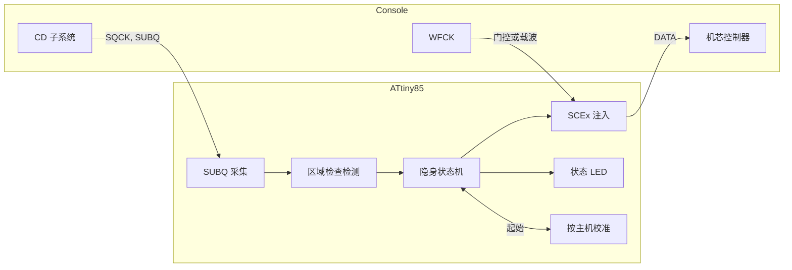

<div align="center">

<h1>openscex-modchip</h1>

<p>
  <a href="README.md">English</a> &nbsp;·&nbsp; <a href="README.ja.md">日本語</a> &nbsp;·&nbsp; <b>中文</b>
</p>

<strong>面向 PlayStation 与 PSone 的隐身 SCEx 区域解锁，运行在按主机校正自身时钟的 ATtiny85 上。</strong>

<br><br>

[](https://github.com/gufranco/openscex-modchip/actions/workflows/ci.yml)
[](https://github.com/gufranco/openscex-modchip/releases)
[](AGENTS.md)
[](LICENSE)

<br>

<p>
  <a href="#快速开始">快速开始</a> &nbsp;|&nbsp;
  <a href="#主机接点">接线</a> &nbsp;|&nbsp;
  <a href="#状态-led">状态 LED</a> &nbsp;|&nbsp;
  <a href="#与其他芯片对比">与其他芯片对比</a> &nbsp;|&nbsp;
  <a href="../../issues/new?template=compatibility.yml">报告你的主机</a>
</p>

</div>

闪存 [**5720**](Makefile) 字节 · [**8**](assets/psnee) 个主板系列，PU-7 至 PM-41(2) · [**3**](src/region.c) 个区域 · MISRA 偏离 [**0**](AGENTS.md) · 主机测试行与分支覆盖率 [**100%**](tests/host) · 变异体 [**206/206**](tools/mutate.py) 被杀死

```bash
gh release download --repo gufranco/openscex-modchip --pattern 'openscex-modchip-attiny85.hex' --pattern SHA256SUMS
sha256sum -c SHA256SUMS --ignore-missing
avrdude -c <programmer> -p attiny85 -U flash:w:openscex-modchip-attiny85.hex:i
```

> [!IMPORTANT]
> 当前固件通过了全部仿真关卡，尚未在实机上运行。接线前请测量各接点电压。 出处：[compatibility reports](https://github.com/gufranco/openscex-modchip/issues?q=label%3Acompatibility), [tests/sim](tests/sim)。

面向初代索尼 PlayStation（厚机）与 PSone 的区域解锁固件，运行在使用内部振荡器的 ATtiny85 上，并按主机自身的 SUBQ 帧率校正该振荡器。它只在 SUBQ 区域检查窗口内送出配置好的区域字符串，主机一接受就立即停止，游戏运行时让数据线保持高阻。它不需要光驱盖线：光驱停转时 SUBQ 变得安静，它由此知道已经换盘。它不修补引导 ROM，因此日本厚机与 PAL 的 PSone 仍保留第二道区域检查；如需绕过，请安装已修补的 BIOS。它不是光驱模拟器，不支持 PS2 或土星，也不破解 LibCrypt。 出处：[src/run.c](src/run.c), [src/inject.c](src/inject.c), [AGENTS.md](AGENTS.md)。

| | | 出处 |
|:--|:--|:--|
| **接受后保持静默**<br>第一个程序区帧即停止注入（字符串中途也一样），游戏运行时不发送任何内容；只有新的导入区读取，例如反改机游戏强制的 TOC 重读，才会再次得到响应。 | **无需光驱盖线的换盘**<br>芯片把光驱安静 1.5 s 视为换盘，并为多光盘游戏的每张光盘重新武装。 | [src/inject.c](src/inject.c), [src/loop.c](src/loop.c), [src/run.c](src/run.c) |
| **自校正的时序**<br>芯片对主机 75 Hz 的 SUBQ 帧计时，把内部振荡器校正到约 1% 以内，无需时钟线。 | **一个区域，一个窗口**<br>只送出配置的区域字符串，只在 SUBQ 区域检查窗口内，每次武装最多 16 次。 | [src/trim.c](src/trim.c), [src/region.c](src/region.c), [include/pscu/config.h](include/pscu/config.h) |
| **状态 LED 或蜂鸣器**<br>接在一个引脚上的 LED 或有源蜂鸣器显示每个启动阶段、每张光盘的结果和当前的接线故障；final 构建只发短响，每个故障只报一次。 | **代码实证**<br>MISRA C:2012 合规，主机覆盖率 100%，simavr 主机模型，变异测试，逐字节一致的重新构建。 | [src/led.c](src/led.c), [tests/host](tests/host), [tools/mutate.py](tools/mutate.py) |

## 概览

| 项目 | 值 | 出处 |
|:-----|:---|:--|
| 目标机型 | PlayStation 厚机 PU-7 至 PU-23，PSone PM-41 与 PM-41(2) | [assets/psnee](assets/psnee), [PsNee PSNee.ino L372-L406](https://github.com/kalymos/PsNee/blob/df52aec97d4e1677e3ed3ead1fba0bf102b1cfd7/PSNee/PSNee.ino#L372-L406) |
| MCU | ATtiny85（8 脚 DIP） | [include/port/registers.h](include/port/registers.h), [ATtiny25/45/85 datasheet 2586Q](https://ww1.microchip.com/downloads/en/DeviceDoc/Atmel-2586-AVR-8-bit-Microcontroller-ATtiny25-ATtiny45-ATtiny85_Datasheet.pdf) |
| 方式 | SCEx 注入 | [src/inject.c](src/inject.c), [psx-spx cdromdrive.md, SCEx](https://github.com/psx-spx/psx-spx.github.io/blob/6d7d1bc106a7e0b616b0330fe58401ab1ba57f0f/docs/cdromdrive.md#L1211-L1230) |
| 区域 | 每次构建一个，`REGION=jp|us|eu`（默认 us） | [Makefile](Makefile), [src/region.c](src/region.c) |
| 时钟 | 内部 8 MHz RC 振荡器，按主机的 SUBQ 帧率校正 | [src/trim.c](src/trim.c), [ATtiny25/45/85 datasheet 2586Q](https://ww1.microchip.com/downloads/en/DeviceDoc/Atmel-2586-AVR-8-bit-Microcontroller-ATtiny25-ATtiny45-ATtiny85_Datasheet.pdf) |
| 连线 | 4 根信号线（SQCK、SUBQ、DATA、WFCK）加电源；LED 或有源蜂鸣器可选 | [include/port/registers.h](include/port/registers.h), [PsNee MCU.h L453-L530](https://github.com/kalymos/PsNee/blob/df52aec97d4e1677e3ed3ead1fba0bf102b1cfd7/PSNee/MCU.h#L453-L530) |
| 工具链 | C17，MISRA C:2012 零偏离，版本固定的 Docker 镜像 | [Dockerfile](Dockerfile), [AGENTS.md](AGENTS.md) |

## 各机型的构建

| 主机 | 主板 | `REGION` | 第二道区域检查 | 出处 |
|:-----|:-----|:---------|:---------------|:--|
| 厚机 US/加拿大，SCPH-1001 | PU-8 | `us` | 无 | [consolemods PS1 region information](https://consolemods.org/wiki/PS1:Region_Information), [PsNee PSNee.ino L10-L17](https://github.com/kalymos/PsNee/blob/df52aec97d4e1677e3ed3ead1fba0bf102b1cfd7/PSNee/PSNee.ino#L10-L17) |
| 厚机 US/加拿大，SCPH-550x1/700x1/900x1 | PU-18 至 PU-23 | `us` | 无 | [consolemods PS1 region information](https://consolemods.org/wiki/PS1:Region_Information), [PsNee PSNee.ino L10-L17](https://github.com/kalymos/PsNee/blob/df52aec97d4e1677e3ed3ead1fba0bf102b1cfd7/PSNee/PSNee.ino#L10-L17) |
| 厚机 PAL，SCPH-1002 | PU-8 | `eu` | 无 | [consolemods PS1 region information](https://consolemods.org/wiki/PS1:Region_Information), [PsNee PSNee.ino L10-L17](https://github.com/kalymos/PsNee/blob/df52aec97d4e1677e3ed3ead1fba0bf102b1cfd7/PSNee/PSNee.ino#L10-L17) |
| 厚机 PAL，SCPH-550x2/900x2 | PU-18 至 PU-22 | `eu` | 无 | [consolemods PS1 region information](https://consolemods.org/wiki/PS1:Region_Information), [PsNee PSNee.ino L10-L17](https://github.com/kalymos/PsNee/blob/df52aec97d4e1677e3ed3ead1fba0bf102b1cfd7/PSNee/PSNee.ino#L10-L17) |
| PSone US/加拿大，SCPH-101 | PM-41 / PM-41(2) | `us` | 无 | [consolemods PS1 region information](https://consolemods.org/wiki/PS1:Region_Information), [PsNee PSNee.ino L10-L17](https://github.com/kalymos/PsNee/blob/df52aec97d4e1677e3ed3ead1fba0bf102b1cfd7/PSNee/PSNee.ino#L10-L17) |
| PSone PAL，SCPH-102 | PM-41 / PM-41(2) | `eu` | 在引导 ROM 中；需要已修补的 BIOS | [consolemods PS1 region information](https://consolemods.org/wiki/PS1:Region_Information), [PsNee PSNee.ino L33-L38](https://github.com/kalymos/PsNee/blob/df52aec97d4e1677e3ed3ead1fba0bf102b1cfd7/PSNee/PSNee.ino#L33-L38) |
| PSone 日本，SCPH-100 | PM-41 | `jp` | 在引导 ROM 中；需要已修补的 BIOS | [consolemods PS1 region information](https://consolemods.org/wiki/PS1:Region_Information), [PsNee PSNee.ino L33-L38](https://github.com/kalymos/PsNee/blob/df52aec97d4e1677e3ed3ead1fba0bf102b1cfd7/PSNee/PSNee.ino#L33-L38) |
| 厚机日本，SCPH-1000/3000/3500/5000/5500/7000/7500/9000 | PU-7 至 PU-23 | `jp` | 在引导 ROM 中；需要已修补的 BIOS，但早期的 SCPH-1000 仍会启动光盘 | [consolemods PS1 region information](https://consolemods.org/wiki/PS1:Region_Information), [PsNee PSNee.ino L33-L38](https://github.com/kalymos/PsNee/blob/df52aec97d4e1677e3ed3ead1fba0bf102b1cfd7/PSNee/PSNee.ino#L33-L38) |
| 亚洲，SCPH-xxx3 | 未记录 | `jp` | 无 | [consolemods PS1 region information](https://consolemods.org/wiki/PS1:Region_Information), [PsNee PSNee.ino L10-L17](https://github.com/kalymos/PsNee/blob/df52aec97d4e1677e3ed3ead1fba0bf102b1cfd7/PSNee/PSNee.ino#L10-L17) |
| 亚洲 Video CD，SCPH-5903 | 未记录 | `jp` + `VCD_FILTER=on` | 无 | [consolemods PS1 region information](https://consolemods.org/wiki/PS1:Region_Information), [PsNee PSNee.ino L456-L490](https://github.com/kalymos/PsNee/blob/df52aec97d4e1677e3ed3ead1fba0bf102b1cfd7/PSNee/PSNee.ino#L456-L490) |

PU-7 与 PU-8 使用与 PU-18、PU-20 相同的静态门控方式，PsNee V9.0 在这些主板上也是如此；PsNee 还把 SCPH-1000 与 SCPH-3000 列为第二道检查需要 BIOS 补丁的机型（Read：PSNee.ino:33-38）。引导 ROM 中的检查不由本芯片处理：在上表标出的机型上，安装已修补的 BIOS 之前外区游戏仍可能被拒绝。亚洲型号无需修补：PsNee V9.0 仅用 NTSC-J 字符串支持 SCPH-xxx3 与 SCPH-5903。SCPH-5903 还能播放 Video CD，因此其构建加上 `VCD_FILTER=on`，使注入只在游戏的导入区触发，不会在 Video CD 上触发。这两行亚洲机型尚未在本项目的实机上确认。开发机（DTL-H120x、PU-9）原生即可读刻录盘，无需芯片。 出处：[PsNee PSNee.ino L33-L38](https://github.com/kalymos/PsNee/blob/df52aec97d4e1677e3ed3ead1fba0bf102b1cfd7/PSNee/PSNee.ino#L33-L38), [PsNee PSNee.ino L10-L17](https://github.com/kalymos/PsNee/blob/df52aec97d4e1677e3ed3ead1fba0bf102b1cfd7/PSNee/PSNee.ino#L10-L17), [PsNee PSNee.ino L456-L490](https://github.com/kalymos/PsNee/blob/df52aec97d4e1677e3ed3ead1fba0bf102b1cfd7/PSNee/PSNee.ino#L456-L490), [src/subq.c](src/subq.c)。

## 快速开始

各[发布](../../releases)都附有按机型预构建的 `.hex`，可跳过工具链，直接用下面的 `avrdude` 步骤烧录。每个发布附带三份 ATtiny85 镜像（`us`、`eu`、`jp`）、SCPH-5903 镜像（`jp-vcd`）、这四份各自安静的 `-final` 镜像（见[状态 LED](#状态-led)）、`SHA256SUMS` 文件、许可证与构建来源证明。v0.3.0 至 v0.8.0 的发布附带 ATtiny84 镜像，v0.2.0 及之前的发布附带旧四线设计的 ATtiny85 镜像。烧录前请先校验下载文件：

```bash
sha256sum -c SHA256SUMS --ignore-missing
gh attestation verify openscex-modchip-attiny85.hex --repo gufranco/openscex-modchip
```

发布版本由提交历史自动生成，且只来自 CI 通过的提交；`0.x` 系列表示固件尚未经实机验证。若要从源码构建：所有构建、检查与测试都通过 `make` 在版本固定的 Docker 工具链中运行，主机上只运行 `avrdude`。 出处：[.releaserc.json](.releaserc.json), [.github/workflows/release.yml](.github/workflows/release.yml)。

| 工具 | 用途 | 出处 |
|:-----|:-----|:--|
| Docker | 运行固定的工具链 | [Docker](https://docs.docker.com/get-docker/), [Dockerfile](Dockerfile) |
| Git | 克隆仓库 | [Git](https://git-scm.com/downloads) |
| avrdude | 把镜像烧进芯片 | [avrdude](https://github.com/avrdudes/avrdude) |

```bash
git clone https://github.com/gufranco/openscex-modchip.git
cd openscex-modchip
make REGION=us                                        # 美洲
make REGION=jp VCD_FILTER=on                          # SCPH-5903
make REGION=us PROFILE=final                          # 美洲，安静的指示
avrdude -c <programmer> -p attiny85 -U flash:w:openscex-modchip-attiny85.hex:i
avrdude -c <programmer> -p attiny85 -U lfuse:w:0xE2:m -U hfuse:w:0xDD:m -U efuse:w:0xFF:m
```

任何 ISP 都可以，包括 Arduino as ISP。先写闪存，最后写熔丝。low 熔丝 `0xE2` 选择内部 8 MHz 振荡器、适合缓慢上电的启动延时，且不分频（Read：ATtiny25/45/85 数据手册 2586Q，Table 6-6 与 Table 6-7，CKSEL 0010，SUT 10），因此只用编程器就能在桌面上读取或重新烧录芯片。固件在启动时也会清除时钟预分频器，因此 CKDIV8 熔丝不会让它变慢。重新烧录会擦除校准记录及其振荡器校正，芯片会重新学习。 出处：[Arduino as ISP](https://docs.arduino.cc/built-in-examples/arduino-isp/ArduinoISP/), [ATtiny25/45/85 datasheet 2586Q](https://ww1.microchip.com/downloads/en/DeviceDoc/Atmel-2586-AVR-8-bit-Microcontroller-ATtiny25-ATtiny45-ATtiny85_Datasheet.pdf), [src/run.c](src/run.c)。

全新的 ATtiny85 出厂时 CKDIV8 熔丝已编程，因此以 1 MHz 运行；数据手册要求 ISP 时钟的高、低电平各持续超过两个 CPU 周期，所以在写入熔丝之前编程器必须低于 250 kHz。Arduino as ISP 本身就满足；若其他编程器无法与新芯片通信，第一次写入时请用 avrdude 的 `-B` 降速，例如 `-B 8`。熔丝选择 8 MHz 后即可使用默认速度。来源：[ATtiny25/45/85 datasheet 2586Q](https://ww1.microchip.com/downloads/en/DeviceDoc/Atmel-2586-AVR-8-bit-Microcontroller-ATtiny25-ATtiny45-ATtiny85_Datasheet.pdf), [avrdude manual, -B](https://avrdudes.github.io/avrdude/8.0/avrdude_3.html)。

| 构建 | 熔丝（low / high / extended） | 出处 |
|:-----|:------------------------------|:--|
| 内部 8 MHz，带 2.7 V 欠压检测，推荐 | `0xE2` / `0xDD` / `0xFF` | [ATtiny25/45/85 datasheet 2586Q](https://ww1.microchip.com/downloads/en/DeviceDoc/Atmel-2586-AVR-8-bit-Microcontroller-ATtiny25-ATtiny45-ATtiny85_Datasheet.pdf) |
| 内部 8 MHz，不带欠压检测 | `0xE2` / `0xDF` / `0xFF` | [ATtiny25/45/85 datasheet 2586Q](https://ww1.microchip.com/downloads/en/DeviceDoc/Atmel-2586-AVR-8-bit-Microcontroller-ATtiny25-ATtiny45-ATtiny85_Datasheet.pdf) |

欠压检测在电源低于 2.7 V 时使芯片保持复位，因此芯片不会在断电时正在跌落的电源上运行；尚未在主机上实测。请保持开启：按速度等级，ATtiny85 在 2.7 V 以上运行 0 至 10 MHz（Read：同一数据手册；只有 ATtiny85V 可低至 1.8 V），低于 2.7 V 芯片即超出额定范围。熔丝容易忘记设置，因此固件也在每个字符串前测量电源，低于约 2.75 V 时不发送，并显示代码 7。该门限按带隙读数偏高的芯片设定，因此低 5% 的 3.3 V 电源仍能通过。 出处：[ATtiny25/45/85 datasheet 2586Q](https://ww1.microchip.com/downloads/en/DeviceDoc/Atmel-2586-AVR-8-bit-Microcontroller-ATtiny25-ATtiny45-ATtiny85_Datasheet.pdf), [src/supply.c](src/supply.c)。

用 [Makefile](Makefile) 的目标验证：

```bash
make size        # 镜像大小；剩余闪存少于 256 字节时失败
make test        # 主机测试、simavr 主机模型及其栈检查、静态分析、MISRA
make repro       # 两次全新构建逐字节一致
make mutate      # 逻辑层的变异测试
make bench_ci    # 主机测试台：在同一个模拟主机中对比本固件与 PsNee
```

同样的关卡在每次 push 与拉取请求时于 CI 运行，定义在 [`.github/workflows/ci.yml`](.github/workflows/ci.yml)。贡献者可运行一次 `make hooks`，在本地启用提交信息与格式检查。

## MCU 引脚

4 路 SCEx 信号与 LED 保持 PsNee 经验证的 ATtiny85 分配（Read 自 PsNee `MCU.h`），因此与 PsNee 的接线指南逐脚一致；PB5 保持为复位，芯片仍可用 ISP 烧录。物理引脚号为标准 8 脚 PDIP 配置，SOIC 请查数据手册。 出处：[PsNee MCU.h L453-L530](https://github.com/kalymos/PsNee/blob/df52aec97d4e1677e3ed3ead1fba0bf102b1cfd7/PSNee/MCU.h#L453-L530), [include/port/registers.h](include/port/registers.h), [ATtiny25/45/85 datasheet 2586Q](https://ww1.microchip.com/downloads/en/DeviceDoc/Atmel-2586-AVR-8-bit-Microcontroller-ATtiny25-ATtiny45-ATtiny85_Datasheet.pdf)。

| DIP 脚 | 端口 | 信号 | 方向 | 连接到 | 出处 |
|:------:|:-----|:-----|:-----|:-------|:--|
| 1 | PB5 | RESET | - | 保持为复位 | [include/port/registers.h](include/port/registers.h), [ATtiny25/45/85 datasheet 2586Q](https://ww1.microchip.com/downloads/en/DeviceDoc/Atmel-2586-AVR-8-bit-Microcontroller-ATtiny25-ATtiny45-ATtiny85_Datasheet.pdf) |
| 2 | PB3 | LED | 输出，可选 | 经 1 kΩ 电阻的状态 LED，或不接 | [include/port/registers.h](include/port/registers.h), [PsNee PSNee.ino L64](https://github.com/kalymos/PsNee/blob/df52aec97d4e1677e3ed3ead1fba0bf102b1cfd7/PSNee/PSNee.ino#L64) |
| 3 | PB4 | WFCK | 输入输出 | 静态门控，或 PU-22 及以后的实时载波 | [include/port/registers.h](include/port/registers.h), [PsNee MCU.h L453-L530](https://github.com/kalymos/PsNee/blob/df52aec97d4e1677e3ed3ead1fba0bf102b1cfd7/PSNee/MCU.h#L453-L530) |
| 4 | GND | GND | - | 主机地 | [ATtiny25/45/85 datasheet 2586Q](https://ww1.microchip.com/downloads/en/DeviceDoc/Atmel-2586-AVR-8-bit-Microcontroller-ATtiny25-ATtiny45-ATtiny85_Datasheet.pdf) |
| 5 | PB0 | SQCK | 输入 | SUBQ 串行时钟 | [include/port/registers.h](include/port/registers.h), [PsNee MCU.h L453-L530](https://github.com/kalymos/PsNee/blob/df52aec97d4e1677e3ed3ead1fba0bf102b1cfd7/PSNee/MCU.h#L453-L530) |
| 6 | PB1 | SUBQ | 输入 | SUBQ 串行数据 | [include/port/registers.h](include/port/registers.h), [PsNee MCU.h L453-L530](https://github.com/kalymos/PsNee/blob/df52aec97d4e1677e3ed3ead1fba0bf102b1cfd7/PSNee/MCU.h#L453-L530) |
| 7 | PB2 | DATA | 输出，拉低或高阻 | 向机芯控制器注入 SCEx | [include/port/registers.h](include/port/registers.h), [src/port.S](src/port.S) |
| 8 | VCC | VCC | - | 主机电源，先测量 | [ATtiny25/45/85 datasheet 2586Q](https://ww1.microchip.com/downloads/en/DeviceDoc/Atmel-2586-AVR-8-bit-Microcontroller-ATtiny25-ATtiny45-ATtiny85_Datasheet.pdf) |

## 主机接点

每个接点都在下方照片中标出名称：每块主板上都标有 SQCK、SUBQ、DATA、WFCK、VCC 与 GND，各线焊在这些照片标出的位置。PU-18 的照片是主板背面。图中也标有 AX、DX 与 RESET，但它们属于 PsNee 的引导 ROM 补丁，本芯片没有该功能，请不要连接。 出处：[assets/psnee](assets/psnee)。

<table>
<tr><td align="center" width="33%"><a href="assets/psnee/pu-7.jpg"></a><br><sub><b>PU-7</b>。照片来自 PsNee</sub></td><td align="center" width="33%"><a href="assets/psnee/pu-8a.jpg"></a><br><sub><b>PU-8</b>，1-658-467-22。照片来自 PsNee</sub></td><td align="center" width="33%"><a href="assets/psnee/pu-8b.jpg"></a><br><sub><b>PU-8</b>，1-658-467-12。照片来自 PsNee</sub></td></tr>
<tr><td align="center" width="33%"><a href="assets/psnee/pu-18.jpg"></a><br><sub><b>PU-18</b>。照片来自 PsNee</sub></td><td align="center" width="33%"><a href="assets/psnee/pu-20.jpg"></a><br><sub><b>PU-20</b>。照片来自 PsNee</sub></td><td align="center" width="33%"><a href="assets/psnee/pu-22.jpg"></a><br><sub><b>PU-22</b>。照片来自 PsNee</sub></td></tr>
<tr><td align="center" width="33%"><a href="assets/psnee/pu-23.jpg"></a><br><sub><b>PU-23</b>。照片来自 PsNee</sub></td><td align="center" width="33%"><a href="assets/psnee/pm-41.jpg"></a><br><sub><b>PM-41</b>。照片来自 PsNee</sub></td><td align="center" width="33%"><a href="assets/psnee/pm-41-2.jpg"></a><br><sub><b>PM-41(2)</b>。照片来自 PsNee</sub></td></tr>
</table>

这九张照片来自 kalymos 及其贡献者的 [PsNee](https://github.com/kalymos/PsNee) V9.0，以 [Unlicense](LICENSES/Unlicense.txt) 发布至公有领域，此处为缩小后的副本。有了它们，芯片的每一根线都有焊接位置的图片。

| 主板系列 | SCPH 年代 | DATA 注入点 | WFCK 作用 | 可信度 | 出处 |
|:---------|:----------|:------------|:----------|:-------|:--|
| PU-7、PU-8、PU-18、PU-20 | 1000-750x | 摆动 ASIC 送入机芯控制器的数字 NRZ 输出 | 静态门控 | Read | [assets/psnee](assets/psnee), [PsNee PSNee.ino L372-L406](https://github.com/kalymos/PsNee/blob/df52aec97d4e1677e3ed3ead1fba0bf102b1cfd7/PSNee/PSNee.ino#L372-L406) |
| PU-22、PU-23 | 7500-900x | CD 处理器的循迹线，WFCK 作伪载波，三线加跳线 | 实时时钟，需同步 | Read | [assets/psnee](assets/psnee), [PsNee PSNee.ino L372-L406](https://github.com/kalymos/PsNee/blob/df52aec97d4e1677e3ed3ead1fba0bf102b1cfd7/PSNee/PSNee.ino#L372-L406) |
| PM-41、PM-41(2) | PSone 100-103 | 同样的循迹线载波方式；PM-41(2) 空闲时让芯片 I/O 浮空 | 实时时钟 | Read | [assets/psnee](assets/psnee), [quade.co PsNee guide](https://quade.co/ps1-modchip-guide/psnee/) |

没有时钟线，也没有光驱盖线：芯片使用自身的振荡器，并从 SUBQ 得知换盘，因此可以放在 4 根信号线够得着的任何位置。请让这些线尽量短；quade.co 将 Mayumi V4 的故障归因于长线拾取的噪声。为早期版本安装的芯片在写入本固件之前必须拆掉时钟线与光驱盖线：在 ATtiny85 上 2 号脚是 PB3（指示输出），3 号脚是 PB4（WFCK 输入），留在 2 号脚上的主机时钟会被反向驱动。 出处：[src/trim.c](src/trim.c), [src/loop.c](src/loop.c), [quade.co Mayumi V4 guide](https://quade.co/ps1-modchip-guide/mayumi-v4/), [include/port/registers.h](include/port/registers.h)。

上方照片在每块受支持主板上标出了 SQCK 与 SUBQ，请以照片为准。出处：[assets/psnee](assets/psnee)。

## 载板

三块可选的载板把芯片装在 DIP-8 插座上，便于取下重新烧录，并在一条边上用六个 4 × 4 mm 焊盘接收主机的导线，间距 6 mm，依次为 WFCK、SQCK、SUBQ、DATA、VCC 和 GND。焊盘位于正面且没有孔，所有元件都是直插件；芯片内置的上拉对主机噪声太弱，因此每块板都用 10 kΩ 上拉把 RESET 保持为高电平；每块板都是包含原理图、布局和设计规则的 KiCad 10 工程。来源：[hardware](hardware)。

| 板 | 元件 | 尺寸 | 来源 |
|:--|:--|:--|:--|
| 载板 | 插座、100 nF 去耦电容、带 10 kΩ RESET 上拉的防呆 ISP 插座，以及指示电路：PB3 驱动一个 2N3904，按两位拨码开关的设置点亮带 1 kΩ 电阻的 LED、驱动蜂鸣器、两者都开或都关；蜂鸣器经 10 Ω 与 100 µF 滤波供电，并联一个 1N4148 | 35.7 × 43.2 mm | [hardware/openscex-carrier.kicad_sch](hardware/openscex-carrier.kicad_sch), [hardware/openscex-carrier.kicad_pcb](hardware/openscex-carrier.kicad_pcb) |
| 迷你板 | 插座、100 nF 去耦电容、10 kΩ RESET 上拉、直接接在 PB3 上带 1 kΩ 电阻的 LED、防呆 ISP 插座 | 35.7 × 25.2 mm | [hardware/openscex-mini.kicad_sch](hardware/openscex-mini.kicad_sch), [hardware/openscex-mini.kicad_pcb](hardware/openscex-mini.kicad_pcb) |
| 裸板 | 只有插座、100 nF 去耦电容和 10 kΩ RESET 上拉 | 35.7 × 21.7 mm | [hardware/openscex-bare.kicad_sch](hardware/openscex-bare.kicad_sch), [hardware/openscex-bare.kicad_pcb](hardware/openscex-bare.kicad_pcb) |

<table>
<tr><td align="center" width="33%"><a href="assets/boards/carrier-3d.png"></a><br><sub><b>载板</b>, 3D 视图</sub></td><td align="center" width="33%"><a href="assets/boards/carrier-top.png"></a><br><sub><b>载板</b>, 正面</sub></td><td align="center" width="33%"><a href="assets/boards/carrier-bottom.png"></a><br><sub><b>载板</b>, 背面，接地层</sub></td></tr>
<tr><td align="center" width="33%"><a href="assets/boards/mini-3d.png"></a><br><sub><b>迷你板</b>, 3D 视图</sub></td><td align="center" width="33%"><a href="assets/boards/mini-top.png"></a><br><sub><b>迷你板</b>, 正面</sub></td><td align="center" width="33%"><a href="assets/boards/mini-bottom.png"></a><br><sub><b>迷你板</b>, 背面，接地层</sub></td></tr>
<tr><td align="center" width="33%"><a href="assets/boards/bare-3d.png"></a><br><sub><b>裸板</b>, 3D 视图</sub></td><td align="center" width="33%"><a href="assets/boards/bare-top.png"></a><br><sub><b>裸板</b>, 正面</sub></td><td align="center" width="33%"><a href="assets/boards/bare-bottom.png"></a><br><sub><b>裸板</b>, 背面，接地层</sub></td></tr>
</table>

三块都是按抗噪设计的双层板。走线尽量放在正面，使背面在主机信号线下方保持为完整的接地层；两层都铺地，并用 0.6 mm 过孔缝合；没有走线的弯折超过 45 度；不同网络的走线彼此相距 1 mm，与焊盘相距 0.8 mm。载板上的蜂鸣器以 2.4 kHz 脉冲最多吸取 30 mA，放在离主机信号线最远的角落，其纹波由滤波器挡在芯片电源之外。来源：[hardware/openscex-carrier.kicad_dru](hardware/openscex-carrier.kicad_dru), [hardware/openscex-carrier.kicad_pcb](hardware/openscex-carrier.kicad_pcb), [CMI-1295IC-0385T datasheet](https://www.sameskydevices.com/product/resource/cmi-1295ic-0385t.pdf)。

ISP 插座采用 AVR 六针排列：1 MISO 接 SUBQ，2 VCC，3 SCK 接 DATA，4 MOSI 接 SQCK，5 RESET，6 GND；护套带防呆，并与其他元件保持 1.5 mm 间距，便于插拔排线。请在载板离开主机或拆下导线后再烧录：装在主机上时，编程器会向主机电源供电，并在 SQCK 和 SUBQ 上与主机自身的驱动器冲突。来源：[hardware/openscex-carrier.kicad_sch](hardware/openscex-carrier.kicad_sch), [hardware/openscex-mini.kicad_sch](hardware/openscex-mini.kicad_sch), [ATtiny25/45/85 datasheet 2586Q](https://ww1.microchip.com/downloads/en/DeviceDoc/Atmel-2586-AVR-8-bit-Microcontroller-ATtiny25-ATtiny45-ATtiny85_Datasheet.pdf)。

每块板都附有列出每个元件采购型号的物料清单，以及可直接上传给制板厂的 Gerber 和钻孔压缩包。两者均由 KiCad 10.0.6 导出；走线离开焊盘的每个连接处都带有泪滴，直接画在电路板中，无需在 KiCad 中重新填充。来源：[hardware/openscex-carrier-bom.csv](hardware/openscex-carrier-bom.csv), [hardware/fab/openscex-carrier-gerbers.zip](hardware/fab/openscex-carrier-gerbers.zip), [hardware/openscex-mini-bom.csv](hardware/openscex-mini-bom.csv), [hardware/fab/openscex-mini-gerbers.zip](hardware/fab/openscex-mini-gerbers.zip), [hardware/openscex-bare-bom.csv](hardware/openscex-bare-bom.csv), [hardware/fab/openscex-bare-gerbers.zip](hardware/fab/openscex-bare-gerbers.zip)。

## 安全

- 接线前测量每个接点的逻辑电压。数值取自成熟的 PsNee 与 Mayumi 安装（厚机约 5 V，PSone PM-41(2) 较低且对噪声敏感），但假设不等于测量。 出处：[quade.co PsNee guide](https://quade.co/ps1-modchip-guide/psnee/), [quade.co Mayumi V4 guide](https://quade.co/ps1-modchip-guide/mayumi-v4/)。
- 打开主机并焊接 CD 子系统可能损坏主机。风险自负。 出处：[quade.co PS1 modchip guide](https://quade.co/ps1-modchip-guide/)。

## 状态 LED

PB3 可选接一个 LED 或一个有源蜂鸣器，两者都是芯片唯一的诊断手段：它显示芯片处于哪个阶段、每张光盘是否通过区域检查，以及出问题时该检查哪根线。它从不延迟或阻碍任何功能，也不保存历史，所以除两个启动代码外，代码反映当前状态。 出处：[src/led.c](src/led.c)。

| 部件 | 选择 | 出处 |
|:-----|:-----|:--|
| LED | 3 mm 或 5 mm 的红、橙、黄、绿 LED，正向电压约 2 V；不要用蓝色或白色，其 3 V 正向电压在 PSone 较低的电源下几乎不给电阻留电压 | [Kingbright WP7113ID datasheet](https://www.kingbrightusa.com/images/catalog/SPEC/WP7113ID.pdf), [ATtiny25/45/85 datasheet 2586Q](https://ww1.microchip.com/downloads/en/DeviceDoc/Atmel-2586-AVR-8-bit-Microcontroller-ATtiny25-ATtiny45-ATtiny85_Datasheet.pdf) |
| 电阻 | 1 kΩ，功率不限：5 V 时约 3 mA，3.5 V 时约 1.5 mA，室内足够亮，远低于引脚 40 mA 的绝对最大值（Read：ATtiny25/45/85 数据手册 2586Q） | [ATtiny25/45/85 datasheet 2586Q](https://ww1.microchip.com/downloads/en/DeviceDoc/Atmel-2586-AVR-8-bit-Microcontroller-ATtiny25-ATtiny45-ATtiny85_Datasheet.pdf) |
| LED 接线 | 2 号引脚（PB3）接电阻，电阻接 LED 阳极（长脚），阴极（平边）接地 | [include/port/registers.h](include/port/registers.h) |
| 蜂鸣器 | 代替 LED 的有源压电蜂鸣器，即自带驱动、通直流就响的型号，例如 PUI Audio AI-3035-TWT-3V-R：2 至 5 V，3 V 时最大 9 mA，约 3.5 kHz，直径 30 mm；在 5 V 的厚机上请实测电流 | [AI-3035-TWT-3V-R datasheet](https://api.puiaudio.com/filename/AI-3035-TWT-3V-R.pdf), [ATtiny25/45/85 datasheet 2586Q](https://ww1.microchip.com/downloads/en/DeviceDoc/Atmel-2586-AVR-8-bit-Microcontroller-ATtiny25-ATtiny45-ATtiny85_Datasheet.pdf) |
| 蜂鸣器接线 | 2 号引脚（PB3）接蜂鸣器 + 端，- 端接地，不需要电阻也不需要二极管：压电元件不是线圈，关断时不会把电压尖峰送回引脚。电磁蜂鸣器是线圈，不支持 | [AI-3035-TWT-3V-R datasheet](https://api.puiaudio.com/filename/AI-3035-TWT-3V-R.pdf), [include/port/registers.h](include/port/registers.h) |

驱动该引脚的构建有两种。默认的 `debug` 显示下表全部内容；用 `make PROFILE=final` 构建、以 `-final` 镜像发布的 `final` 保持安静。安装和排查故障时烧录 `debug`，玩游戏时换成 `final`。两者在同一时刻发送相同的字符串，只有该引脚不同，模拟器逐个边沿核对。 出处：[include/pscu/led.h](include/pscu/led.h), [tests/sim/sim_profile.c](tests/sim/sim_profile.c)。

| 阶段 | debug | final | 出处 |
|:-----|:------|:------|:--|
| 主板识别 | 上电后点亮约 0.4 s | 熄灭 | [src/engine.c](src/engine.c) |
| 主板确定 | 静态门控主板（PU-18、PU-20）闪 1 次 300 ms，WFCK 载波主板（PU-22 及以后）闪 2 次 | 静态门控主板短响 1 次 60 ms，WFCK 载波主板 2 次 | [src/led.c](src/led.c) |
| 等待光盘 | 每 2 s 短闪 40 ms | 熄灭 | [src/led.c](src/led.c) |
| 注入中 | 每个区域字符串闪 90 至 181 ms | 熄灭 | [src/engine.c](src/engine.c) |
| 结果 | 代码显示 3 次，之后熄灭 | 被接受的光盘短响 1 次 60 ms，被拒绝的光盘显示代码 2 两次；之后熄灭 | [src/led.c](src/led.c) |
| 游戏中 | 熄灭；每次 OSCCAL 变动或写入校准值时闪 40 ms | 熄灭 | [src/led.c](src/led.c), [src/run.c](src/run.c) |

代码是 700 ms 的长闪，间隔 300 ms，暂停 2 s 后重复。`final` 中代码 3 和 4 每张光盘只显示一次，代码 7 在持续期间每 30 s 重复一次。 出处：[src/led.c](src/led.c)。

| 代码 | 含义 | 检查 | 出处 |
|:----:|:-----|:-----|:--|
| 1 | 主机接受了区域字符串 | 无需处理，光盘正常运行 | [src/led.c](src/led.c), [src/loop.c](src/loop.c) |
| 2 | 已送出字符串但主机未到达程序区 | DATA 与 WFCK 接线，以及构建的区域是否与光盘一致 | [src/led.c](src/led.c), [src/loop.c](src/loop.c) |
| 3 | 上电后 5 s 内没有 SUBQ 帧；显示 15 s 后回到心跳闪烁 | SQCK、SUBQ、电源与地；没有光盘时也会显示 | [src/led.c](src/led.c), [src/loop.c](src/loop.c) |
| 4 | 有帧但 20 s 内没有区域检查；持续期间重复 | SUBQ；音乐 CD 时也属正常 | [src/led.c](src/led.c), [src/loop.c](src/loop.c) |
| 5 | 看门狗复位了芯片，下次启动时显示一次 | 注入中停止的 WFCK | [src/led.c](src/led.c), [src/port_chip.S](src/port_chip.S) |
| 6 | 主板与校准记录中的不同，启动时显示一次；代码 5 优先 | 接触不良的 WFCK 线，除非芯片换到了另一台主机 | [src/led.c](src/led.c), [src/calib.c](src/calib.c) |
| 7 | 测得电源低于约 2.75 V，或测量失败；持续期间不发送字符串，优先于代码 3 和 4 | 取电点的 VCC 与地，应在 3.3 V 以上 | [src/led.c](src/led.c), [src/supply.c](src/supply.c) |

## 工作原理



## 包含内容

| 功能 | 说明 | 出处 |
|:-----|:-----|:--|
| SCEx 注入 | 44 位 LSB 优先的区域字符串，PU-7 至 PU-20 的静态门控方式（与 PsNee 和 Mayumi V4 一样，每个字符串期间把 WFCK 门控拉低），以及 PU-22 及以后的 WFCK 载波方式 | [src/inject.c](src/inject.c), [src/port.S](src/port.S), [PsNee PSNee.ino L53](https://github.com/kalymos/PsNee/blob/df52aec97d4e1677e3ed3ead1fba0bf102b1cfd7/PSNee/PSNee.ino#L53) |
| 主板自动识别 | 启动时 WFCK 的行为决定门控或载波模式；一个构建适用所有主板。与 MultiMode 3 和 Mayumi V4 一样，只有 25 个连续的 WFCK 边沿、每个都在上一个之后 360 µs 内出现时才算作载波，因此有噪声或未连接的线不会被当成载波。在识别为门控的主板上，每个字符串前再观测 WFCK 9.4 ms，因此启动后才出现的载波绝不会被拉低。看门狗复位后沿用启动时记录的主板而不重新识别，因此在字符串中途停止的载波不会被误认为门控而被驱动 | [src/board_mode.c](src/board_mode.c), [src/engine.c](src/engine.c), [src/calib.c](src/calib.c), [PsNee PSNee.ino L372-L406](https://github.com/kalymos/PsNee/blob/df52aec97d4e1677e3ed3ead1fba0bf102b1cfd7/PSNee/PSNee.ino#L372-L406) |
| 电源保护 | 每个字符串前芯片用 1.1 V 带隙测量自身电源；低于约 2.75 V，或读数不可能来自真实电源时，不发送任何内容并显示代码 7；短暂的电压下降只暂停一轮发送而不重新计数，被关闭的窗口不会让校准学到任何东西 | [src/supply.c](src/supply.c), [src/port_chip.S](src/port_chip.S), [ATtiny25/45/85 datasheet 2586Q](https://ww1.microchip.com/downloads/en/DeviceDoc/Atmel-2586-AVR-8-bit-Microcontroller-ATtiny25-ATtiny45-ATtiny85_Datasheet.pdf) |
| 振荡器校正 | 芯片使用内部 8 MHz 振荡器，在导入区与游戏中对主机 75 Hz 的 SUBQ 帧计时，每批最多调 4 级、每次写入一级，直到误差在 1% 以内，且离出厂值不超过 16 级；校正值保存在 EEPROM 中，启动时应用 | [src/trim.c](src/trim.c), [src/run.c](src/run.c), [ATtiny25/45/85 datasheet 2586Q](https://ww1.microchip.com/downloads/en/DeviceDoc/Atmel-2586-AVR-8-bit-Microcontroller-ATtiny25-ATtiny45-ATtiny85_Datasheet.pdf) |
| 换盘 | 无需光驱盖线：停转的光驱带来 1.5 s 没有有效 SUBQ 帧，这会为下一张光盘重新武装；旋转中光盘的寻道或重读会持续产生帧，因此不会被当作换盘。SUBQ 计数器最多比起始位置高 8 帧，因此即使主机拒绝了光盘，打开光驱盖后约半秒的采集失败内窗口就会关闭；每张光盘都可以得到整个 16 个字符串的上限，因此比第一张更难读的第二张光盘也不会缺字符串 | [src/inject.c](src/inject.c), [src/loop.c](src/loop.c), [include/pscu/loop.h](include/pscu/loop.h) |
| 隐身 | 只在 SUBQ 区域检查窗口内、每次武装有上限地注入，与 PsNee 和 Mayumi V4 一样在字符串之间间隔 5 帧即 67 ms，之后 DATA 高阻、LED 关闭；主机一读到程序区即停止，并在读取程序区期间保持静默；之后的导入区读取，例如反改机 v2 检测中、拷贝盘需要新字符串的 TOC 重读，会在同一上限下再次得到响应 | [src/inject.c](src/inject.c), [src/loop.c](src/loop.c), [include/pscu/config.h](include/pscu/config.h), [PsNee PSNee.ino L53](https://github.com/kalymos/PsNee/blob/df52aec97d4e1677e3ed3ead1fba0bf102b1cfd7/PSNee/PSNee.ino#L53), [psx-spx cdromformat.md, anti-modchip](https://github.com/psx-spx/psx-spx.github.io/blob/6d7d1bc106a7e0b616b0330fe58401ab1ba57f0f/docs/cdromformat.md#L1624-L1646) |
| 单一区域 | 只送出 `REGION`，从不送出全部三个 | [src/region.c](src/region.c) |
| 自适应时序 | 在 WFCK 载波主板上通过计数 30 个 WFCK 周期为注入位计时，因此在单倍速和倍速下都跟随主机自身的时钟；在静态门控主板上由芯片按主机 SUBQ 速率校正的振荡器计时 | [src/port.S](src/port.S), [src/trim.c](src/trim.c) |
| 自我恢复 | 每次 SUBQ 采集都在帧间空隙重新对齐，并在 30 ms 后放弃；注入中 WFCK 载波停止时看门狗会释放 DATA；没有引脚需要上拉：SQCK、SUBQ、WFCK 是主机的线，DATA 释放时是主机的线，PB3 是输出 | [src/engine.c](src/engine.c), [src/port.S](src/port.S), [include/port/registers.h](include/port/registers.h) |
| 状态 LED | 独立引脚上的可选 LED 或有源蜂鸣器显示启动阶段、每张光盘的结果和当前故障；`debug` 构建显示全部，`final` 构建只发短响并对每个故障只报一次；固件从不等待它，什么都不接也正确运行 | [src/led.c](src/led.c) |
| 现场诊断 | 无需编程器：LED 或蜂鸣器的代码指出失败的阶段，从没有时钟的 SUBQ 到始终没有区域检查的 SUBQ；无需用编程器读回任何内容 | [src/led.c](src/led.c), [src/loop.c](src/loop.c) |
| 按主机校准 | 学习本主机最晚可在何时开始以及自身振荡器的快慢，保存在 6 字节的 EEPROM 记录中，缺失或损坏时回退到默认值 | [src/calib.c](src/calib.c) |
| 闭环确认 | 注入后，芯片在 SUBQ 中等待程序区帧（真实的音轨号），机芯控制器只有在接受区域字符串后才允许读取它，因此显示区域检查是否通过 | [src/inject.c](src/inject.c), [src/loop.c](src/loop.c) |
| 验证 | 主机测试行与分支覆盖率 100%，包含偏快与偏慢振荡器的 simavr 主机模型，变异测试，可复现构建，以及主机测试台：把同一个模拟主机接到本固件、PsNee、Mayumi V4 和 MM3 上，检查凡是它们被接受的场景本固件也被接受、位单元落在它们的范围内、在区域检查之外发送的不多于它们；其场景执行本固件中主机可达的每一条指令，无法到达的指令都在源码中注明原因 | [tests/host](tests/host), [tests/sim](tests/sim), [tools/mutate.py](tools/mutate.py), [tools/bench](tools/bench), [CONTRIBUTING.md](CONTRIBUTING.md) |

## 按主机校准

芯片会学习所装主机如何读取区域字符串，并把结果保存在 6 字节的 EEPROM 记录中，因此之后的光盘驱动数据线的时间更短。每个学到的值只会朝固定默认值回退，所以记录丢失、损坏或来自别处时，损失的只是隐蔽性，而不是光盘。 出处：[src/calib.c](src/calib.c)。

| 值 | 学习来源 | 效果 | 出处 |
|:---|:---------|:-----|:--|
| 起始位置 | 每张被接受的光盘把起始推迟 2 个导入区帧，即 27 ms，最多 20 帧；`jp` 构建保持默认值，因为 PsNee 告诫在日本主机上不要用更晚的触发 | 字符串更接近区域检查开始；被拒绝，或导入区读取在起始之前结束，则回退 2 帧并停止探索 | [src/calib.c](src/calib.c), [PsNee PSNee.ino L48](https://github.com/kalymos/PsNee/blob/df52aec97d4e1677e3ed3ead1fba0bf102b1cfd7/PSNee/PSNee.ino#L48) |
| 主板 | 启动时识别的主板 | 主板不同则显示一次代码 6，并重新学习起始位置 | [src/calib.c](src/calib.c), [src/led.c](src/led.c) |
| 振荡器 | 主机晶振以 75 Hz 排列的单倍速帧间隔，导入区与游戏中均计，且只在电源检查通过时计，因为振荡器的速率随电源变化 | 每批 64 帧按超出 1% 死区的误差每 1% 调一级 (不足 1% 按一级计)、最多 4 级来调整 OSCCAL，每次写入只改一级，直到误差在 1% 以内；校正属于芯片本身，因此更换主板时保留 | [src/trim.c](src/trim.c), [src/run.c](src/run.c) |

芯片只写入值有变化的字节，只在启动时或光盘检查有结果之后写入，从不在发送字符串时写入，因此稳定下来的主机不再写入任何内容。单元擦写寿命为 100,000 次（Read：ATtiny25/45/85 数据手册 2586Q）。校验字节能发现因断电只写了一半的记录，此时按默认值读取。重新烧录也会擦除记录，因为上面两组熔丝都让 EESAVE 保持未编程（Read：同一数据手册，Table 20-4，高熔丝位 3）。光盘得到的字符串数不靠学习：每张光盘都可以得到整个 16 个字符串的上限，由主机自身的接受，即程序区，结束这一串。2 帧的步长和 20 帧的上限是设计选择，尚未在主机上调校。 出处：[src/calib.c](src/calib.c), [src/port_chip.S](src/port_chip.S), [ATtiny25/45/85 datasheet 2586Q](https://ww1.microchip.com/downloads/en/DeviceDoc/Atmel-2586-AVR-8-bit-Microcontroller-ATtiny25-ATtiny45-ATtiny85_Datasheet.pdf)。

## 配置

同一套源码构建所有变体；参数传给 `make`。 出处：[Makefile](Makefile)。

| 参数 | 取值 | 默认 | 选择 | 出处 |
|:-----|:-----|:-----|:-----|:--|
| `REGION` | `jp`、`us`、`eu` | `us` | 芯片送出的唯一区域字符串 | [Makefile](Makefile), [src/region.c](src/region.c) |
| `PROFILE` | `debug`、`final` | `debug` | LED 或蜂鸣器显示的内容：debug 显示每个阶段、字符串和故障；final 在上电和光盘被接受时短响，每个故障只显示一次；两者的 DATA 相同 | [Makefile](Makefile), [include/pscu/led.h](include/pscu/led.h) |
| `VCD_FILTER` | `off`、`on` | `off` | 仅 SCPH-5903 设为 on：注入只在游戏的导入区 TOC 触发，不在 Video CD 上触发，遵循 PsNee V9.0 的 SCPH-5903 过滤器 | [Makefile](Makefile), [src/subq.c](src/subq.c), [PsNee PSNee.ino L456-L490](https://github.com/kalymos/PsNee/blob/df52aec97d4e1677e3ed3ead1fba0bf102b1cfd7/PSNee/PSNee.ino#L456-L490) |

非默认区域、过滤器或配置会在产物名上加标签，例如 `openscex-modchip-attiny85-jp.hex`、`openscex-modchip-attiny85-jp-vcd.hex` 或 `openscex-modchip-attiny85-final.hex`。 出处：[Makefile](Makefile)。

## 与其他芯片对比

| 能力 | openscex | PsNee V9 | Mayumi V4 | MM3 | 出处 |
|:-----|:---------|:---------|:----------|:----|:--|
| 隐身触发 | 由程序区关闭的 SUBQ 检查窗口 | SUBQ 解码 | 感应线加光驱盖线 | 与 Mayumi V4 相同的程序 | [src/loop.c](src/loop.c), [PsNee PSNee.ino L525-L551](https://github.com/kalymos/PsNee/blob/df52aec97d4e1677e3ed3ead1fba0bf102b1cfd7/PSNee/PSNee.ino#L525-L551), [quade.co Mayumi V4 guide](https://quade.co/ps1-modchip-guide/mayumi-v4/), [quade.co MM3 guide](https://quade.co/ps1-modchip-guide/mm3/) |
| 换盘检测 | 光驱停转时 SUBQ 的静默 | SUBQ 计数器衰减 | 光驱盖线 | 光驱盖线 | [src/run.c](src/run.c), [PsNee PSNee.ino L525-L551](https://github.com/kalymos/PsNee/blob/df52aec97d4e1677e3ed3ead1fba0bf102b1cfd7/PSNee/PSNee.ino#L525-L551), [quade.co Mayumi V4 guide](https://quade.co/ps1-modchip-guide/mayumi-v4/), [quade.co MM3 guide](https://quade.co/ps1-modchip-guide/mm3/) |
| 时钟 | 内部，按 SUBQ 校正 | 内部 | 主机 | 内部 RC | [src/trim.c](src/trim.c), [quade.co PsNee guide](https://quade.co/ps1-modchip-guide/psnee/), [quade.co Mayumi V4 guide](https://quade.co/ps1-modchip-guide/mayumi-v4/), [quade.co MM3 guide](https://quade.co/ps1-modchip-guide/mm3/) |
| 引导 ROM BIOS 补丁 | 无，使用已修补的 BIOS | 有，ATmega 版本 | 无 | 无 | [AGENTS.md](AGENTS.md), [PsNee PSNee.ino L33-L38](https://github.com/kalymos/PsNee/blob/df52aec97d4e1677e3ed3ead1fba0bf102b1cfd7/PSNee/PSNee.ino#L33-L38), [quade.co Mayumi V4 guide](https://quade.co/ps1-modchip-guide/mayumi-v4/), [quade.co MM3 guide](https://quade.co/ps1-modchip-guide/mm3/) |
| 主板 | PU-7 至 PM-41(2) | PU-7 至 PM-41(2) | PU-18 及以后 | PU-7 及以后 | [src/board_mode.c](src/board_mode.c), [quade.co PsNee guide](https://quade.co/ps1-modchip-guide/psnee/), [quade.co Mayumi V4 guide](https://quade.co/ps1-modchip-guide/mayumi-v4/), [quade.co MM3 guide](https://quade.co/ps1-modchip-guide/mm3/) |
| 诊断 | LED 阶段与结果代码 | 串口调试 | 无 | 无 | [src/led.c](src/led.c), [quade.co PsNee guide](https://quade.co/ps1-modchip-guide/psnee/) |
| 按主机学习 | 起始位置与振荡器校正 | 无 | 无 | 无 | [src/calib.c](src/calib.c), [quade.co PsNee guide](https://quade.co/ps1-modchip-guide/psnee/) |
| 测试与静态分析 | 主机、simavr、变异、MISRA、主机测试台 | 无 | 无 | 无 | [CONTRIBUTING.md](CONTRIBUTING.md), [.github/workflows/ci.yml](.github/workflows/ci.yml) |
| 实战记录 | 2 块主板，旧固件 | 数年 | 数十年 | 数十年 | [compatibility reports](https://github.com/gufranco/openscex-modchip/issues?q=label%3Acompatibility), [quade.co PS1 modchip guide](https://quade.co/ps1-modchip-guide/) |

### 主机测试台中的对比

主机测试台把同一台模拟主机接到所有能构建或加载的芯片上，并按下列项目逐一判定。每个项目模拟游戏的一项反改机检测或主机可能出现的一种故障，只有在代表芯片所面向主板的每个场景中都成立才算通过；芯片不面向该项目任何主板时记为不适用。这些是针对测试台主机模型的仿真结果，而非实机结果；模型及其出处见 [CONTRIBUTING.md](CONTRIBUTING.md)。

<!-- showcase:start -->
| 项目 | openscex | psnee-attiny85 | psnee-atmega328p | mayumi-v4 | mm3-12c508a | old-crow-12c508 | old-crow-12c508-v54f | old-crow-16c84 | old-crow-16c54 | modavr-attiny13 | ubernee-atmega328p | onechip-12c508a | 出处 |
|---|---|---|---|---|---|---|---|---|---|---|---|---|---|
| 反改机 v1 检测期间保持静默 | 通过 | 通过 | 通过 | 未通过 | 未通过 | 未通过 | 未通过 | 未通过 | 未通过 | 未通过 | 通过 | 通过 | [psx-spx cdromformat.md, anti-modchip](https://github.com/psx-spx/psx-spx.github.io/blob/6d7d1bc106a7e0b616b0330fe58401ab1ba57f0f/docs/cdromformat.md#L1624-L1646) |
| 反改机 v2 重读时重新认证 | 通过 | 通过 | 通过 | 未通过 | 未通过 | 通过 | 通过 | 通过 | 通过 | 通过 | 通过 | 未通过 | [tonyhax docs/ap_v2.c](https://github.com/socram8888/tonyhax/blob/6c9d18ccbdfd3ffc3dc5f0eb373a50600199e208/docs/ap_v2.c#L225-L285), [aprip readme, APv2](https://github.com/alex-free/aprip/blob/767fa1ded63076e2380822986120170272420443/readme.md#apv2) |
| 反改机 v2 检测期间保持静默 | 通过 | 通过 | 通过 | 未通过 | 未通过 | 未通过 | 未通过 | 未通过 | 未通过 | 未通过 | 通过 | 通过 | [tonyhax docs/ap_v2.c](https://github.com/socram8888/tonyhax/blob/6c9d18ccbdfd3ffc3dc5f0eb373a50600199e208/docs/ap_v2.c#L225-L285), [psx-spx cdromformat.md, anti-modchip](https://github.com/psx-spx/psx-spx.github.io/blob/6d7d1bc106a7e0b616b0330fe58401ab1ba57f0f/docs/cdromformat.md#L1624-L1646) |
| 游戏运行后不再发送字符串 | 通过 | 通过 | 通过 | 未通过 | 未通过 | 未通过 | 未通过 | 未通过 | 未通过 | 未通过 | 未通过 | 未通过 | [psx-spx cdromdrive.md, 19h,04h](https://github.com/psx-spx/psx-spx.github.io/blob/6d7d1bc106a7e0b616b0330fe58401ab1ba57f0f/docs/cdromdrive.md#L1211-L1230) |
| 不注入时主机侧引脚全部悬空 | 通过 | 未通过 | 未通过 | 未通过 | 未通过 | 未通过 | 未通过 | 未通过 | 未通过 | 未通过 | 未通过 | 未通过 | [quade.co PsNee guide](https://quade.co/ps1-modchip-guide/psnee/), [bench runners](bench) |
| SQCK 卡住后仍能认证 | 通过 | 通过 | 通过 | 通过 | 通过 | 不适用 | 不适用 | 不适用 | 不适用 | 不适用 | 通过 | 未通过 | [tools/bench/edge_scenarios.py](tools/bench/edge_scenarios.py) |
| WFCK 停顿后恢复且从不驱动 WFCK | 通过 | 通过 | 通过 | 通过 | 通过 | 不适用 | 不适用 | 不适用 | 不适用 | 不适用 | 未通过 | 通过 | [tools/bench/edge_scenarios.py](tools/bench/edge_scenarios.py) |
| 第二张光盘时重新启用 | 通过 | 通过 | 通过 | 通过 | 通过 | 不适用 | 不适用 | 不适用 | 不适用 | 不适用 | 通过 | 通过 | [tools/bench/scenarios.py](tools/bench/scenarios.py) |

- **反改机 v1 检测期间保持静默**：游戏在播放程序区时统计 SCEx 字符串；正版光盘在那里没有字符串，哪怕只出现一段不完整的字符串也会被判定为改机芯片。出处：[psx-spx cdromformat.md, anti-modchip](https://github.com/psx-spx/psx-spx.github.io/blob/6d7d1bc106a7e0b616b0330fe58401ab1ba57f0f/docs/cdromformat.md#L1624-L1646)。
- **反改机 v2 重读时重新认证**：ReadTOC 会清除正版认证状态；重读导入区期间若没有收到完整字符串，拷贝盘的 GetID 就会失败。出处：[tonyhax docs/ap_v2.c](https://github.com/socram8888/tonyhax/blob/6c9d18ccbdfd3ffc3dc5f0eb373a50600199e208/docs/ap_v2.c#L225-L285), [aprip readme, APv2](https://github.com/alex-free/aprip/blob/767fa1ded63076e2380822986120170272420443/readme.md#apv2)。
- **反改机 v2 检测期间保持静默**：重读之后，游戏寻道到光盘中部，再次统计 SCEx 字符串。出处：[tonyhax docs/ap_v2.c](https://github.com/socram8888/tonyhax/blob/6c9d18ccbdfd3ffc3dc5f0eb373a50600199e208/docs/ap_v2.c#L225-L285), [psx-spx cdromformat.md, anti-modchip](https://github.com/psx-spx/psx-spx.github.io/blob/6d7d1bc106a7e0b616b0330fe58401ab1ba57f0f/docs/cdromformat.md#L1624-L1646)。
- **游戏运行后不再发送字符串**：区域检查读取的是导入区；读取程序区时出现的字符串正是检测方要找的。出处：[psx-spx cdromdrive.md, 19h,04h](https://github.com/psx-spx/psx-spx.github.io/blob/6d7d1bc106a7e0b616b0330fe58401ab1ba57f0f/docs/cdromdrive.md#L1211-L1230)。
- **不注入时主机侧引脚全部悬空**：字符串之间被驱动或上拉的线会给主机自身的信号加负载（PM-41(2) 的拾取噪声），也会被任何监视者看到；在 DATA、门控线和所有输入上检查。出处：[quade.co PsNee guide](https://quade.co/ps1-modchip-guide/psnee/), [bench runners](bench)。
- **SQCK 卡住后仍能认证**：在帧中途停止的时钟不得让芯片卡住而错过检查。出处：[tools/bench/edge_scenarios.py](tools/bench/edge_scenarios.py)。
- **WFCK 停顿后恢复且从不驱动 WFCK**：在载波主板上 WFCK 是 CD DSP 的输出，驱动它会与主机冲突。出处：[tools/bench/edge_scenarios.py](tools/bench/edge_scenarios.py)。
- **第二张光盘时重新启用**：多光盘游戏在换盘后会再次要求区域字符串。出处：[tools/bench/scenarios.py](tools/bench/scenarios.py)。
<!-- showcase:end -->

## 已在实机验证

在真实主机上成功启动外区光盘的组合（SCEx 区域解锁），使用 2026-10-05 的固件。 出处：[compatibility reports](https://github.com/gufranco/openscex-modchip/issues?q=label%3Acompatibility)。

| 主板系列 | 主机 | 时钟 | 注入 | 状态 | 出处 |
|:---------|:-----|:-----|:-----|:-----|:--|
| PU-18 | 厚机，NTSC-U/C | 主机 | SCEx | Verified 2026-10-05 | [compatibility reports](https://github.com/gufranco/openscex-modchip/issues?q=label%3Acompatibility) |
| PM-41 | PSone | 主机 | SCEx | Verified 2026-10-05 | [compatibility reports](https://github.com/gufranco/openscex-modchip/issues?q=label%3Acompatibility) |

这些结果早于当前设计：无需光驱盖线、由 SUBQ 判断的换盘，带校正的内部振荡器、程序区静默与重读处理、有上限的 SUBQ 等待，以及 2026-10-06 以来的全部改动。当前固件通过了全部仿真关卡，尚未在实机上运行。2026-10-05 主机时钟构建所用的芯片、各台机器的确切 SCPH 以及构建时的频率均未记录。尚未在实机确认：PU-7、PU-8、PU-20、PU-22、PU-23、PM-41(2)，以及任何主板上的 PAL 与 NTSC-J。 出处：[compatibility reports](https://github.com/gufranco/openscex-modchip/issues?q=label%3Acompatibility), [AGENTS.md](AGENTS.md)。

逐机型验证由社区推动。在你的主机上试过了吗？请提交[兼容性报告](../../issues/new?template=compatibility.yml)，此表将随确认的安装而增长。

## 可信度标签

| 标签 | 含义 | 出处 |
|:-----|:-----|:--|
| Read | 取自一手资料（PsNee 源码、Mayumi V4 二进制、quade.co、consolemods、psdevwiki、ATtiny25/45/85 数据手册） | [AGENTS.md](AGENTS.md), [PsNee MCU.h L453-L530](https://github.com/kalymos/PsNee/blob/df52aec97d4e1677e3ed3ead1fba0bf102b1cfd7/PSNee/MCU.h#L453-L530), [quade.co PS1 modchip guide](https://quade.co/ps1-modchip-guide/), [ATtiny25/45/85 datasheet 2586Q](https://ww1.microchip.com/downloads/en/DeviceDoc/Atmel-2586-AVR-8-bit-Microcontroller-ATtiny25-ATtiny45-ATtiny85_Datasheet.pdf) |
| Concluded | 由资料推断，并非任何一份资料直接陈述 | [AGENTS.md](AGENTS.md) |
| Verified | 本项目在实机或 simavr 模型中确认 | [AGENTS.md](AGENTS.md), [tests/sim](tests/sim) |
| Unknown | 没有资料给出，请在主机上测量 | [AGENTS.md](AGENTS.md) |

| 事实 | 标签 | 出处 |
|:-----|:-----|:--|
| SCEx 引脚顺序 | Read（PsNee `MCU.h`），所有者确认已经实战验证 | [PsNee MCU.h L453-L530](https://github.com/kalymos/PsNee/blob/df52aec97d4e1677e3ed3ead1fba0bf102b1cfd7/PSNee/MCU.h#L453-L530) |
| 由 SUBQ 静默判断换盘 | Concluded：打开光驱盖会使光驱停转，有效的模式 1 帧随之停止；1.5 s 的界限是设计选择，在实机验证前为 Unknown | [src/inject.c](src/inject.c), [include/pscu/config.h](include/pscu/config.h) |
| 内部振荡器精度 | Read：出厂校准 ±10%，用户校准 ±1%（ATtiny25/45/85 数据手册，Table 21-2）。校正能否在主机上达到该精度为 Unknown | [ATtiny25/45/85 datasheet 2586Q](https://ww1.microchip.com/downloads/en/DeviceDoc/Atmel-2586-AVR-8-bit-Microcontroller-ATtiny25-ATtiny45-ATtiny85_Datasheet.pdf) |
| SQCK 与 SUBQ 接点 | Read，在每块受支持主板的 PsNee 照片上标出；其背后的机芯控制器引脚号仍为 Unknown | [assets/psnee](assets/psnee) |
| 各焊点电压 | 由 PsNee 与 Mayumi 的安装 Concluded（厚机约 5 V，PSone 较低且对噪声敏感）；测量以确认 | [quade.co PsNee guide](https://quade.co/ps1-modchip-guide/psnee/), [quade.co Mayumi V4 guide](https://quade.co/ps1-modchip-guide/mayumi-v4/) |
| PU-18 与 PSone 上的 SCEx 解锁 | 以旧固件 Verified 2026-10-05（见上表） | [compatibility reports](https://github.com/gufranco/openscex-modchip/issues?q=label%3Acompatibility) |

## 版本

发布遵循 `0.x` 系列的[语义化版本](https://semver.org/)，这意味着次版本也可能破坏兼容性：v0.3.0 用 ATtiny84 取代了 ATtiny85 四线设计，v0.8.0 之后的发布在设计不再需要时钟线与光驱盖线后回到 ATtiny85。每个发布都打了标签，并从 CI 通过的提交构建；说明见[发布](../../releases)。

## 支持

| 需求 | 渠道 |
|:-----|:-----|
| 报告缺陷 | [缺陷模板](../../issues/new?template=bug.yml) |
| 你的主机上的结果 | [兼容性报告](../../issues/new?template=compatibility.yml) |
| 安全报告 | [安全策略](SECURITY.md)，私下报告 |
| 贡献 | [贡献指南](CONTRIBUTING.md) |

## 许可证

固件与文档采用 [MIT](LICENSE)。
